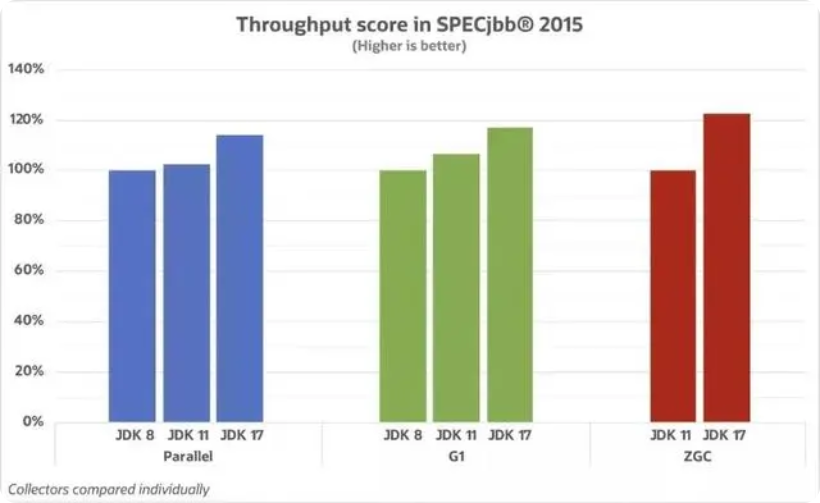

# JavaSE_第16章 JDK新特性

## 学习目标

- [ ] 能够理解函数式编程相对于面向对象的优点
- [ ] 能够掌握Lambda表达式的标准格式
- [ ] 能够使用Lambda标准格式
- [ ] 能够掌握Lambda表达式的省略格式与规则
- [ ] 能够通过Lambda使用自定义的接口（有且仅有一个抽象方法）
- [ ] 能够使用@FunctionalInterface注解
- [ ] 能够使用Supplier函数式接口
- [ ] 能够使用Consumer函数式接口
- [ ] 能够使用Function函数式接口
- [ ] 能够使用Predicate函数式接口
- [ ] 能够使用方法引用和构造器引用
- [ ] 能够理解流与集合相比的优点
- [ ] 能够理解流的延迟执行特点
- [ ] 能够通过集合、映射或数组获取流
- [ ] 能够掌握常用的流操作
- [ ] 能够使用Optional类包装对象并获取其中包装的对象

## 16.1 Lambda表达式

### 16.1.1 函数式编程思想


在数学中，**函数**就是有输入量、输出量的一套计算方案，也就是“拿什么东西做什么事情”。编程中的函数，也有类似的概念，你调用我的时候，给我实参为形参赋值，然后通过运行方法体，给你返回一个结果。对于调用者来做，关注这个方法具备什么样的功能。相对而言，面向对象过分强调“必须通过对象的形式来做事情”，而函数式思想则尽量忽略面向对象的复杂语法——**强调做什么，而不是以什么形式做**。

* 面向对象的思想:
  * 做一件事情,找一个能解决这个事情的对象,调用对象的方法,完成事情.

* 函数式编程思想:
  * 只要能获取到结果,谁去做的,怎么做的都不重要,重视的是结果,不重视过程

Java8引入了Lambda表达式之后，Java也开始支持函数式编程。

Lambda表达式不是Java最早使用的，很多语言就支持Lambda表达式，例如：C++，C#，Python，Scala等。如果有Python或者Javascript的语言基础，对理解Lambda表达式有很大帮助，可以这么说lambda表达式其实就是实现SAM接口的语法糖，使得Java也算是支持函数式编程的语言。Lambda**写的好**可以极大的减少代码冗余，同时可读性也好过冗长的匿名内部类。

> 备注：“语法糖”是指使用更加方便，但是原理不变的代码语法。例如在遍历集合时使用的for-each语法，其实
> 底层的实现原理仍然是迭代器，这便是“语法糖”。从应用层面来讲，Java中的Lambda可以被当做是匿名内部
> 类的“语法糖”，但是二者在原理上是不同的。

#### 冗余的匿名内部类

当需要启动一个线程去完成任务时，通常会通过`java.lang.Runnable`接口来定义任务内容，并使用`java.lang.Thread`类来启动该线程。代码如下：

```java
public class Demo01Runnable {
	public static void main(String[] args) {
    	// 匿名内部类
		Runnable task = new Runnable() {
			@Override
			public void run() { // 覆盖重写抽象方法
				System.out.println("多线程任务执行！");
			}
		};
		new Thread(task).start(); // 启动线程
	}
}
```

本着“一切皆对象”的思想，这种做法是无可厚非的：首先创建一个`Runnable`接口的匿名内部类对象来指定任务内容，再将其交给一个线程来启动。

**代码分析：**

对于`Runnable`的匿名内部类用法，可以分析出几点内容：

* `Thread`类需要`Runnable`接口作为参数，其中的抽象`run`方法是用来指定线程任务内容的核心；
* 为了指定`run`的方法体，**不得不**需要`Runnable`接口的实现类；
* 为了省去定义一个`RunnableImpl`实现类的麻烦，**不得不**使用匿名内部类；
* 必须覆盖重写抽象`run`方法，所以方法名称、方法参数、方法返回值**不得不**再写一遍，且不能写错；
* 而实际上，**似乎只有方法体才是关键所在**。

#### 编程思想转换

**做什么，而不是谁来做，怎么做**

我们真的希望创建一个匿名内部类对象吗？不。我们只是为了做这件事情而**不得不**创建一个对象。我们真正希望做的事情是：将`run`方法体内的代码传递给`Thread`类知晓。

**传递一段代码**——这才是我们真正的目的。而创建对象只是受限于面向对象语法而不得不采取的一种手段方式。那，有没有更加简单的办法？如果我们将关注点从“怎么做”回归到“做什么”的本质上，就会发现只要能够更好地达到目的，过程与形式其实并不重要。

**生活举例：**


当我们需要从北京到上海时，可以选择高铁、汽车、骑行或是徒步。我们的真正目的是到达上海，而如何才能到达上海的形式并不重要，所以我们一直在探索有没有比高铁更好的方式——搭乘飞机。


而现在这种飞机（甚至是飞船）已经诞生：2014年3月Oracle所发布的Java 8（JDK 1.8）中，加入了**Lambda表达式**的重量级新特性，为我们打开了新世界的大门。

#### 体验Lambda的更优写法

借助Java 8的全新语法，上述`Runnable`接口的匿名内部类写法可以通过更简单的Lambda表达式达到等效：

```java
public class Demo02LambdaRunnable {
	public static void main(String[] args) {
		new Thread(() -> System.out.println("多线程任务执行！")).start(); // 启动线程
	}
}
```

这段代码和刚才的执行效果是完全一样的，可以在1.8或更高的编译级别下通过。从代码的语义中可以看出：我们启动了一个线程，而线程任务的内容以一种更加简洁的形式被指定。

不再有“不得不创建接口对象”的束缚，不再有“抽象方法覆盖重写”的负担，就是这么简单！

### 16.1.2 函数式接口

lambda表达式其实就是实现SAM接口的语法糖，所谓SAM接口就是Single Abstract Method，即该接口中只有一个抽象方法需要实现，当然该接口可以包含其他非抽象方法。

其实只要满足“SAM”特征的接口都可以称为函数式接口，都可以使用Lambda表达式，但是如果要更明确一点，最好在声明接口时，加上@FunctionalInterface。一旦使用该注解来定义接口，编译器将会强制检查该接口是否确实有且仅有一个抽象方法，否则将会报错。

之前学过的SAM接口中，标记了@FunctionalInterface的函数式接口的有：Runnable，Comparator，FileFilter。

Java8在java.util.function新增了很多函数式接口：主要分为四大类，消费型、供给型、判断型、功能型。基本可以满足我们的开发需求。当然你也可以定义自己的函数式接口。

#### 1、自定义函数式接口

只要确保接口中有且仅有一个抽象方法即可：

```java
修饰符 interface 接口名称 {
    public abstract 返回值类型 方法名称(可选参数信息);
    // 其他非抽象方法内容
}
```

> 接口当中抽象方法的 public abstract 是可以省略的

例如：声明一个计算器`Calculator`接口，内含抽象方法`calc`可以对两个int数字进行计算，并返回结果：

```java
public interface Calculator {
    int calc(int a, int b);
}
```

在测试类中，声明一个如下方法：

```java
    public static void invokeCalc(int a, int b, Calculator calculator) {
        int result = calculator.calc(a, b);
        System.out.println("结果是：" + result);
    }
```

下面进行测试：

```java
	public static void main(String[] args) {
		invokeCalc(1, 2, (int a,int b)-> {return a+b;});
		invokeCalc(1, 2, (int a,int b)-> {return a-b;});
		invokeCalc(1, 2, (int a,int b)-> {return a*b;});
		invokeCalc(1, 2, (int a,int b)-> {return a/b;});
		invokeCalc(1, 2, (int a,int b)-> {return a%b;});
		invokeCalc(1, 2, (int a,int b)-> {return a>b?a:b;});
	}
```

#### **2、消费型接口**

消费型接口的抽象方法特点：有形参，但是返回值类型是void

| 接口名               | 抽象方法                       | 描述                       |
| -------------------- | ------------------------------ | -------------------------- |
| Consumer<T>          | void accept(T t)               | 接收一个对象用于完成功能   |
| BiConsumer<T,U>      | void accept(T t, U u)          | 接收两个对象用于完成功能   |
| DoubleConsumer       | void accept(double value)      | 接收一个double值           |
| IntConsumer          | void accept(int value)         | 接收一个int值              |
| LongConsumer         | void accept(long value)        | 接收一个long值             |
| ObjDoubleConsumer<T> | void accept(T t, double value) | 接收一个对象和一个double值 |
| ObjIntConsumer<T>    | void accept(T t, int value)    | 接收一个对象和一个int值    |
| ObjLongConsumer<T>   | void accept(T t, long value)   | 接收一个对象和一个long值   |

#### **3、供给型接口**

这类接口的抽象方法特点：无参，但是无返回值

| 接口名          | 抽象方法               | 描述              |
| --------------- | ---------------------- | ----------------- |
| Supplier<T>     | T get()                | 返回一个对象      |
| BooleanSupplier | boolean getAsBoolean() | 返回一个boolean值 |
| DoubleSupplier  | double getAsDouble()   | 返回一个double值  |
| IntSupplier     | int getAsInt()         | 返回一个int值     |
| LongSupplier    | long getAsLong()       | 返回一个long值    |

#### **4、判断型接口**

这里接口的抽象方法特点：有参，但是返回值类型是boolean结果。

| 接口名           | 抽象方法                   | 描述             |
| ---------------- | -------------------------- | ---------------- |
| Predicate<T>     | boolean test(T t)          | 接收一个对象     |
| BiPredicate<T,U> | boolean test(T t, U u)     | 接收两个对象     |
| DoublePredicate  | boolean test(double value) | 接收一个double值 |
| IntPredicate     | boolean test(int value)    | 接收一个int值    |
| LongPredicate    | boolean test(long value)   | 接收一个long值   |

#### **5、功能型接口**

这类接口的抽象方法特点：既有参数又有返回值

| 接口名                  | 抽象方法                                        | 描述                                                |
| ----------------------- | ----------------------------------------------- | --------------------------------------------------- |
| Function<T,R>           | R apply(T t)                                    | 接收一个T类型对象，返回一个R类型对象结果            |
| UnaryOperator<T>        | T apply(T t)                                    | 接收一个T类型对象，返回一个T类型对象结果            |
| DoubleFunction<R>       | R apply(double value)                           | 接收一个double值，返回一个R类型对象                 |
| IntFunction<R>          | R apply(int value)                              | 接收一个int值，返回一个R类型对象                    |
| LongFunction<R>         | R apply(long value)                             | 接收一个long值，返回一个R类型对象                   |
| ToDoubleFunction<T>     | double applyAsDouble(T value)                   | 接收一个T类型对象，返回一个double                   |
| ToIntFunction<T>        | int applyAsInt(T value)                         | 接收一个T类型对象，返回一个int                      |
| ToLongFunction<T>       | long applyAsLong(T value)                       | 接收一个T类型对象，返回一个long                     |
| DoubleToIntFunction     | int applyAsInt(double value)                    | 接收一个double值，返回一个int结果                   |
| DoubleToLongFunction    | long applyAsLong(double value)                  | 接收一个double值，返回一个long结果                  |
| IntToDoubleFunction     | double applyAsDouble(int value)                 | 接收一个int值，返回一个double结果                   |
| IntToLongFunction       | long applyAsLong(int value)                     | 接收一个int值，返回一个long结果                     |
| LongToDoubleFunction    | double applyAsDouble(long value)                | 接收一个long值，返回一个double结果                  |
| LongToIntFunction       | int applyAsInt(long value)                      | 接收一个long值，返回一个int结果                     |
| DoubleUnaryOperator     | double applyAsDouble(double operand)            | 接收一个double值，返回一个double                    |
| IntUnaryOperator        | int applyAsInt(int operand)                     | 接收一个int值，返回一个int结果                      |
| LongUnaryOperator       | long applyAsLong(long operand)                  | 接收一个long值，返回一个long结果                    |
|                         |                                                 |                                                     |
| BiFunction<T,U,R>       | R apply(T t, U u)                               | 接收一个T类型和一个U类型对象，返回一个R类型对象结果 |
| BinaryOperator<T>       | T apply(T t, T u)                               | 接收两个T类型对象，返回一个T类型对象结果            |
| ToDoubleBiFunction<T,U> | double applyAsDouble(T t, U u)                  | 接收一个T类型和一个U类型对象，返回一个double        |
| ToIntBiFunction<T,U>    | int applyAsInt(T t, U u)                        | 接收一个T类型和一个U类型对象，返回一个int           |
| ToLongBiFunction<T,U>   | long applyAsLong(T t, U u)                      | 接收一个T类型和一个U类型对象，返回一个long          |
| DoubleBinaryOperator    | double applyAsDouble(double left, double right) | 接收两个double值，返回一个double结果                |
| IntBinaryOperator       | int applyAsInt(int left, int right)             | 接收两个int值，返回一个int结果                      |
| LongBinaryOperator      | long applyAsLong(long left, long right)         | 接收两个long值，返回一个long结果                    |

### 16.1.3 Lambda表达式语法

Lambda表达式是用来给【函数式接口】的变量或形参赋值用的。

其实本质上，Lambda表达式是用于实现【函数式接口】的“抽象方法”

Lambda表达式语法格式

```java
(形参列表) -> {Lambda体}
```

说明：

* (形参列表)它就是你要赋值的函数式接口的抽象方法的(形参列表)，照抄
* {Lambda体}就是实现这个抽象方法的方法体
* ->称为Lambda操作符（减号和大于号中间不能有空格，而且必须是英文状态下半角输入方式）

优化：Lambda表达式可以精简

* 当{Lambda体}中只有一句语句时，可以省略{}和{;}
* 当{Lambda体}中只有一句语句时，并且这个语句还是一个return语句，那么return也可以省略，但是如果{;}没有省略的话，return是不能省略的
* (形参列表)的类型可以省略
* 当(形参列表)的形参个数只有一个，那么可以把数据类型和()一起省略，但是形参名不能省略
* 当(形参列表)是空参时，()不能省略

示例代码：

```java
public class TestLambdaGrammer {
	@Test
	public void test1(){
		//用Lambda表达式给Runnable接口的形参或变量赋值
		/*
		 * 确定两件事，才能写好lambda表达式
		 * （1）这个接口的抽象方法长什么样：
		 * 		public void run()
		 * （2）这个抽象方法的实现要干什么事
		 * 		例如：我要打印“hello lambda"
		 */
		Runnable r = () -> {System.out.println("hello lambda");};
	}
	
	@Test
	public void test2(){
		//lambda体省略了{;}
		Runnable r = () -> System.out.println("hello lambda");
	}
	
	@Test
	public void test3(){
		String[] arr = {"hello","Hello","java","chai"};
		
		//为arr数组排序，但是，想要不区分大小写
		/*
		 * public static <T> void sort(T[] a,Comparator<? super T> c)
		 * 这里要用Lambda表达式为Comparator类型的形参赋值
		 * 
		 * 两件事：
		 * （1）这个接口的抽象方法：  int compare(T o1, T o2)
		 * （2）这个抽象方法要做什么事？
		 * 		例如：这里要对String类型的元素，不区分大小写的比较大小
		 */
//		Arrays.sort(arr, (String o1, String o2) -> {return o1.compareToIgnoreCase(o2);});
		
		//省略了{return ;}
//		Arrays.sort(arr, (String o1, String o2) ->  o1.compareToIgnoreCase(o2));
		
		//省略了两个String
		Arrays.sort(arr, (o1, o2) ->  o1.compareToIgnoreCase(o2));
		
		for (String string : arr) {
			System.out.println(string);
		}
	}
	
	@Test
	public void test4(){
		ArrayList<String> list = new ArrayList<>();
		list.add("hello");
		list.add("java");
		list.add("world");
		
		/*
		 * JDK1.8给Collection系列的集合，准确的讲是在Iterable接口中，增加了一个默认方法
		 * 		default void forEach(Consumer<? super T> action) 
		 * 这个方法是用来遍历集合等的。代替原来的foreach循环的。
		 * 
		 * 这个方法的形参是Consumer接口类型，它是函数式接口中消费型接口的代表
		 * 我现在调用这个方法，想要用Lambda表达式为Consumer接口类型形参赋值
		 * 
		 * 两件事：
		 * （1）它的抽象方法：  void  accept(T t)
		 * （2）抽象方法的实现要完成的事是什么
		 * 		例如：这里要打印这个t
		 */
//		list.forEach((String t) -> {System.out.println(t);});
		
		//省略{;}
//		list.forEach((String t) -> System.out.println(t));
		
		//省略String
//		list.forEach((t) -> System.out.println(t));
		
		//可以省略形参()
		list.forEach(t -> System.out.println(t));
	}
}
```

### 16.1.4 Lambda表达式练习

#### 练习1：无参无返回值形式

假如有自定义函数式接口Call如下：

```java
public interface Call {
    void shout();
}
```

在测试类中声明一个如下方法：

```java
public static void callSomething(Call call){
		call.shout();
	}
```

在测试类的main方法中调用callSomething方法，并用Lambda表达式为形参call赋值，可以喊出任意你想说的话。

```java
public class TestLambda {
	public static void main(String[] args) {
		callSomething(()->System.out.println("回家吃饭"));
		callSomething(()->System.out.println("我爱你"));
		callSomething(()->System.out.println("滚蛋"));
		callSomething(()->System.out.println("回来"));
	}
	public static void callSomething(Call call){
		call.shout();
	}
}
interface Call {
    void shout();
}
```

#### 练习2：消费型接口

代码示例：Consumer<T>接口

在JDK1.8中Collection集合接口的父接口Iterable接口中增加了一个默认方法：

`public default void forEach(Consumer<? super T> action) `遍历Collection集合的每个元素，执行“xxx消费型”操作。

在JDK1.8中Map集合接口中增加了一个默认方法：

`public default void forEach(BiConsumer<? super K,? super V> action)`遍历Map集合的每对映射关系，执行“xxx消费型”操作。

案例：

（1）创建一个Collection系列的集合，添加你知道的编程语言，调用forEach方法遍历查看

（2）创建一个Map系列的集合，添加一些(key,value)键值对，例如，添加编程语言排名和语言名称，调用forEach方法遍历查看

示例代码：

```java
	@Test
	public void test1(){
		List<String> list = Arrays.asList("java","c","python","c++","VB","C#");
		list.forEach(s -> System.out.println(s));
    }
	@Test
	public void test2(){
		HashMap<Integer,String> map = new HashMap<>();
		map.put(1, "java");
		map.put(2, "c");
		map.put(3, "python");
		map.put(4, "c++");
        map.put(5, "VB");
        map.put(6, "C#");
		map.forEach((k,v) -> System.out.println(k+"->"+v));
	}
```

#### 练习3：供给型接口

代码示例：Supplier<T>接口

在JDK1.8中增加了StreamAPI，java.util.stream.Stream<T>是一个数据流。这个类型有一个静态方法：

`public static <T> Stream<T> generate(Supplier<T> s)`可以创建Stream的对象。而又包含一个forEach方法可以遍历流中的元素：`public void forEach(Consumer<? super T> action)`。

案例：

现在请调用Stream的generate方法，来产生一个流对象，并调用Math.random()方法来产生数据，为Supplier函数式接口的形参赋值。最后调用forEach方法遍历流中的数据查看结果。

```java
	@Test
	public void test2(){
		Stream.generate(() -> Math.random()).forEach(num -> System.out.println(num));
	}
```

#### 练习4：功能型接口

代码示例：Funtion<T,R>接口

在JDK1.8时Map接口增加了很多方法，例如：

`public default void replaceAll(BiFunction<? super K,? super V,? extends V> function) `按照function指定的操作替换map中的value。

`public default void forEach(BiConsumer<? super K,? super V> action)`遍历Map集合的每对映射关系，执行“xxx消费型”操作。

案例：

（1）声明一个Employee员工类型，包含编号、姓名、薪资。

（2）添加n个员工对象到一个HashMap<Integer,Employee>集合中，其中员工编号为key，员工对象为value。

（3）调用Map的forEach遍历集合

（4）调用Map的replaceAll方法，将其中薪资低于10000元的，薪资设置为10000。

（5）再次调用Map的forEach遍历集合查看结果

Employee类：

```java
class Employee{
	private int id;
	private String name;
	private double salary;
	public Employee(int id, String name, double salary) {
		super();
		this.id = id;
		this.name = name;
		this.salary = salary;
	}
	public Employee() {
		super();
	}
	public int getId() {
		return id;
	}
	public void setId(int id) {
		this.id = id;
	}
	public String getName() {
		return name;
	}
	public void setName(String name) {
		this.name = name;
	}
	public double getSalary() {
		return salary;
	}
	public void setSalary(double salary) {
		this.salary = salary;
	}
	@Override
	public String toString() {
		return "Employee [id=" + id + ", name=" + name + ", salary=" + salary + "]";
	}
	
}
```

测试类：

```java
import java.util.HashMap;

public class TestLambda {
	public static void main(String[] args) {
		HashMap<Integer,Employee> map = new HashMap<>();
		Employee e1 = new Employee(1, "张三", 8000);
		Employee e2 = new Employee(2, "李四", 9000);
		Employee e3 = new Employee(3, "王五", 10000);
		Employee e4 = new Employee(4, "赵六", 11000);
		Employee e5 = new Employee(5, "钱七", 12000);
		
		map.put(e1.getId(), e1);
		map.put(e2.getId(), e2);
		map.put(e3.getId(), e3);
		map.put(e4.getId(), e4);
		map.put(e5.getId(), e5);
		
		map.forEach((k,v) -> System.out.println(k+"="+v));
		System.out.println();
		
		map.replaceAll((k,v)->{
			if(v.getSalary()<10000){
				v.setSalary(10000);
			}
			return v;
		});
		map.forEach((k,v) -> System.out.println(k+"="+v));
	}
}
```

#### 练习5：判断型接口

代码示例：Predicate<T>接口

JDK1.8时，Collecton<E>接口增加了一下方法，其中一个如下：

`public default boolean removeIf(Predicate<? super E> filter)` 用于删除集合中满足filter指定的条件判断的。

`public default void forEach(Consumer<? super T> action) `遍历Collection集合的每个元素，执行“xxx消费型”操作。

案例：

（1）添加一些字符串到一个Collection集合中

（2）调用forEach遍历集合

（3）调用removeIf方法，删除其中字符串的长度<5的

（4）再次调用forEach遍历集合

```java

import java.util.ArrayList;

public class TestLambda {
	public static void main(String[] args) {
		ArrayList<String> list = new ArrayList<>();
		list.add("hello");
		list.add("java");
		list.add("atguigu");
		list.add("ok");
		list.add("yes");
		
		list.forEach(str->System.out.println(str));
		System.out.println();
		
		list.removeIf(str->str.length()<5);
		list.forEach(str->System.out.println(str));
	}
}
```

#### 练习6：判断型接口

案例：

（1）声明一个Employee员工类型，包含编号、姓名、性别，年龄，薪资。

（2）声明一个EmployeeSerice员工管理类，包含一个ArrayList<Employee>集合的属性all，在EmployeeSerice的构造器中，创建一些员工对象，为all集合初始化。

（3）在EmployeeSerice员工管理类中，声明一个方法：ArrayList<Employee> get(Predicate<Employee> p)，即将满足p指定的条件的员工，添加到一个新的ArrayList<Employee> 集合中返回。

（4）在测试类中创建EmployeeSerice员工管理类的对象，并调用get方法，分别获取：

* 所有员工对象
* 所有年龄超过35的员工
* 所有薪资高于15000的女员工
* 所有编号是偶数的员工
* 名字是“张三”的员工
* 年龄超过25，薪资低于10000的男员工

示例代码：

Employee类：

```java
public class Employee{
	private int id;
	private String name;
	private char gender;
	private int age;
	private double salary;
	
	public Employee(int id, String name, char gender, int age, double salary) {
		super();
		this.id = id;
		this.name = name;
		this.gender = gender;
		this.age = age;
		this.salary = salary;
	}
	public Employee() {
		super();
	}
	public int getId() {
		return id;
	}
	public void setId(int id) {
		this.id = id;
	}
	public String getName() {
		return name;
	}
	public void setName(String name) {
		this.name = name;
	}
	public double getSalary() {
		return salary;
	}
	public void setSalary(double salary) {
		this.salary = salary;
	}
	@Override
	public String toString() {
		return "Employee [id=" + id + ", name=" + name + ", gender=" + gender + ", age=" + age + ", salary=" + salary
				+ "]";
	}
}
```

员工管理类：

```java
class EmployeeService{
	private ArrayList<Employee> all;
	public EmployeeService(){
		all = new ArrayList<Employee>();
		all.add(new Employee(1, "张三", '男', 33, 8000));
		all.add(new Employee(2, "翠花", '女', 23, 18000));
		all.add(new Employee(3, "无能", '男', 46, 8000));
		all.add(new Employee(4, "李四", '女', 23, 9000));
		all.add(new Employee(5, "老王", '男', 23, 15000));
		all.add(new Employee(6, "大嘴", '男', 23, 11000));
	}
	public ArrayList<Employee> get(Predicate<Employee> p){
		ArrayList<Employee> result = new ArrayList<Employee>();
		for (Employee emp : all) {
			if(p.test(emp)){
				result.add(emp);
			}
		}
		return result;
	}
}
```

测试类：

```java
public class TestLambda {
	public static void main(String[] args) {
		EmployeeService es = new EmployeeService();
		
		es.get(e -> true).forEach(e->System.out.println(e));
		System.out.println();
		es.get(e -> e.getAge()>35).forEach(e->System.out.println(e));
		System.out.println();
		es.get(e -> e.getSalary()>15000 && e.getGender()=='女').forEach(e->System.out.println(e));
		System.out.println();
		es.get(e -> e.getId()%2==0).forEach(e->System.out.println(e));
		System.out.println();
		es.get(e -> "张三".equals(e.getName())).forEach(e->System.out.println(e));
		System.out.println();
		es.get(e -> e.getAge()>25 && e.getSalary()<10000 && e.getGender()=='男').forEach(e->System.out.println(e));
	}
}
```

### 16.1.5 方法引用与构造器引用

Lambda表达式是可以简化函数式接口的变量与形参赋值的语法。而方法引用和构造器引用是为了简化Lambda表达式的。当Lambda表达式满足一些特殊的情况时，还可以再简化：

（1）Lambda体只有一句语句，并且是通过调用一个对象的/类现有的方法来完成的

例如：System.out对象，调用println()方法来完成Lambda体

​          Math类，调用random()静态方法来完成Lambda体

（2）并且Lambda表达式的形参正好是给该方法的实参

例如：t->System.out.println(t)

​        () -> Math.random() 都是无参

#### 方法引用

方法引用的语法格式：

（1）实例对象名::实例方法		

（2）类名::静态方法

（3）类名::实例方法

说明：

* ::称为方法引用操作符（两个:中间不能有空格，而且必须英文状态下半角输入）
* Lambda表达式的形参列表，全部在Lambda体中使用上了，要么是作为调用方法的对象，要么是作为方法的实参。
* 在整个Lambda体中没有额外的数据。

```java
	
	@Test
	public void test4(){
//		Runnable r = () -> System.out.println("hello lambda");
		Runnable r = System.out::println;//打印空行
		
		//不能简化方法引用，因为"hello lambda"这个无法省略
	}
	
	@Test
	public void test3(){
		String[] arr = {"Hello","java","chai"};
//		Arrays.sort(arr, (s1,s2) -> s1.compareToIgnoreCase(s2));
		
		//用方法引用简化
		/*
		 * Lambda表达式的形参，第一个（例如：s1），正好是调用方法的对象，剩下的形参(例如:s2)正好是给这个方法的实参
		 */
		Arrays.sort(arr, String::compareToIgnoreCase);
	}
	
	@Test
	public void test2(){
//		Stream<Double> stream = Stream.generate(() -> Math.random());
		
		//用方法引用简化
		Stream<Double> stream = Stream.generate(Math::random);
	}
	
	@Test
	public void test1(){
		List<Integer> list = Arrays.asList(1,3,4,8,9);
		
		//list.forEach(t -> System.out.println(t));
		
		//用方法再简化
		list.forEach(System.out::println);
	}
```

#### 构造器引用

（1）当Lambda表达式是创建一个对象，并且满足Lambda表达式形参，正好是给创建这个对象的构造器的实参列表。

（2）  当Lambda表达式是创建一个数组对象，并且满足Lambda表达式形参，正好是给创建这个数组对象的长度

构造器引用的语法格式：

* 类名::new
* 数组类型名::new

示例代码：

```java
public class TestMethodReference {
    @Test
	public void teset04() {
		Stream<Integer> stream = Stream.of(1,2,3);
		Stream<int[]> map = stream.map(int[]::new);
	}
    
	
	//这个方法是模仿HashMap中，把你指定的数组的长度纠正为2的n次方的代码
	//createArray()的作用是，创建一个长度为2的n次方的数组
	public <R> R[] createArray(Function<Integer,R[]> fun,int length){
		int n = length - 1;
        n |= n >>> 1;
        n |= n >>> 2;
        n |= n >>> 4;
        n |= n >>> 8;
        n |= n >>> 16;
        length = n < 0 ? 1 : n + 1;
		return fun.apply(length);
	}
	
	@Test
	public void test3(){
		/*
		 * Function是一个函数式接口，可以用Lambda表达式赋值
		 * Function<T,R>的抽象方法   R apply(T t)
		 * 
		 * createArray这个方法中用的是Function<Integer,R[]> fun。说明T类型已经指定为Integer
		 * 说明
		 */
//		Function<Integer,String[]> f = (Integer len) -> new String[len];
		
		//因为Lambda体是在创建一个数组对象完成的，而且Lambda表达式的形参正好是创建数组用的长度
		//通过构造器引用省略
		Function<Integer,String[]> f = String[]::new;
		String[] array = createArray(f, 10);
		
		System.out.println(array.length);//16
	}
       
    
    @Test
	public void teset02() {
		Stream<String> stream = Stream.of("1.0","2.3","4.4");
		
//		Stream<BigDecimal> stream2 = stream.map(num -> new BigDecimal(num));
		
		Stream<BigDecimal> stream2 = stream.map(BigDecimal::new);
	}
	
	@Test
	public void test1(){
//		Supplier<String> s = () -> new String();//通过供给型接口，提供一个空字符串对象
		
		//构造器引用
		Supplier<String> s = String::new;//通过供给型接口，提供一个空字符串对象
	}

}
```

## 16.2 StreamAPI

Java8中有两大最为重要的改变。第一个是 Lambda 表达式；另外一个则是 Stream API。

Stream API ( java.util.stream) 把真正的函数式编程风格引入到Java中。这是目前为止对Java类库最好的补充，因为Stream API可以极大提高Java程序员的生产力，让程序员写出高效率、干净、简洁的代码。

Stream 是 Java8 中处理集合的关键抽象概念，它可以指定你希望对集合进行的操作，可以执行非常复杂的查找、过滤和映射数据等操作。 使用Stream API 对集合数据进行操作，就类似于使用 SQL 执行的数据库查询。也可以使用 Stream API 来并行执行操作。简言之，Stream API 提供了一种高效且易于使用的处理数据的方式。

Stream是数据渠道，用于操作数据源（集合、数组等）所生成的元素序列。“集合讲的是数据，负责存储数据，Stream流讲的是计算，负责处理数据！”

注意：

①Stream 自己不会存储元素。

②Stream 不会改变源对象。每次处理都会返回一个持有结果的新Stream。

③Stream 操作是延迟执行的。这意味着他们会等到需要结果的时候才执行。

Stream 的操作三个步骤：

1- 创建 Stream：通过一个数据源（如：集合、数组），获取一个流

2- 中间操作：中间操作是个操作链，对数据源的数据进行n次处理，但是在终结操作前，并不会真正执行。

3- 终止操作：一旦执行终止操作，就执行中间操作链，最终产生结果并结束Stream。


### 16.2.1 创建Stream

**1、创建 Stream方式一：通过集合**

Java8 中的 Collection 接口被扩展，提供了两个获取流的方法：

* public default Stream<E> stream() : 返回一个顺序流

* public default Stream<E> parallelStream() : 返回一个并行流

**2、创建 Stream方式二：通过数组**

Java8 中的 Arrays 的静态方法 stream() 可以获取数组流：

* public static <T> Stream<T> stream(T[] array): 返回一个流

重载形式，能够处理对应基本类型的数组：

* public static IntStream stream(int[] array)：返回一个整型数据流
* public static LongStream stream(long[] array)：返回一个长整型数据流
* public static DoubleStream stream(double[] array)：返回一个浮点型数据流

**3、创建 Stream方式三：通过Stream的of()**

可以调用Stream类静态方法 of(), 通过显示值创建一个流。它可以接收任意数量的参数。

* public static<T> Stream<T> of(T... values) : 返回一个顺序流

**4、创建 Stream方式四：创建无限流**

可以使用静态方法 Stream.iterate() 和 Stream.generate(), 创建无限流。

* public static<T> Stream<T> iterate(final T seed, final UnaryOperator<T> f):返回一个无限流
* public static<T> Stream<T> generate(Supplier<T> s) ：返回一个无限流

```java
package com.atguigu.test06;

import java.util.Arrays;
import java.util.List;
import java.util.stream.IntStream;
import java.util.stream.Stream;

import org.junit.Test;

public class Test07StreamCreate {
	@Test
	public void test06(){
		/*
		 * Stream<T> iterate(T seed, UnaryOperator<T> f)  
		 * UnaryOperator接口，SAM接口，抽象方法：
		 * 
		 * UnaryOperator<T> extends Function<T,T>
		 * 		T apply(T t)
		 */
		Stream<Integer> stream = Stream.iterate(1, num -> num+=2);
//		stream = stream.limit(10);
		stream.forEach(System.out::println);
	}
	
	@Test
	public void test05(){
		Stream<Double> stream = Stream.generate(Math::random);
		stream.forEach(System.out::println);
	}
	
	@Test
	public void test04(){
		Stream<Integer> stream = Stream.of(1,2,3,4,5);
		stream.forEach(System.out::println);
	}
	
	@Test
	public void test03(){
		String[] arr = {"hello","world"};
		Stream<String> stream = Arrays.stream(arr);
	}
	
	@Test
	public void test02(){
		int[] arr = {1,2,3,4,5};
		IntStream stream = Arrays.stream(arr);
	}
	
	@Test
	public void test01(){
		List<Integer> list = Arrays.asList(1,2,3,4,5);
		
		//JDK1.8中，Collection系列集合增加了方法
		Stream<Integer> stream = list.stream();
	}
}

```

### 16.2.2  中间操作

多个中间操作可以连接起来形成一个流水线，除非流水线上触发终止操作，否则中间操作不会执行任何的处理！而在终止操作时一次性全部处理，称为“惰性求值”。

| **方  法**                          | **描  述**                                                   |
| ----------------------------------- | ------------------------------------------------------------ |
| **filter(Predicate p)**             | 接收 Lambda ， 从流中排除某些元素                            |
| **distinct()**                      | 筛选，通过流所生成元素的equals() 去除重复元素                |
| **limit(long maxSize)**             | 截断流，使其元素不超过给定数量                               |
| **skip(long n)**                    | 跳过元素，返回一个扔掉了前 n 个元素的流。若流中元素不足 n 个，则返回一个空流。与 limit(n) 互补 |
| **peek(Consumer** **action)**       | 接收Lambda，对流中的每个数据执行Lambda体操作                 |
| **sorted()**                        | 产生一个新流，其中按自然顺序排序                             |
| **sorted(Comparator com)**          | 产生一个新流，其中按比较器顺序排序                           |
| **map(Function f)**                 | 接收一个函数作为参数，该函数会被应用到每个元素上，并将其映射成一个新的元素。 |
| **mapToDouble(ToDoubleFunction f)** | 接收一个函数作为参数，该函数会被应用到每个元素上，产生一个新的 DoubleStream。 |
| **mapToInt(ToIntFunction f)**       | 接收一个函数作为参数，该函数会被应用到每个元素上，产生一个新的 IntStream。 |
| **mapToLong(ToLongFunction f)**     | 接收一个函数作为参数，该函数会被应用到每个元素上，产生一个新的 LongStream。 |
| **flatMap(Function f)**             | 接收一个函数作为参数，将流中的每个值都换成另一个流，然后把所有流连接成一个流 |

```java
package com.atguigu.test06;

import java.util.Arrays;
import java.util.stream.Stream;

import org.junit.Test;

public class Test08StreamMiddle {
	
	@Test
	public void test12(){
		String[] arr = {"hello","world","java"};
		Arrays.stream(arr)
			.flatMap(t -> Stream.of(t.split("|")))//Function<T,R>接口抽象方法 R apply(T t)  现在的R是一个Stream
			.forEach(System.out::println);
	}
	
	
	@Test
	public void test11(){
		String[] arr = {"hello","world","java"};
		
		Arrays.stream(arr)
			.map(t->t.toUpperCase())
			.forEach(System.out::println);
	}
	
	@Test
	public void test10(){
		Stream.of(1,2,3,4,5)
			.map(t -> t+=1)//Function<T,R>接口抽象方法 R apply(T t)
			.forEach(System.out::println);
	}
	
	@Test
	public void test09(){
		//希望能够找出前三个最大值，前三名最大的，不重复
		Stream.of(11,2,39,4,54,6,2,22,3,3,4,54,54)
			.distinct()
			.sorted((t1,t2) -> -Integer.compare(t1, t2))//Comparator接口  int compare(T t1, T t2)
			.limit(3)
			.forEach(System.out::println);
	}
	
	@Test
	public void test08(){
		long count = Stream.of(1,2,3,4,5,6,2,2,3,3,4,4,5)
			.distinct()
			.peek(System.out::println)  //Consumer接口的抽象方法  void accept(T t)
			.count();
		System.out.println("count="+count);
	}
	
	
	@Test
	public void test07(){
		Stream.of(1,2,3,4,5,6,2,2,3,3,4,4,5)
			.skip(5)
			.distinct()
			.filter(t -> t%3==0)
			.forEach(System.out::println);
	}

	@Test
	public void test06(){
		Stream.of(1,2,3,4,5,6,2,2,3,3,4,4,5)
			.skip(5)
			.forEach(System.out::println);
	}
	
	@Test
	public void test05(){
		Stream.of(1,2,2,3,3,4,4,5,2,3,4,5,6,7)
			.distinct()  //(1,2,3,4,5,6,7)
			.filter(t -> t%2!=0) //(1,3,5,7)
			.limit(3)
			.forEach(System.out::println);
	}
	
	
	@Test
	public void test04(){
		Stream.of(1,2,3,4,5,6,2,2,3,3,4,4,5)
			.limit(3)
			.forEach(System.out::println);
	}
	
	
	@Test
	public void test03(){
		Stream.of(1,2,3,4,5,6,2,2,3,3,4,4,5)
			.distinct()
			.forEach(System.out::println);
	}
	
	
	@Test
	public void test02(){
		Stream.of(1,2,3,4,5,6)
			.filter(t -> t%2==0)
			.forEach(System.out::println);
	}
	
	@Test
	public void test01(){
		//1、创建Stream
		Stream<Integer> stream = Stream.of(1,2,3,4,5,6);
		
		//2、加工处理
		//过滤：filter(Predicate p)
		//把里面的偶数拿出来
		/*
		 * filter(Predicate p)
		 * Predicate是函数式接口，抽象方法：boolean test(T t)
		 */
		stream = stream.filter(t -> t%2==0);
		
		//3、终结操作：例如：遍历
		stream.forEach(System.out::println);
	}
}

```

### 16.2.3  终结操作

终端操作会从流的流水线生成结果。其结果可以是任何不是流的值，例如：List、Integer，甚至是 void。流进行了终止操作后，不能再次使用。

| **方法**                                   | **描述**                                                     |
| ------------------------------------------ | ------------------------------------------------------------ |
| **boolean** **allMatch(Predicate p)**      | 检查是否匹配所有元素                                         |
| **boolean** **anyMatch**(**Predicate p**)  | 检查是否至少匹配一个元素                                     |
| **boolean** **noneMatch(Predicate  p)**    | 检查是否没有匹配所有元素                                     |
| **Optional<T>** **findFirst()**            | 返回第一个元素                                               |
| **Optional<T>** **findAny()**              | 返回当前流中的任意元素                                       |
| **long** **count()**                       | 返回流中元素总数                                             |
| **Optional<T>** **max(Comparator c)**      | 返回流中最大值                                               |
| **Optional<T>** **min(Comparator c)**      | 返回流中最小值                                               |
| **void** **forEach(Consumer c)**           | 迭代                                                         |
| **T** **reduce(T iden, BinaryOperator b)** | 可以将流中元素反复结合起来，得到一个值。返回 T               |
| **U** **reduce(BinaryOperator b)**         | 可以将流中元素反复结合起来，得到一个值。返回 Optional<T>     |
| **R** **collect(Collector c)**             | 将流转换为其他形式。接收一个 Collector接口的实现，用于给Stream中元素做汇总的方法 |

Collector 接口中方法的实现决定了如何对流执行收集的操作(如收集到 List、Set、Map)。另外， Collectors 实用类提供了很多静态方法，可以方便地创建常见收集器实例。

```java
package com.atguigu.test06;

import java.util.List;
import java.util.Optional;
import java.util.stream.Collectors;
import java.util.stream.Stream;

import org.junit.Test;

public class Test09StreamEnding {
	
	@Test
	public void test14(){
		List<Integer> list = Stream.of(1,2,4,5,7,8)
				.filter(t -> t%2==0)
				.collect(Collectors.toList());
		
		System.out.println(list);
	}
	
	
	@Test
	public void test13(){
		Optional<Integer> max = Stream.of(1,2,4,5,7,8)
			 .reduce((t1,t2) -> t1>t2?t1:t2);//BinaryOperator接口   T apply(T t1, T t2)
		System.out.println(max);
	}
	
	@Test
	public void test12(){
		Integer reduce = Stream.of(1,2,4,5,7,8)
			 .reduce(0, (t1,t2) -> t1+t2);//BinaryOperator接口   T apply(T t1, T t2)
		System.out.println(reduce);
	}
	
	@Test
	public void test11(){
		Optional<Integer> max = Stream.of(1,2,4,5,7,8)
				.max((t1,t2) -> Integer.compare(t1, t2));
		System.out.println(max);
	}
	
	@Test
	public void test10(){
		Optional<Integer> opt = Stream.of(1,2,4,5,7,8)
				.filter(t -> t%3==0)
				.findFirst();
		System.out.println(opt);
	}
	
	@Test
	public void test09(){
		Optional<Integer> opt = Stream.of(1,2,3,4,5,7,9)
				.filter(t -> t%3==0)
				.findFirst();
		System.out.println(opt);
	}
	
	@Test
	public void test08(){
		Optional<Integer> opt = Stream.of(1,3,5,7,9).findFirst();
		System.out.println(opt);
	}
	
	@Test
	public void test04(){
		boolean result = Stream.of(1,3,5,7,9)
			.anyMatch(t -> t%2==0);
		System.out.println(result);
	}
	
	
	@Test
	public void test03(){
		boolean result = Stream.of(1,3,5,7,9)
			.allMatch(t -> t%2!=0);
		System.out.println(result);
	}
	
	@Test
	public void test02(){
		long count = Stream.of(1,2,3,4,5)
				.count();
		System.out.println("count = " + count);
	}
	
	@Test
	public void test01(){
		Stream.of(1,2,3,4,5)
				.forEach(System.out::println);
	}
}
```

### 16.2.4 练习

案例：

现在有两个 ArrayList 集合存储队伍当中的多个成员姓名，要求使用传统的for循环（或增强for循环）依次进行以
下若干操作步骤：
1. 第一个队伍只要名字为3个字的成员姓名；存储到一个新集合中。
2. 第一个队伍筛选之后只要前3个人；存储到一个新集合中。
3. 第二个队伍只要姓张的成员姓名；存储到一个新集合中。
4. 第二个队伍筛选之后不要前2个人；存储到一个新集合中。
5. 将两个队伍合并为一个队伍；存储到一个新集合中。
6. 根据姓名创建 Person 对象；存储到一个新集合中。
7. 打印整个队伍的Person对象信息。

Person 类的代码为：

```java
public class Person {
    private String name;
    public Person() {}
    public Person(String name) {
        this.name = name;
    }    
    public String getName() {
        return name;
    }
    public void setName(String name) {
        this.name = name;
    }
    @Override
    public String toString() {
        return "Person{name='" + name + "'}";
    }
}
```

两个队伍（集合）的代码如下：

```java
public static void main(String[] args) {
       //第一支队伍
        ArrayList<String> one = new ArrayList<>();
        one.add("迪丽热巴");
        one.add("宋远桥");
        one.add("苏星河");
        one.add("石破天");
        one.add("石中玉");
        one.add("老子");
        one.add("庄子");
        one.add("洪七公");
        //第二支队伍
        ArrayList<String> two = new ArrayList<>();
        two.add("古力娜扎");
        two.add("张无忌");
        two.add("赵丽颖");
        two.add("张三丰");
        two.add("尼古拉斯赵四");
        two.add("张天爱");
        two.add("张二狗");
    
		// ....编写代码完成题目要求 
    }
```

参考答案：

```java
public static void main(String[] args) {
       //第一支队伍
        ArrayList<String> one = new ArrayList<>();
        one.add("迪丽热巴");
        one.add("宋远桥");
        one.add("苏星河");
        one.add("石破天");
        one.add("石中玉");
        one.add("老子");
        one.add("庄子");
        one.add("洪七公");
    
        //第二支队伍
        ArrayList<String> two = new ArrayList<>();
        two.add("古力娜扎");
        two.add("张无忌");
        two.add("赵丽颖");
        two.add("张三丰");
        two.add("尼古拉斯赵四");
        two.add("张天爱");
        two.add("张二狗");
        
		// 第一个队伍只要名字为3个字的成员姓名；
        // 第一个队伍筛选之后只要前3个人；
        Stream<String> streamOne = one.stream().filter(s ‐> s.length() == 3).limit(3);
    
        // 第二个队伍只要姓张的成员姓名；
        // 第二个队伍筛选之后不要前2个人；
        Stream<String> streamTwo = two.stream().filter(s ‐> s.startsWith("张")).skip(2);
    
        // 将两个队伍合并为一个队伍；
        // 根据姓名创建Person对象；
        // 打印整个队伍的Person对象信息。
        Stream.concat(streamOne, streamTwo).map(Person::new).forEach(System.out::println);
        
}
```

## 16.3 Optional类

到目前为止，臭名昭著的空指针异常是导致Java应用程序失败的最常见原因。以前，为了解决空指针异常，Google公司著名的Guava项目引入了Optional类，Guava通过使用检查空值的方式来防止代码污染，它鼓励程序员写更干净的代码。受到Google Guava的启发，Optional类已经成为Java 8类库的一部分。

   Optional实际上是个容器：它可以保存类型T的值，或者仅仅保存null。Optional提供很多有用的方法，这样我们就不用显式进行空值检测。

### 16.3.1 API

1、如何创建Optional对象？或者说如何用Optional来装值对象或null值

（1）static <T> Optional<T> empty() ：用来创建一个空的Optional

（2）static <T> Optional<T> of(T value) ：用来创建一个非空的Optional

（3）static <T> Optional<T> ofNullable(T value) ：用来创建一个可能是空，也可能非空的Optional

2、如何从Optional容器中取出所包装的对象呢？

（1）T get()  ：要求Optional容器必须非空

T get()与of(T value)使用是安全的

（2）T orElse(T other)  ：

orElse(T other) 与ofNullable(T value)配合使用，

如果Optional容器中非空，就返回所包装值，如果为空，就用orElse(T other)other指定的默认值（备胎）代替

（3）T orElseGet(Supplier<? extends T> other)  ：

如果Optional容器中非空，就返回所包装值，如果为空，就用Supplier接口的Lambda表达式提供的值代替

（4）<X extends Throwable> T orElseThrow(Supplier<? extends X> exceptionSupplier) 

如果Optional容器中非空，就返回所包装值，如果为空，就抛出你指定的异常类型代替原来的NoSuchElementException

3、其他方法

（1）boolean isPresent()  ：判断Optional容器中的值是否存在

（2）void ifPresent(Consumer<? super T> consumer) ：

判断Optional容器中的值是否存在，如果存在，就对它进行Consumer指定的操作，如果不存在就不做

（3）<U> Optional<U> map(Function<? super T,? extends U> mapper)  

判断Optional容器中的值是否存在，如果存在，就对它进行Function接口指定的操作，如果不存在就不做

```java
package com.atguigu.test07;

import java.util.ArrayList;
import java.util.Optional;

import org.junit.Test;

public class TestOptional {
	@Test
	public void test9(){
		String str = "Hello";
		Optional<String> opt = Optional.ofNullable(str);
        //判断是否是纯字母单词，如果是，转为大写，否则保持不变
		String result = opt.filter(s->s.matches("[a-zA-Z]+")).
				map(s -> s.toLowerCase()).
				orElse(str);
		System.out.println(result);
	}
	
	
	@Test
	public void test8(){
		String str = null;
		Optional<String> opt = Optional.ofNullable(str);
		String string = opt.orElseThrow(()->new RuntimeException("值不存在"));
		System.out.println(string);
	}
	
	
	@Test
	public void test7(){
		String str = null;
		Optional<String> opt = Optional.ofNullable(str);
		String string = opt.orElseGet(String::new);
		System.out.println(string);
	}
	
	@Test
	public void test6(){
		String str = "hello";
		Optional<String> opt = Optional.ofNullable(str);
		String string = opt.orElse("atguigu");
		System.out.println(string);
	}
	
	@Test
	public void test5(){
		String str = null;
		Optional<String> opt = Optional.ofNullable(str);
//		System.out.println(opt.get());//java.util.NoSuchElementException: No value present
	}
	
	@Test
	public void test4(){
		String str = "hello";
		Optional<String> opt = Optional.of(str);

		String string = opt.get();
		System.out.println(string);
	}
	
	
	@Test
	public void test3(){
		String str = null;
		Optional<String> opt = Optional.ofNullable(str);
		System.out.println(opt);
	}
	
	@Test
	public void test2(){
		String str = "hello";
		Optional<String> opt = Optional.of(str);
		System.out.println(opt);
	}
	

}

```

### 16.3.2 练习

#### 练习1

案例：

（1）声明一个Girl类型，包含姓名（String）属性

（2）声明一个Boy类型，包含姓名（String），女朋友（Girl）属性

（3）在测试类中，创建一个Boy对象，并

如果他有女朋友，显示他女朋友名称；

如果他没有女朋友，他的女朋友默认为“嫦娥”，即只能欣赏“嫦娥”了

```java
class Girl{
	private String name;

	public Girl(String name) {
		super();
		this.name = name;
	}

	public String getName() {
		return name;
	}

	public void setName(String name) {
		this.name = name;
	}

	@Override
	public String toString() {
		return "Girl [name=" + name + "]";
	}
	
}
class Boy{
	private String name;
	private Girl girlFriend;
	public Boy(String name, Girl girlFriend) {
		super();
		this.name = name;
		this.girlFriend = girlFriend;
	}
	public String getName() {
		return name;
	}
	public void setName(String name) {
		this.name = name;
	}
	public Girl getGirlFriend() {
		return girlFriend;
	}
	public void setGirlFriend(Girl girlFriend) {
		this.girlFriend = girlFriend;
	}
	@Override
	public String toString() {
		return "Boy [name=" + name + ", girlFriend=" + girlFriend + "]";
	}
	
}
```

测试类

```java
	public static void main(String[] args) {
//		Boy boy = new Boy("张三",null);
		Boy boy = new Boy("张三",new Girl("翠翠"));
		Optional<Girl> grilFriend = Optional.ofNullable(boy.getGirlFriend());
		Optional.of(grilFriend.orElse(new Girl("嫦娥"))).ifPresent(g->System.out.println(g));
	}
```

#### 练习2

案例：

（1）声明学生类，包含姓名和年龄

（2）添加几个学生对象到一个ArrayList<Student>集合中

（3）对集合中的学生进行操作，找出年龄大于30岁的，并取出第一个学生，如果没有这样的学生，用无参构造new一个学生对象，打印学生信息

学生类示例代码：

```java
class Student{
	private String name;
	private int age;
	public Student(String name, int age) {
		super();
		this.name = name;
		this.age = age;
	}
	public Student() {
		super();
	}
	public String getName() {
		return name;
	}
	public void setName(String name) {
		this.name = name;
	}
	public int getAge() {
		return age;
	}
	public void setAge(int age) {
		this.age = age;
	}
	@Override
	public String toString() {
		return "Student [name=" + name + ", age=" + age + "]";
	}
}
```

测试类

```java
	@Test
	public void test1(){
		ArrayList<Student> list = new ArrayList<>();
		list.add(new Student("张三", 23));
		//...
		
		//取出流中第一个年龄大于30岁的学生的年龄，并打印它的年龄，如果没有，用无参构造创建一个学生对象
		Student stu = list.stream()
			.filter(s -> s.getAge()>30)
			.findFirst().orElse(new Student());
		System.out.println("学生的年龄：" + stu.getAge());
	}
```

## 16.4 JDK17新特性

### 16.4.1 选择JDK17原因

在Java 17正式发布之前，Java开发框架Spring率先在官博宣布，Spring Framework 6和Spring Boot 3计划在2022年第四季度实现总体可用性的高端基线：

1、Java 17+(来自 Spring Framework 5.3.x 线中的 Java 8-17)

2、Jakarta EE 9+（来自Spring框架5.3.x 线中的 Java EE 7-8）

通过实际行动来支持 Java 17，间接呼吁开发者，是时候使用 Java 17了。

3.Spring 官方说明：`https://spring.io/blog/2022/01/20/spring-boot-3-0-0-m1-is-now-available`


> 意味着：springboot3.0 是需要用java17和spring6.0为基础建设。如果从企业选型最新springboot3.0作为架构来说，它搭配jdk17肯定是标配了。
>
> 针对于Spring 6，官网的说明会弃用java8以9为最低版本，而且兼容tomcat10+。

4.JDK17针对于GC方面作出了优化,以及做了性能的提高

   a.在吞吐量方面，Parallel 中 JDK 8 和 JDK 11 差距不大，JDK 17 相较 JDK 8 提升 15% 左右；G1 中 JDK 17 比 JDK 8 提升  18%；ZGC 在 JDK 11引入，JDK 17 对比JDK 11 提升超过 20% 



  b. 在 GC 延迟方面，JDK 17 的提升更为明显。在 Parallel 中 JDK 17 对比 JDK 8 和JDK 11 提升 40%；在 G1 中，JDK 11 对比 JDK 8 提升 26%，JDK 17 对比 JDK 8 提升接近 60%！ZGC 中 JDK 17 对比 JDK  11 提升超过 40% 


>  从GC性能角度去看，JDK 11对比JDK 8延迟提升不到40%；反观JDK 17对比JDK 8 延迟提升 60%，吞吐量提升 18%；可以看到JDK17的提升还是非常明显的 

由于JDK对性能提升方面都是自动的,所以我们可以直接学习jdk新特性中的语法,我们要知道的是下面的语法不是从jdk17开始有的,但是jdk17都兼容这些语法

### 16.4.2 异常处理之try-catch

从jdk7开始,我们用try_catch处理流对象,我们就不用自己手动关闭流对象了

```java
public class Test01 {
    public static void main(String[] args)throws Exception {
        //test01();
        //test02();
        test03();
    }

    /**
     * jdk7之前的IO异常处理方案
     */
    public static void test01() {
        FileWriter fw = null;
        try {
            fw = new FileWriter("code1\\io\\1.txt");
            fw.write("张三");
        } catch (IOException e) {
            throw new RuntimeException(e);
        } finally {
            if (fw != null) {
                try {
                    fw.close();
                } catch (IOException e) {
                    e.printStackTrace();
                }
            }
        }
    }

    /**
     * jdk7开始有的下面这种IO流异常处理方式
     * try(IO流对象;IO流对象){
     *     可能出现异常的代码
     * }catch(异常类型 对象名){
     *     异常处理方案
     * }
     *
     * jvm会自动刷新和关闭流对象
     */
    public static void test02() {
        try (FileWriter fw = new FileWriter("code1\\io\\2.txt");) {
            fw.write("张三");
        } catch (IOException e) {
            e.printStackTrace();
        }
    }

    /**
     * Java 9 中，用资源语句编写try将更容易，我们可以在try子句中使用已经初始化过的资源，此时的资源是final的
     *
     * 在try前创建流对象，在try后面的()中引入流对象，
     * 引入的流对象作用域依然是整个try代码块，当try中的代码执行完毕，会自动释放引用的流对象
     * 
     * 但是如果在try外面的对象需要处理异常,需要单独处理
     */
    public static void test03()throws Exception{
        FileInputStream fis = new FileInputStream("code1\\io\\1.jpg");
        FileOutputStream fos = new FileOutputStream("code1\\io\\1.jpg");
        try(fis;fos){
            byte[] bytes = new byte[1024];
            int len;
            while((len = fis.read(bytes))!=-1){
                fos.write(bytes,0,len);
            }
        } catch (Exception e) {
            e.printStackTrace();
        }
    }
}
```

### 16.4.3 局部变量类型推断

jdk10之前,我们定义局部变量都必须要明确数据的数据类型,但是到了jdk10,出现了一个最为重要的特性,就是`局部变量类型推断`,顾名思义,就是定义局部变量时,不用先确定具体的数据类型了,可以直接根据具体数据推断出所属的数据类型

```java
1.格式:
  var 变量名 = 值
```

```java
public class Test02 {
    public static void main(String[] args) {
        /*
          等号右边为10,默认类型为int型
          所以可以推断出变量i的类型为int型
         */
        var i = 10;
        System.out.println("i = " + i);

         /*
          等号右边为2.5,默认类型为double型
          所以可以推断出变量j的类型为double型
         */
        var j = 2.5;
        System.out.println("j = " + j);

        System.out.println("===============================================");
        //之前:ArrayList<String> list = new ArrayList<String>()
        var list = new ArrayList<String>();
        list.add("张三");
        list.add("李四");
        list.add("王五");

        //之前:Iterator<String> iterator = list.iterator()
        var iterator = list.iterator();
        while(iterator.hasNext()){
            System.out.println(iterator.next());
        }
        System.out.println("===============================================");

        /*
          之前:
           for (元素数据类型 变量名 : 集合名或者数组名) {
            System.out.println(变量名);
           }
         */
        for (var s : list) {
            System.out.println(s);
        }

        System.out.println("===============================================");

        /*
           for (int k = 0; k < list.size(); k++) {
            System.out.println(list.get(k));
           }
         */
        for (var k = 0; k < list.size(); k++) {
            System.out.println(list.get(k));
        }

    }
}
```

### 16.4.4 switch表达式

在JDK 12中引入了Switch表达式作为预览特性。JDK 13提出了第二个switch表达式预览。JEP 354修改了这个特性，**它引入了yield语句，用于返回值。**这意味着，switch表达式(返回值)应该使用yield, switch语句(不返回值)应该使用break

在 JDK 12中有一个，但是要进行一个更改：要从 switch 表达式中生成一个值 break，要删除with value语句以支持a  yield 声明。目的是扩展，switch 以便它可以用作语句或表达式，因此两个表单既可以使用 case ... : 带有连贯符号的传统标签，也可以使用新 case … -> 标签，而不需要通过，还有一个新的语句用于从 switch 表达式中产生值。这些更改将简化编码并为[模式匹配](https://openjdk.java.net/jeps/305)做好准备。 

在以前，我们想要在switch中返回内容，还是比较麻烦的，一般语法如下：

```java
    @Test
    public void test01(){
        String x = "3";
        int i;
        switch (x) {
            case "1":
                i=1;
                break;
            case "2":
                i=2;
                break;
            default:
                i = x.length();
                break;
        }
        System.out.println(i);
    }
```

java 12中：Switch 表达式的写法，省去了 break 语句，避免了因少写 break 而出错,但是省去break需要将:改成->

```java
   /**
     * java 12中：Switch 表达式的写法，省去了 break 语句，避免了因少写 break 而出错,但是省去break需要将:改成->
     */
    @Test
    public void test02(){
        String x = "2";
        int i;
        switch (x) {
            case "1"->
                i=111111;
                //break;
            case "2"->
                i=22222;
                //break;
            default->
                i = x.length();
                //break;
        }
        System.out.println(i);
    }

    /**
     * jdk12中switch前面还可以定义变量接收case对应的结果
     */
    @Test
    public void test03(){
        String x = "2";
        int i;
        int result = switch (x) {
            case "1"->
                    i=111111;
            //break;
            case "2"->
                    i=22222;
            //break;
            default->
                    i = x.length();
            //break;
        };
        System.out.println(i);
        System.out.println(result+".....");
    }
```

java13中：引入了yield语句，用于返回值,这意味着，switch表达式(返回值)应该使用yield, switch语句(不返回值)应该使用break

```java
    /**
     * java13中：引入了yield语句，用于返回值,这意味着，switch表达式(返回值)应该使用yield, switch语句(不返回值)应该使用break
     */
    @Test
    public void test04() {
        String x = "2";
        int i;
        int result = switch (x) {
            case "1":
                i = 111111;
                yield i;
            case "2":
                i = 22222;
                yield i;  
            default:
                i = x.length();
                yield i;
        };
        System.out.println(i);
        System.out.println(result + "..................");
    }
```

### 16.4.5 文本块

在JDK 12中引入了Raw String Literals特性，但在发布之前就放弃了。这个JEP与引入多行字符串文字（text block）在意义上是类似的。

**这条新特性跟 Kotlin 里的文本块是类似的。**

**现实问题**

在Java中，通常需要使用String类型表达HTML，XML，SQL或JSON等格式的字符串，在进行字符串赋值时需要进行转义和连接操作，然后才能编译该代码，这种表达方式难以阅读并且难以维护。

文本块就是指多行字符串，例如一段格式化后的xml、json等。而有了文本块以后，用户不需要转义，Java能自动搞定。因此，**文本块将提高Java程序的可读性和可写性。**

**目标**

- 简化跨越多行的字符串，避免对换行等特殊字符进行转义，简化编写Java程序。
- 增强Java程序中字符串的可读性。

**举例**

会被自动转义，如有一段以下字符串：

```html
<html>
  <body>
      <p>Hello, 尚硅谷</p>
  </body>
</html>
```

将其复制到Java的字符串中，会展示成以下内容：

```java
"<html>\n" +
"    <body>\n" +
"        <p>Hello, 尚硅谷</p>\n" +
"    </body>\n" +
"</html>\n";
```

即被自动进行了转义，这样的字符串看起来不是很直观，在JDK 13中，就可以使用以下语法了：

```java
"""
<html>
  <body>
      <p>Hello, world</p>
  </body>
</html>
""";
```

使用“”“作为文本块的开始符和结束符，在其中就可以放置多行的字符串，不需要进行任何转义。看起来就十分清爽了。

如常见的SQL语句：

```sql
select employee_id,last_name,salary,department_id
from employees
where department_id in (40,50,60)
order by department_id asc
```

原有方式：

```java
String query = "select employee_id,last_name,salary,department_id\n" +
                "from employees\n" +
                "where department_id in (40,50,60)\n" +
                "order by department_id asc";
```

使用新特性：

```java
String newQuery = """
        select employee_id,last_name,salary,department_id
        from employees
        where department_id in (40,50,60)
        order by department_id asc
""";
```

**具体使用(选讲)**

**1.基本使用**

- **文本块**是Java语言中的一种新文字。它可以用来表示任何字符串，并且提供更大的表现力和更少的复杂性。

- **文本块**由零个或多个字符组成，由开始和结束分隔符括起来。
  - 开始分隔符是由三个双引号字符（"""），后面可以跟零个或多个空格，最终以行终止符结束。文本块内容**以开始分隔符的行终止符后的第一个字符开始**。
  - 结束分隔符也是由三个双引号字符（"""）表示，文本块内容**以结束分隔符的第一个双引号之前的最后一个字符结束。**

- **文本块**中的内容可以直接使用"，"，但不是必需的。

- **文本块**中的内容可以直接包括行终止符。允许在文本块中使用 \n，但不是必需的。例如，文本块：

```java
"""
line1
line2
line3
"""
```

相当于：

```java
"line1\nline2\nline3\n"
```

或者一个连接的字符串：

```java
"line1\n" +
"line2\n" +
"line3\n"
```

如果字符串末尾不需要行终止符，则结束分隔符可以放在最后一行内容上。例如：

```java
"""
line1
line2
line3"""
```

相当于

```java
"line1\nline2\nline3"
```

文本块可以表示空字符串，但不建议这样做，因为它需要两行源代码：

```java
String empty = """
""";
```

以下示例是错误格式的文本块：

```java
String a = """""";   // 开始分隔符后没有行终止符
String b = """ """;  // 开始分隔符后没有行终止符
String c = """
           ";        // 没有结束分隔符
String d = """
           abc \ def
           """;      // 含有未转义的反斜线（请参阅下面的转义处理）
```

在运行时，**文本块将被实例化为String的实例，就像字符串一样。**从文本块派生的String实例与从字符串派生的实例是无法区分的。**具有相同内容的两个文本块将引用相同的String实例，就像字符串一样。**

此外，

**2. 编译器在编译时会删除掉这些多余的空格。**

下面这段代码中，我们用.来表示我们代码中的的空格，而这些位置的空格就是多余的。

```java
String html = """
..............<html>
..............    <body>
..............        <p>Hello, world</p>
..............    </body>
..............</html>
..............""";
```

多余的空格还会出现在每一行的结尾，特别是当你从其他地方复制过来时，更容易出现这种情况，比如下面的代码：

```java
String html = """
..............<html>...
..............    <body>
..............        <p>Hello, world</p>....
..............    </body>.
..............</html>...
..............""";
```

这些多余的空格对于程序员来说是看不到的，但是他又是实际存在的，所以**如果编译器不做处理，可能会导致程序员看到的两个文本块内容是一样的，但是这两个文本块却因为存在这种多余的空格而导致差异，比如哈希值不相等。**

**3. 转义字符**

允许开发人员使用 \n，\f 和\r 来进行字符串的垂直格式化，使用 \b和 \t进行水平格式化。比如下面的代码是合法的：

```java
String html = """
              <html>\n
                  <body>\n
                      <p>Hello, world</p>\n
                  </body>\n
              </html>\n
              """;
```

请注意，在文本块内自由使用"是合法的。例如:

```java
String story = """
    "When I use a word," Humpty Dumpty said,
    in rather a scornful tone, "it means just what I
    choose it to mean - neither more nor less."
    "The question is," said Alice, "whether you
    can make words mean so many different things."
    "The question is," said Humpty Dumpty,
    "which is to be master - that's all."
""";
```

但是，三个"字符的序列需要进行转义至少一个"以避免模仿结束分隔符：

```java
String code = 
    """
    String text = \"""
        A text block inside a text block
    \""";
    """;
```

**4. 文本块连接**

可以在任何可以使用字符串的地方使用文本块。例如，文本块和字符串可以相互连接：

```
String code = "public void print(Object o) {" +
              """
                  System.out.println(Objects.toString(o));
              }
              """;
```

但是，涉及文本块的连接可能变得相当笨重。以下面文本块为基础：

```java
String code = """
              public void print(Object o) {
                  System.out.println(Objects.toString(o));
              }
              """;
```

假设我们想把上面的Object改为来自某一变量，我们可能会这么写：

```java
String code = """
              public void print(""" + type + """
               o) {
                  System.out.println(Objects.toString(o));
              }
              """;
```

可以发现这种写法可读性是非常差的，更简洁的替代方法是使用String :: replace或String :: format，比如：

```java
String code = """
              public void print($type o) {
                  System.out.println(Objects.toString(o));
              }
              """.replace("$type", type);
```

```java
String code = String.format("""
              public void print(%s o) {
                  System.out.println(Objects.toString(o));
              }
              """, type);
```

另一个方法是使用String :: formatted，这是一个新方法，比如：

```java
String source = """
                public void print(%s object) {
                    System.out.println(Objects.toString(object));
                }
                """.formatted(type);
```

### 16.4.6 instanceof模式匹配

JDK14、15中预览，JDK16中转正：instanceof的模式匹配

之前我们调用一个对象中的方法,我们会先判断类型,如果调用子类特有方法,我们需要向下转型,如下面代码:

```java
   /**
     * 获取字符串的长度
     *
     * 之前的思路:先判断数据类型,然后向下转型,最后调用子类特有的方法
     * @param obj
     */
    public static void method(Object obj) {
       if (obj instanceof String){
           String s = (String)obj;
           System.out.println(s.length());
       }
    }
```

从JDK14开始,我们不需要单独强转,直接省略强转的过程

```java
   /**
     * 获取字符串的长度
     *
     * 从jdk14开始,我们可以直接省略强转的过程
     *
     * 格式:
     *   父类对象 instanceof 子类类型 对象名
     *
     * @param obj
     */
    public static void method01(Object obj) {
        if (obj instanceof String str){
            System.out.println(str.length()+"个字符");
        }
    }

```

### 16.4.7 Record类

JDK14、15预览特性，JDK16中转正：Record
<p>
record是一种全新的类型，它本质上是一个 final类，同时所有的属性都是 final修饰，它会自动编译出
get、hashcode 、equals、toString 等方法，减少了代码编写量。
**1.注意:**
① Record只会有一个构造方法
② 可以在Record声明的类中定义静态字段、静态方法或实例方法。
③ 不能在Record声明的类中定义实例字段；类不能声明为abstract；不能声明显式的父类等。

**2.小结：**
使用 Record 可以更方便的创建一个常量类

**3.应用：**
记录的设计目标是提供一种将数据建模为数据的好方法。它也不是 JavaBeans 的直接替代品。
JavaBeans 通常是可变的，而记录是不可变的。

我们之前定义一个类是这样写的:

```java
public class Person {
    private final String name;
    private final Integer age;

    public Person(String name, Integer age) {
        this.name = name;
        this.age = age;
    }

    public String getName() {
        return name;
    }

    public Integer getAge() {
        return age;
    }

    @Override
    public boolean equals(Object o) {
        if (this == o) return true;
        if (o == null || getClass() != o.getClass()) return false;
        Person person = (Person) o;
        return Objects.equals(name, person.name) && Objects.equals(age, person.age);
    }

    @Override
    public int hashCode() {
        return Objects.hash(name, age);
    }

    @Override
    public String toString() {
        return "Person{" +
                "name='" + name + '\'' +
                ", age=" + age +
                '}';
    }
}
```

使用Record类型:

```java
public record Person(String name,int age) {
}
```

```java
public class Test05 {
    public static void main(String[] args) {
        Person person1 = new Person("张三", 12);//调用自动生成的有参构造
        Person person2 = new Person("张三", 12);//调用自动生成的有参构造
        System.out.println(person1);//调用自动生成的toString方法
        System.out.println(person2);//调用自动生成的toString方法

        System.out.println(person1.equals(person2));//调用自动生成的equals方法true

        String name = person1.name();//调用自动生成get方法
        int age = person1.age();//调用自动生成get方法
        System.out.println(name+"..."+age);

        System.out.println(person1.hashCode());//调用自动生成的hashCode方法
        System.out.println(person2.hashCode());//调用自动生成的hashCode方法

        Class<?> superclass = person1.getClass().getSuperclass();//获取Person的父类
        System.out.println("superclass = " + superclass);//class java.lang.Record


    }
}

```

### 16.4.8 密封类

1.其实很多语言中都有`密封类`的概念,在Java语言中,也早就有`密封类`的思想,就是final修饰的类,而从JDK15开始,针对`密封类`进行了威力加强

2.密封类：用于限制超类的使用，密封的类和接口限制其它可能继承或实现它们的其它类或接口。
这些class或者interfaces只允许被指定的类或者interface进行扩展和实现。 

   首先 Java 中密封类(Sealed Classes)的核心是: 通过 sealed 修饰符来描述某个类为密封类，同时使用 permits 关键字来制定可以继承或实现该类的类型有哪些。注意 sealed 可以修饰的是类(class)或者接口(interface)，所以 permits 关键字的位置应该在 extends 或者 implements 之后 

3.关键字:

   a.**sealed**:修饰类,表示此类或者接口

   b.**permits**:指明可以继承或者实现该类的有哪些

   c. **non-sealed** :显式说明该类可以被其他类继承或者实现

```java
public sealed class Person permits Worker {
}

public non-sealed class Worker extends Person{
}

public class Teacher extends Worker{
}
```


