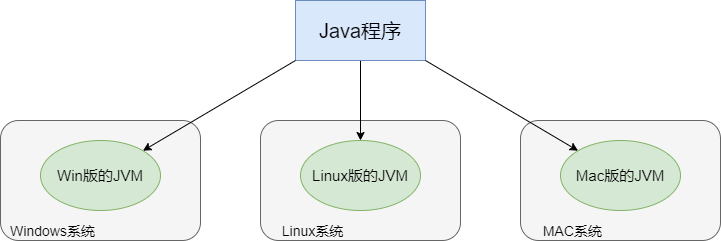
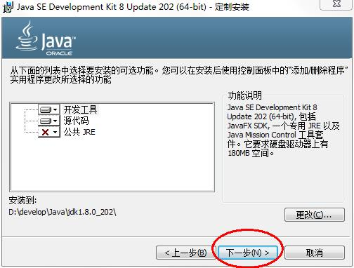
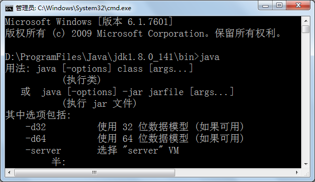

# JavaSE_第1章 Java概述

## 学习目标

* [ ] 理解Java语言的跨平台实现原理
* [ ] 理解JDK/JRE/JVM的组成和作用
* [ ] 能够配置环境变量，JAVA_HOME（会参照笔记配置）
* [ ] 能够编写HelloWorld程序编译并执行
* [ ] 会使用单行注释和多行注释

## 1.1 JavaSE课程体系介绍

JavaSE知识图解


JavaSE知识模块介绍

* **第一部分：计算机编程语言核心结构：**`数据类型`、`运算符`、`流程控制`、`数组`、…
* **第二部分：Java面向对象核心逻辑：**`类和对象`、`封装`、`继承`、`多态`、`抽象`、`接口`、…
* **第三部分：JavaSE核心高级应用：**`集合`、`I/O`、`多线程`、`网络编程`、`反射机制`、…
* **第四部分：Java新特性：**`Lambda表达式`、`函数式编程`、`新Date/Time API`、`接口的默认、静态和私有方法`、…
* 第五部分：MySQL/JDBC核心技术：`SQL语句`、`数据库连接池`、`DBUtils`、`事务管理`、`批处理`、…

## 1.2 计算机语言介绍(了解)

**计算机程序**（Computer program），也称为**软件**（software），简称程序（英语：Program），是指一组指示计算机或其他具有信息处理能力装置执行动作或做出判断的指令，通常用某种**计算机编程语言**编写，运行于某种目标计算机体系结构上。

**计算机语言是什么**

所谓计算机编程语言，即人与计算机交流的语言，人们可以使用编程语言对计算机下达命令，让计算机完成人们需要的功能。

**计算机语言发展**

* 第一代：机器语言
  * 指令以二进制形式存在 ： 1000100111011000
* 第二代：汇编语言
  * 使用助记符表示一条计算机指令： MOV  AX, BX
* 第三代：高级语言
  * 接近人类自然语言，使程序员更容易编写，更容易读懂。相反低级语言更接近底层，效率高，难于理解。
    * Java、C（接近汇编）、C++、Python等


**计算机语言排行榜**

TIOBE排行榜是根据互联网上有经验的程序员、课程和第三方厂商的数量，并使用搜索引擎（如Google、Bing、Yahoo!）以及Wikipedia、Amazon、YouTube和Baidu等统计出的排名数据。


**计算机语言走势**


## 1.3 Java语言概述(了解)

### 1.3.1 Java生态圈

**Java是目前应用最为广泛的软件开发平台之一。**随着Java以及Java社区的不断壮大，Java 也早已不再是简简单单的一门计算机语言了，它更是一个平台、一种文化、一个社区。

**作为一个平台，**Java虚拟机扮演着举足轻重的作用。除了 Java语言，任何一种能够被编译成字节码的计算机语言都属于Java这个平台。Groovy、Scala、 JRuby、Kotlin等都是Java平台的一部分，它们依赖于Java虚拟机，同时，Java平台也因为它们变得更加丰富多彩。

**作为一种文化，**Java几乎成为了 “开源”的代名词。在Java程序中，有着数不清的开源软件和框架。如Tomcat、Struts, Hibernate, Spring等。就连JDK和JVM自身也有不少开源的实现，如OpenJDK、Apache Harmony。可以说，“共享”的精神在Java世界里体现得淋漓尽致。

**作为一个社区，**Java拥有全世界最多的技术拥护者和开源社区支持，有数不清的论坛和资料。从桌面应用软件、嵌入式开发到企业级应用、后台服务器、中间件，都可以看到Java的身影。其应用形式之复杂、参与人数之众多也令人咋舌。可以说，Java社区已经俨然成为了一个良好而庞大的生态系统。**其实这才是Java最大的优势和财富。**

### 1.3.2 Java 是最好的语言吗？

不是，因为在每个领域都有更合适的编程语言。

- C 语言在现代计算机软件编程语言中具有非常重要的地位，几乎所有的操作系统都是 C 语言写成的。C++ 是面向对象的 C 语言，一直在不断的改进。C#由微软开发，以C为基础，面向对象，增加垃圾回收，更像Java。


- JavaScript 是能运行在浏览器中的语言，丰富的前端界面离不开 Javascript 的功劳。近年来的 Node.js 又在后端占有一席之地。
- Python 用于系统管理，并通过高性能预编译的库，提供 API 来进行科学计算，文本处理等，是 Linux 必选的解释性语言。
- Ruby 强于 DSL（领域特定语言），程序员可以定义丰富的语义来充分表达自己的思想。
- Erlang 就是为分布式计算设计的，能保证在大规模并发访问的情况下，保持强壮和稳定性。
- Go 语言内置了并发能力，可以编译成本地代码。当前新的网络相关项目，很大比例是由 Go 语言编写的，如 Docker、Kubernetes 等。
- 编写网页用 PHP，函数式编程有 Lisp，编写 iOS 程序有 Swift/Objective-C。
-  R的思想是：它可以提供一些集成的统计工具，但更大量的是它提供各种数学计算、统计计算的[函数](https://baike.baidu.com/item/函数/301912)，从而使使用者能灵活机动的进行数据分析，甚至创造出符合需要的新的统计计算方法 
-  SQL 是用于访问和处理数据库的标准的计算机语言，这类数据库包括：MySQL，Oracle, Sybase, SQL Server, DB2, Access 等等 


一句话概括，**能留在排行榜之上的语言，都是好的语言，在其所在的领域能做到最好。**

### **1.3.3 Java语言发展历史**

Java诞生于1995年，由SUN公司（Sun Microsystems）推出，09年SUN被Oracle（甲骨文）收购。


------


------


------

Java之父是詹姆斯.高斯林(James Gosling)。


**版本历史：**

|  发行版本  |  发行时间  |                          备注                          |
| :--------: | :--------: | :----------------------------------------------------: |
|    Java    | 1995.05.23 |  Sun公司在Sun world会议上正式发布Java和HotJava浏览器   |
|  Java 1.0  | 1996.01.23 |          Sun公司发布了Java的第一个开发工具包           |
|  Java 1.1  | 1997.02.19 |                                                        |
|  Java 1.2  | 1998.12.08 | 拆分成：J2SE（标准版）、J2EE（企业版）、J2ME（小型版） |
|  Java 1.3  | 2000.05.08 |                                                        |
|  Java1.4   | 2004.02.06 |                                                        |
|  Java 5.0  | 2004.09.30 | ①版本号从1.5改为5.0；②平台更名为JavaSE、JavaEE、JavaME |
|  Java 6.0  | 2006.12.11 |    2009.04.20 Oracle宣布收购SUN公司，收购价74亿美金    |
|   Java 7   | 2011.07.02 |                                                        |
| **Java 8** | 2014.03.18 |         5.0版本以来最大变化的版本，长期支持版          |
|   Java 9   | 2017.09.22 |  ①每半年更新一次；②Java 9开始不再支持windows 32位系统  |
|  Java 10   | 2018.03.21 |                                                        |
|  Java 11   | 2018.09.25 |         JDK安装包取消独立JRE安装包，长期支持版         |
|  Java 12   | 2019.03.19 |                                                        |
|  Java 13   | 2019.9.18  |                                                        |
| Java 14.0  | 2020.3.17  |                                                        |
| Java 15.0  |   2020.9   |                                                        |
|  Java16.0  |   2021.3   |                                                        |
|  Java17.0  |   2021.9   |                   最新的长期支持版本                   |
|    ...     |    ...     |                          ...                           |

### 1.3.4 Java技术体系平台

* **JavaSE**（Java Platform, Standard Edition标准版）：允许您在桌面和服务器上开发和部署Java应用程序。Java提供了丰富的用户界面、性能、多功能性、可移植性和当今应用程序所需的安全性。
* **JavaEE**（Java Platform, Enterprise Edition企业版）：是为开发企业环境下的应用程序提供的一套解决方案，主要针对于Web应用程序开发。
* JavaME（Java Platform, Micro Edition 小型版）：为互联网上的嵌入式和移动设备上运行的应用提供了一个健壮、灵活的环境：微控制器、传感器、网关、移动电话、个人数字助理（PDA）、电视机顶盒、打印机等等。JavaME包括灵活的用户界面、健壮的安全性、内置的网络协议，以及支持动态下载的网络和离线应用程序。基于JavaME的应用程序在许多设备上都是可移植的，但是利用了每个设备的本机功能。
  *  *Java Embedded: 用于解锁物联网的智能设备的价值：*
    *通过远程市场更新和刷新功能延长产品生命周期和价值；*
    *利用Java的可伸缩性、健壮性、可移植性和全套功能，提高生产效率，降低成本，缩短上市时间；*
    *在边缘启用快速数据功能；*
  *  *Java Card：使安全元件（如智能卡和其他防篡改安全芯片）能够承载采用Java技术的应用程序。Java card提供了一个安全的、可互操作的执行平台，它可以在一个资源受限的设备上存储和更新多个应用程序，同时保持最高的认证级别和与标准的兼容性。*
  *  *Java TV：是一种基于JavaME的技术，它为开发在tv和机顶盒设备上运行的java应用程序提供了一个性能良好、安全且易于实现的解决方案。使用Java TV运行时，开发人员可以轻松创建应用程序，例如电子节目指南（EPG）、视频点播（VOD）客户端、游戏和教育应用程序、用于访问Internet数据的应用程序（例如天气、新闻播报器、社交网络）以及大多数蓝光光盘标题上的用户界面和奖金内容。*

### 1.3.5  Java的主要应用领域

- **企业级应用** ：主要指复杂的大企业软件系统、各种类型网站后台系统。 Java的安全机制以及它的跨平台优势，使在分布式系统领域开发中有广泛应用。包括金融、电信、交通电子商务等。
- **大数据平台开发** ：各类框架有 Hadoop，spark ，storm，flink 等，就这类技术生态圈来讲，还有各种中间件如 flume ，kafka ，sqoop 等，这些框架以及工具大多数是用 Java 编写而成，但提供诸如 Java，scala ，Python，R等各种语言API供编程。
- **Android 移动平台应用** ：Android应用程序使Java语言编写。Android开发水平的高低很大程度上取决于 Java语言核心能力是否扎实 。

### 1.3.6  **Java语言的特点**

* **完全面向对象：**Java语言支持封装、继承、多态，面向对象编程，让程序更好达到**高内聚，低耦合**的标准。

* **支持分布式：**Java语言支持Internet应用的开发，在基本的Java应用编程接口中有一个网络应用编程接口（java net），它提供了用于网络应用编程的类库，包括URL、URLConnection、Socket、ServerSocket等。Java的RMI（远程方法激活）机制也是开发分布式应用的重要手段。

* **健壮型：**Java的强类型机制、异常处理 等是Java程序健壮性的重要保证。对指针的丢弃是Java的明智选择。

* **安全：**Java通常被用在网络环境中，为此，Java提供了一个安全机制以防恶意代码的攻击。如：安全防范机制（类ClassLoader），如分配不同的名字空间以防替代本地的同名类、字节代码检查。

* **跨平台性：**Java程序（后缀为java的文件）在Java平台上被编译为体系结构中立的字节码格式（后缀为class的文件），然后可以在实现这个Java平台的任何系统中运行。

## 1.4 Java语言跨平台原理

- **跨平台**：任何软件的运行，都必须要运行在操作系统之上，而我们用Java编写的软件可以运行在任何的操作系统上，这个特性称为**Java语言的跨平台特性**。该特性是由JVM实现的，我们编写的程序运行在JVM上，而JVM运行在操作系统上。
- **JVM**（Java Virtual Machine ）：Java虚拟机，简称JVM，是运行所有Java程序的虚拟计算机，是Java程序的运行环境之一，也是Java 最具吸引力的特性之一。我们编写的Java代码，都运行在**JVM** 之上。



如图所示，Java的虚拟机本身是不具备跨平台功能的，每个操作系统下都有不同版本的虚拟机。

- **JRE ** (Java Runtime Environment) ：是Java程序的运行时环境，包含`JVM` 和运行时所需要的`核心类库`。
- **JDK**  (Java Development Kit)：是Java程序开发工具包，包含`JRE` 和开发人员使用的工具。

我们想要运行一个已有的Java程序，那么只需安装`JRE` 即可。

我们想要开发一个全新的Java程序，那么必须安装`JDK` ，其内部包含`JRE`。


**JDK、JRE与JVM之间的关系**


## 1.5 搭建开发环境

### 1.5.1下载JDK8

1. 打开官网地址：www.oracle.com 

2. 找到下载页面：

   - 登录Oracle公司官网，www.oracle.com，如图所示：在顶部点击Developer开发者，然后再选择点击[Developer Resource Center](https://developer.oracle.com/)

     

   - 在页面中间的技术分类部分，选择`Java`，单击进入，如图所示：

     

   - 下拉页面，找到**Java SE Technologies**，在此选择`Download Oracle JDK`，单击进入，如图所示：

     

   - 进入页面后，顶部默认是最新版的Java15下载，在此处选择`JDK Download`，单击进入可以下载JDK15，如图所示：

     

   - 选择对应的操作系统类型，点击进行下载，如图所示

     

   - 勾选接收协议，点击正式开始下载，如图所示

     

- **如何下载之前JDK版本？**

  - 回到刚才看到最新版JDK15的页面，下拉到最下面，找到[Java Archive ](https://www.oracle.com/java/technologies/oracle-java-archive-downloads.html)（Java档案馆）点击进入，如图所示

    

  - 选择不同历史版本，点击下载

    

  - 例如：这里选择JavaSE 8(8U202 and earlier)，再选择小版本号，并选择对应的操作系统类型，即可下载。早期版本分为32位/64位操作系统区分，其中x86表示32位，x64表示64位。

    

### 1.5.2 JDK8的安装

- 安装步骤：

  - 双击`jdk-8u202-windows-x64.exe`文件，并单击`下一步`，如图所示：

    

  - 取消独立JRE的安装，单击`公共JRE前的下拉列表`，选择`此功能将不可用`如图所示：

    

  - 修改安装路径，单击更改，如图所示：

    

  - 将安装路径修改为`D:\develop\Java\jdk1.8.0_202\`，并单击确定，如图所示：

    

  - 单击下一步，如图所示：

    

  - 稍后几秒，安装完成，如图所示：

    

  - 目录结构，如图所示：

    

## 三、 配置环境变量

为什么配置path？

希望在命令行使用javac.exe等工具时，任意目录下都可以找到这个工具所在的目录。

例如：我们在C:\Users\Irene目录下使用java命令，结果如下：


我们在JDK的安装目录的bin目录下使用java命令，结果如下：



我们不可能每次使用java.exe，javac.exe等工具的时候都进入到JDK的安装目录下，太麻烦了。我们希望在任意目录下都可以使用JDK的bin目录的开发工具，因此我们需要告诉操作系统去哪里找这些开发工具，这就需要配置path环境变量。

### 1.只配置path

- 步骤：

  - 打开桌面上的计算机，进入后在左侧找到`计算机`，单击鼠标`右键`，选择`属性`，如图所示：

    

  - 选择`高级系统设置`，如图所示：

    

  - 在`高级`选项卡，单击`环境变量`，如图所示：

    

  - 在`系统变量`中，选中`Path` 环境变量，`双击`或者`点击编辑` ,如图所示：

    

  - 在变量值的最前面，键入`D:\develop\Java\jdk1.8.0_202\bin;`  分号必须要写，而且还要是**英文符号**。如图所示：

    

  - 环境变量配置完成，**重新开启**DOS命令行，在任意目录下输入`javac` 命令，运行成功。

    

### 2. 配置JAVA_HOME+path

- 步骤：

  - 打开桌面上的计算机，进入后在左侧找到`计算机`，单击鼠标`右键`，选择`属性`，如图所示：

    

  - 选择`高级系统设置`，如图所示：

    

  - 在`高级`选项卡，单击`环境变量`，如图所示：

    

  - 在`系统变量`中，单击`新建` ，创建新的环境变量，如图所示：

    

  - 变量名输入`JAVA_HOME`，变量值输入 `D:\develop\Java\jdk1.8.0_202` ，并单击`确定`，如图所示：

    

  - 选中`Path` 环境变量，`双击`或者`点击编辑` ,如图所示：

    

  - 在变量值的最前面，键入`%JAVA_HOME%\bin;`  分号必须要写，而且还要是**英文符号**。如图所示：

    

  - 环境变量配置完成，**重新开启**DOS命令行，在任意目录下输入`javac` 命令，运行成功。

    

## 1.6  入门程序

### 1.6.1 Java程序开发三步骤

1. **编写：**编写源代码，即编写java代码，保存为.java文件
2. **编译：**执行javac命令，把java源文件编译生成.class字节码文件
3. **运行：**执行java命令，运行生成的.class文件，得到程序结果


### 1.6.2 编写HelloWorld入门程序

1. #### 编写Java源程序


   ​	1)打开最简单文本编辑器：记事本，键入以下java代码（全英文字符，区分大小写）：

   ```java
   public class Hello{
     	public static void main(String[] args) {
         	System.out.println("Hello World");
     	}
   }
   ```

   ​	2)保存文件路径为`D:\` ，保存的完整的文件名修改为`Hello.java`（注意确认系统中文件有没有默认隐藏后缀）。

2. #### 编译Java源文件


   在CMD命令行中，**进入**`D:\`**目录**，使用`javac` 命令编译源文件。

   

   命令行没有任何提示，表示编译成功。

   成功后再`D:\`目录，产生了一个新的文件 `Hello.class`，该文件就是可以运行的**字节码文件**

3. ####  运行Java程序


   在CMD命令行中，**进入Java源文件的目录**`D:\`，使用`java` 命令进行运行。

   

   > tips：java Hello  不要写 不要写 不要写 .class

### 1.6.3 程序简单说明

-  **Java程序的结构：**

  ```java
  类{
      方法{
          语句;
      }
  }
  ```

  *注意：1.类{}是一个可执行程序的最小单元。2.括号都是成对出现的。*

-  **Java程序的入口：**

  Java程序执行需要有个起始点或入口，即**main方法**

  ```java
  public static void main(String[] args){   
  }
  ```

  *注意：如果拼写错误会导致**找不到主方法***

- **输出语句：**

  如果想要跟计算机来个互动，比如让他输出一句话：

  ```java
  System.out.println("Hello World");
  ```

  此行代码表示，在控制台打印输出一句话，即双引号内部的内容，可以自己尝试修改看看。

## 1.7  常见问题及解决

### 1. 代码拼写错误

* 	单词拼写问题，Java语言是一门严格区分大小写的语言
   * 正确：class		错误：Class
   * 正确：String       错误：string
   * 正确：System     错误：system
   * 正确：main		 错误：mian
* 	标点符号使用问题
   * 不能用中文符号，英文半角的标点符号（正确）
   * 括号问题，要成对出现

### 2. 源文件名问题

源文件名有问题会导致编译时**找不到文件**

可能的原因：

- 文件路径错误
- 文件名拼写错误
- 文件名后缀不是.java
- 类名声明为public时，必须要与文件名相同

> （1）源文件名是否必须与类名一致？public呢？
>
> ```java
> 如果这个类不是public，那么源文件名可以和类名不一致。但是不便于代码维护。
> 如果这个类是public，那么要求源文件名必须与类名一致。否则编译报错。
> 我们建议大家，不管是否是public，都与源文件名保持一致，而且一个源文件尽量只写一个类，目的是为了好维护。
> ```
>
> （2）一个源文件中是否可以有多个类？public呢？
>
> ```java
> 一个源文件中可以有多个类，编译后会生成多个.class字节码文件。
> 但是一个源文件只能有一个public的类。
> ```
>
> （3）main方法必须在public的类中吗？
>
> ```java
> 不是。
> 但是后面写代码时，基本上main方法（主方法）习惯上都在public类中。
> ```
>

### 3.字符编码问题

当cmd命令行窗口的字符编码与.java源文件的字符编码不一致（cmd命令行窗口默认GBK，nopad默认utf-8），如何解决？


解决方案一：

	在Notepad++等编辑器中，修改源文件的字符编码


解决方案二：

	在使用javac命令式，可以指定源文件的字符编码

```cmd
javac -encoding utf-8 Review01.java
```

### **练习**

在控制台输出个人信息：

姓名：张三

年龄：18

性别：男

爱好：女

简介······

