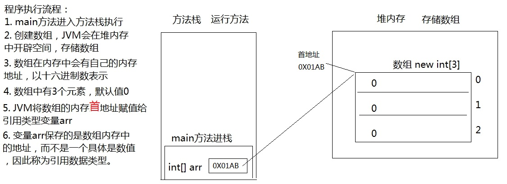
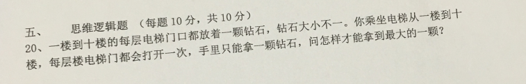
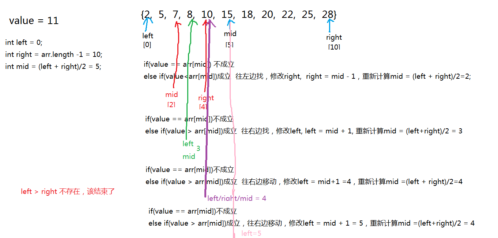
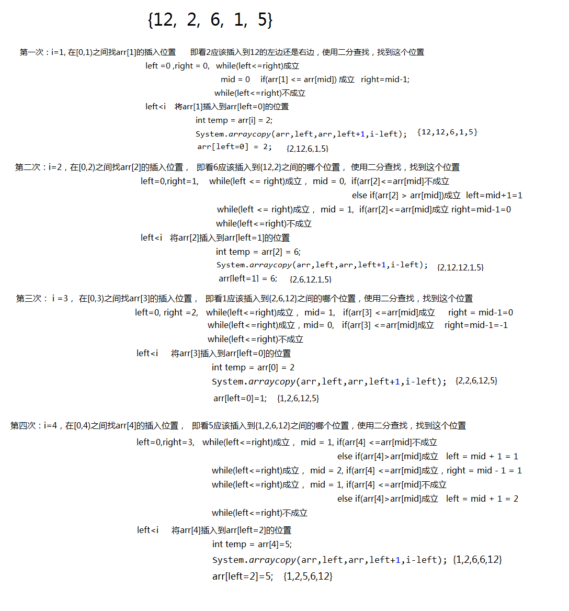
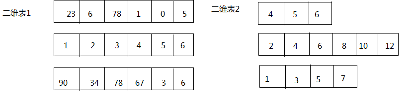
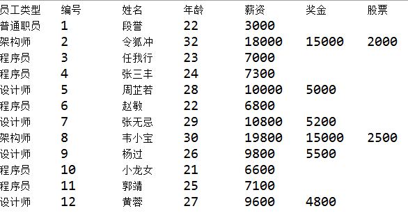

# JavaSE_第4章 数组

## 学习目标

- [ ] 理解数组的概念
- [ ] 掌握数组的声明和初始化
- [ ] 使用索引访问数组的元素
- [ ] 了解数组的内存图解
- [ ] 避免空指针和越界异常
- [ ] 掌握数组的遍历
- [ ] 掌握数组元素的统计
- [ ] 掌握数组最大值的获取
- [ ] 掌握数组元素的查找
- [ ] 掌握数组的冒泡排序

## 4.1数组概述

1. **数组的概念：**

   - **数组(array)，就是多个相同类型的数据按一定顺序排列的集合，并使用一个名字命名，然后用编号区分这些数据。**
   - 数组就是一个数据容器。

2. **相关概念：**

   - **数组名**
   - **下标（或脚标、索引）**(index)
   - **元素**(element)
   - **数组的长度**(length)

   

3. **数组的特点：**

   - 数组的长度一旦确定就不能修改（重要）
   - 存储的元素为相同的数据类型，可以是基本数据类型或引用数据类型
   - 有索引，创建数组时会在内存中开辟一整块连续的空间。
   - 存取元素的速度快，因为可以通过[下标]，直接定位到任意一个元素。

## 4.2 数组的声明与初始化

数组在使用之前需要先进行声明并初始化

### 4.2.1 数组的声明

数组的声明，即声明一个数组类型的变量。

```java
//推荐
元素的数据类型[] 数组的名称;
int[] age;
//不推荐
元素的数据类型  数组名[];
int age[];
```

### 4.2.2 数组的初始化

数组使用之前需要先初始化，什么是数组初始化？就是给数组分配内存空间，并给元素赋值。

数组有两种初始化方式：

1. **方式一：动态初始化**

   动态初始化就是先确定元素的个数（即数组的长度），而元素此时只是默认值，并不是真正的数据。元素真正的数据需要后续单独一个一个赋值。

   格式：

   ```java
    数组存储的元素的数据类型[] 数组名字 = new 数组存储的元素的数据类型[长度];
   
     或
   
    数组存储的数据类型[] 数组名字;
    数组名字 = new 数组存储的数据类型[长度];
   ```

   new：关键字，创建数组使用的关键字。因为数组本身是引用数据类型，所以要用new创建数组对象。

   [长度]：数组的长度，表示数组容器中可以存储多少个元素。

   注意：数组有定长特性，长度一旦指定，不可更改。

   例如，定义可以存储5个整数的数组容器，代码如下：

   ```java
   int[] arr = new int[5];
   
   int[] arr;
   arr = new int[5];
   ```

2. **方式二：静态初始化**

   定义数组的同时为数组分配内存空间，并赋值。程序员只给定数组元素的初始值，不指定数组长度，由系统决定数组的长度

   格式：

   ```java
   数据类型[] 数组名 = new 数据类型[]{元素1,元素2,元素3...};
   或
   数据类型[] 数组名;
   数组名 = new 数据类型[]{元素1,元素2,元素3...};
   
   简化方式：
   数据类型[] 数组名 = {元素1,元素2,元素3...};//必须在一个语句中完成，不能分开两个语句写
   ```

   例如：定义存储1，2，3，4，5整数的数组容器。

   ```java
   int[] arr = new int[]{1,2,3,4,5};//正确
   
   int[] arr;
   arr = new int[]{1,2,3,4,5};//正确
   
   int[] arr = new int[5]{1,2,3,4,5};//错误的，后面有{}指定元素列表，就不需要在[长度]指定长度。
   
   //简化方式：
   int[] arr = {1,2,3,4,5};//正确
   
   int[] arr;
   arr = {1,2,3,4,5};//错误
   ```

数据类型： 指定创建的数组容器可以存储什么数据类型的数据。

- [] : 表示数组。
- 数组名字：为定义的数组起个变量名，满足标识符规范，可以使用名字操作数组。
- new：关键字，理解为开辟内存空间。因为数组本身是引用数据类型，所以要用new创建数组对象。
- [长度]：数组的长度，表示数组容器中可以存储多少个元素。
  - **注意：数组有定长特性，长度一旦指定，不可更改。**
  - 和水杯道理相同，买了一个2升的水杯，总容量就是2升，不能多也不能少。

## 4.3 数组元素的访问

- **索引：** 每一个存储到数组的元素，都会自动的拥有一个编号，从0开始，这个自动编号称为**数组索引(index)**，可以通过数组的索引访问到数组中的元素。

- **索引范围：**[0, 数组的长度-1]

- **格式：**

  ```java
  数组名[索引]
  ```


- **访问数组元素：**

  - 数组名[索引]，表示指定索引位置的元素

  - 数组名[索引]=值，表示为数组中指定索引位置的元素赋值

    ```java
    public static void main(String[] args) {
        //定义存储int类型数组，赋值元素1，2，3，4，5
        int[] arr = {1,2,3,4,5};
        //为0索引元素赋值为6
        arr[0] = 6;
        //获取数组0索引上的元素
        int i = arr[0];
        System.out.println(i);
        //直接输出数组0索引元素
        System.out.println(arr[0]);
    }
    ```


## 4.4 数组的遍历

* **数组遍历：** 就是将数组中的每个元素分别获取出来，就是遍历。遍历也是数组操作中的基石。

* **数组的长度属性：** 每个数组都具有长度，而且是固定的，Java中赋予了数组的一个属性，可以获取到数组的长度，语句为：`数组名.length` ，属性length的执行结果是数组的长度，int类型结果。由次可以推断出，数组的最大索引值为`数组名.length-1`。

  ```java
  public static void main(String[] args) {
      int[] arr = {11, 22, 33, 44, 55};
      //打印输出数组的长度
      System.out.println("数组长度："+arr.length);//5
      //数组遍历（正序）：
      System.out.println("数组遍历：");
      for (int i = 0; i < arr.length; i++) {
          System.out.println(arr[i]);
      }
      //数组遍历（逆序）：
      System.out.println("数组逆序遍历：");
      for (int i = arr.length-1; i >=0 ; i--) {
          System.out.println(arr[i]);
      }
  }
  ```


## 4.5 数组元素的默认值

当我们使用动态初始化创建数组时：

```java
数据类型[] 数组名字 = new 数据类型[长度];
```

此时只确定了数组的长度，那么数组的元素是什么值呢？

数组的元素有默认值：


## 4.6 数组内存图

### 4.6.1 内存概述

内存是计算机中重要的部件之一，它是与CPU进行沟通的桥梁。其作用是用于暂时存放CPU中的运算数据，以及与硬盘等外部存储器交换的数据。只要计算机在运行中，CPU就会把需要运算的数据调到内存中进行运算，当运算完成后CPU再将结果传送出来。我们编写的程序是存放在硬盘中的，在硬盘中的程序是不会运行的，必须放进内存中才能运行，运行完毕后会清空内存。

Java虚拟机要运行程序，必须要对内存进行空间的分配和管理。

### 4.6.2 Java虚拟机的内存划分

为了提高运算效率，就对空间进行了不同区域的划分，因为每一片区域都有特定的处理数据方式和内存管理方式。


| 区域名称   | 作用                                                      |
| ----------| ---------------------------------------------------------|
| 程序计数器 | 程序计数器是CPU中的寄存器，它包含每一个线程下一条要执行的指令的地址 |
| 本地方法栈 | 当程序中调用了native的本地方法时，本地方法执行期间的内存区域 |
| 方法区     | 存储已被虚拟机加载的类信息、常量、静态变量、即时编译器编译后的代码等数据。 |
| 堆内存     | 存储对象（包括数组对象），new来创建的，都存储在堆内存。      |
| 虚拟机栈   | 用于存储正在执行的每个Java方法的局部变量表等。<br />局部变量表存放了编译期可知长度的各种基本数据类型、对象引用，方法执行完，自动释放。 |

### 4.6.3 数组内存图分析

**（1）一个数组内存图**

```java
public static void main(String[] args) {
  	int[] arr = new int[3];
  	System.out.println(arr);//[I@5f150435
}
```



> 思考：打印arr为什么是[I@5f150435，它是数组的地址吗？
>
> 答：它不是数组的地址。
>
> 问？不是说arr中存储的是数组对象的首地址吗？
>
> 答：arr中存储的是数组的首地址，但是因为数组是引用数据类型，打印arr时，会自动调用arr数组对象的toString()方法，默认该方法实现的是对象类型名@该对象的hashCode()值的十六进制值。
>
> 问？对象的hashCode值是否就是对象内存地址？
>
> 答：不一定，因为这个和不同品牌的JVM产品的具体实现有关。例如：Oracle的OpenJDK中给出了5种实现，其中有一种是直接返回对象的内存地址，但是OpenJDK默认没有选择这种方式。

**（2）两个数组内存图**

```java
public static void main(String[] args) {
    int[] arr = new int[3];
    int[] arr2 = new int[2];
    System.out.println(arr);
    System.out.println(arr2);
}
```


**（3）两个变量指向一个数组**

```java
public static void main(String[] args) {
    // 定义数组，存储3个元素
    int[] arr = new int[3];
    //数组索引进行赋值
    arr[0] = 5;
    arr[1] = 6;
    arr[2] = 7;
    //输出3个索引上的元素值
    System.out.println(arr[0]);
    System.out.println(arr[1]);
    System.out.println(arr[2]);
    //定义数组变量arr2，将arr的地址赋值给arr2
    int[] arr2 = arr;
    arr2[1] = 9;
    System.out.println(arr[1]);
}
```


##  数组的练习题

1. 练习1：用一个数组存储26个小写英文字母，并遍历显示，显示要求如：a->A

2. 练习2：用一个数组存储本组学员的年龄，从键盘输入，并遍历显示

3. 练习3：用一个数组存储本组学员的姓名，从键盘输入，并遍历显示

4. 练习4：用数组存储一个星期的7个英文单词，然后从键盘输入星期的值[1-7]，输出对应的英文单词

5. 练习5：用数组存储平年每一个月的总天数，从键盘输入年，月，日，输出这一天是这一年的第几天

   ​	提示：闰年（1）能被4整除不能被100整除（2）或能被400整除的年份

6. 练习6：从1990年1月1日开始，三天打鱼两天晒网，问某年某月某日是打鱼还是晒网

7. 画内存图

   - （1）

     ```java
     int[] arr1 = {1,2,3,4,5};
     ```

   - （2）画出当i=3的内存图

     ```java
     int[] arr2 = new int[5];
     for(int i=0; i<arr2.length; i++){
     	arr[i] = i+1;
     }
     ```

## 4.7 数组的基础算法

### 4.7.1 统计

求数组元素的总和、均值、统计偶数个数等

思路：遍历数组，挨个的累加，判断每一个元素

示例代码：

```java
int[] arr = {4,5,6,1,9};
//求总和、均值
int sum = 0;//因为0加上任何数都不影响结果
for(int i=0; i<arr.length; i++){
    sum += arr[i];
}
//均值
double avg = (double)sum/arr.length;
```

示例代码2：

```java
int[] arr = {4,5,6,1,9};

//求总乘积
long result = 1;//因为1乘以任何数都不影响结果
for(int i=0; i<arr.length; i++){
    result *= arr[i];
}
```

示例代码3：

```java
int[] arr = {4,5,6,1,9};
//统计偶数个数
int even = 0;
for(int i=0; i<arr.length; i++){
    if(arr[i]%2==0){
        even++;
    }
}
```

### 4.7.2  查找指定元素

查找某个指定元素在数组中的首次出现的位置（索引）

常见查找算法有**顺序查找**，**二分查找**（折半查找，前提要求数组中元素是按照大小顺序排序的）

顺序查找示例代码：

```java
//查找value第一次在数组中出现的index
public static void main(String[] args){
    int[] arr = {4,5,6,1,9};
    int value = 1;
    int index = -1;

    for(int i=0; i<arr.length; i++){
        if(arr[i] == value){
            index = i;
            break;
        }
    }

    if(index==-1){
        System.out.println(value + "不存在");
    }else{
        System.out.println(value + "的下标是" + index);
    }
}
```

### 4.7.3 查找最值及其位置



1. **查找出数组中元素的最大值或最小值**

   思路：

   （1）先假设第一个元素为最大/最小，用max/min变量表示最大/小值，

   （2）然后用max/min与后面的每个元素一一比较

   示例代码：

   ```java
   int[] arr = {4,5,6,1,9};
   //找最大值
   int max = arr[0];
   for(int i=1; i<arr.length; i++){
       if(arr[i] > max){
           max = arr[i];
       }
   }
   ```

2. **查找最值及其第一次出现的下标**

   思路：

   （1）先假设第一个元素最大/最小，用变量index表示其位置，

   （2）然后用index位置的元素与后面的元素一一比较

   （3）用变量index时刻记录目前比对的最大/小的下标

   示例代码：

   ```java
   //求最大值及其位置
   int[] arr = {4, 5, 6, 1, 9};
   int maxIndex=0;//假定索引0位置的元素最大
   for (int i = 1; i < arr.length; i++) {
       if(arr[i]>arr[maxIndex]){
           maxIndex=i;
       }
   }
   System.out.println("最大值：" + arr[maxIndex]);
   ```

3. **查找找最值及其所有下标位置（最大值重复）**

   思路：

   （1）先找到最大值

   （2）遍历数组，看哪些元素和最大值是一样的

   示例代码：

   ```java
   int[] arr = {4,9,5,6,1,9};
   //找最大值
   int max = arr[0];
   for(int i=1; i<arr.length; i++){
       if(arr[i] > max){
           max = arr[i];
       }
   }
   
   //遍历数组，看哪些元素和最大值是一样的
   for(int i=0; i<arr.length; i++){
       if(max == arr[i]){
           System.out.print(i+"\t");
       }
   }
   ```


### 4.7.5 排序之冒泡排序

**排序：把数组中元素按照从小到大（升序）或者从大到小（降序）顺序进行重新排列**

Java中的经典算法之冒泡排序（Bubble Sort）

原理：比较两个相邻的元素，将值大的元素交换至右端，最大值出现在最后位置。

思路：

​			依次比较相邻的两个数，将小数放到前面，大数放到后面。

​			即第一趟，首先比较第1个和第2个元素，将小数放到前面，大数放到后面。

​			然后比较第2个和第3个元素，将小数放到前面，大数放到后面。

​			如此继续，直到比较最后两个数，将小数放到前面，大数放到后面。

​			重复第一趟步骤，直至全部排序完成。

```java
例如：冒泡：从小到大，从左到右两两比较
/*
{6,3,8,2,9,1}
	第一轮：
	第1次：arr[0]与arr[1]比较，6>3成立，就交换，{3,6,8,2,9,1}
	第2次：arr[1]与arr[2]比较，6>8不成立，不交换{3,6,8,2,9,1}
	第3次：arr[2]与arr[3]比较，8>2成立，就交换，{3,6,2,8,9,1}
	第4次：arr[3]与arr[4]比较，8>9不成立，不交换{3,6,2,8,9,1}
	第5次：arr[4]与arr[5]比较，9>1成立，就交换，{3,6,2,8,1,9}
	
	第一轮结果：{3,6,2,8,1,9}   9已经到达正确位置，下一轮不用在参与

	第二轮：
	第1次：arr[0]与arr[1]比较，3>6不成立，不交换{3,6,2,8,1,9}
	第2次：arr[1]与arr[2]比较，6>2成立，就交换，{3,2,6,8,1,9}
	第3次：arr[2]与arr[3]比较，6>8不成立，不交换{3,2,6,8,1,9}
	第4次：arr[3]与arr[4]比较，8>1成立，就交换，{3,2,6,1,8,9}
	
	第二轮结果：{3,2,6,1,8,9}   8已经到达正确位置，下一轮不用在参与
	
	第三轮：
	第1次：arr[0]与arr[1]比较，3>2成立，就交换，{2,3,6,1,8,9}
	第2次：arr[1]与arr[2]比较，3>6不成立，不交换{2,3,6,1,8,9}
	第3次：arr[2]与arr[3]比较，6>1成立，就交换，{2,3,1,6,8,9}
	
	第三轮结果：{2,3,1,6,8,9}   6已经到达正确位置，下一轮不用在参与
	
	第四轮：
	第1次：arr[0]与arr[1]比较，2>3不成立，不交换{2,3,1,6,8,9} 
	第2次：arr[1]与arr[2]比较，3>1成立，就交换，{2,1,3,6,8,9} 
	
	第四轮结果：{2,1,3,6,8,9}    3已经到达正确位置，下一轮不用在参与
	
	第五轮
	第1次：arr[0]与arr[1]比较，2>1成立，就交换，{1,2,3,6,8,9}
	
	第五轮结果：{1,2,3,6,8,9}   2已经到达正确位置，下一轮不用在参与
	
	剩下1，肯定是最小的了，不用比较了
	
	6个元素，比较了5轮， n个元素需要n-1轮
	每一轮比较很多次
*/
```

示例代码：

```java
	public static void main(String[] args){
		int[] arr = {6,3,8,2,9,1};  //arr.length = 6
		
		//i=1,2,3,4,5  一共5轮
		for(int i=1; i<arr.length; i++){//轮数
			/*
			i=1，第1轮，j=0,1,2,3,4   arr[j]与arr[j+1]
			i=2，第2轮，j=0,1,2,3     arr[j]与arr[j+1]
			i=3，第3轮，j=0,1,2       arr[j]与arr[j+1]
			i=4，第4轮，j=0,1         arr[j]与arr[j+1]
			i=5，第5轮，j=0           arr[j]与arr[j+1]
			
			j=0, j<=arr.length-1-i
			*/
			for(int j=0; j<=arr.length-1-i; j++){
				if(arr[j] > arr[j+1]){
                    //交换位置
					int temp = arr[j];
					arr[j] = arr[j+1];
					arr[j+1] = temp;
				}
			}
		}
		
		//结果
		for(int i=0; i<arr.length; i++){
			System.out.print(arr[i] + " ");
		}
	}
```

## 4.8 数组工具类

java.util.Arrays数组工具类，提供了很多静态方法来对数组进行操作，而且如下每一个方法都有各种重载形式，以下只列出int[]类型的，其他类型的数组类推：

- static int binarySearch(int[] a, int key) ：要求数组有序，在数组中查找key是否存在，如果存在返回第一次找到的下标，不存在返回负数
- static int[] copyOf(int[] original, int newLength)  ：根据original原数组复制一个长度为newLength的新数组，并返回新数组
- static int[] copyOfRange(int[] original, int from, int to) ：复制original原数组的[from,to)构成新数组，并返回新数组
- static boolean equals(int[] a, int[] a2) ：比较两个数组的长度、元素是否完全相同
- static void fill(int[] a, int val) ：用val填充整个a数组
- static void fill(int[] a, int fromIndex, int toIndex, int val)：将a数组[fromIndex,toIndex)部分填充为val 
- static void sort(int[] a) ：将a数组按照从小到大进行排序
- static void sort(int[] a, int fromIndex, int toIndex) ：将a数组的[fromIndex, toIndex)部分按照升序排列
- static String toString(int[] a) ：把a数组的元素，拼接为一个字符串，形式为：[元素1，元素2，元素3。。。]

示例代码：

```java
import java.util.Arrays;
import java.util.Random;

public class Test{
    public static void main(String[] args){
    	int[] arr = new int[5];
        // 打印数组,输出地址值
  		System.out.println(arr); // [I@2ac1fdc4
  		// 数组内容转为字符串
    	System.out.println("arr数组初始状态："+ Arrays.toString(arr));
    	
    	Arrays.fill(arr, 3);
    	System.out.println("arr数组现在状态："+ Arrays.toString(arr));
    	
    	Random rand = new Random();
    	for (int i = 0; i < arr.length; i++) {
			arr[i] = rand.nextInt(100);//赋值为100以内的随机整数
		}
    	System.out.println("arr数组现在状态："+ Arrays.toString(arr));
    	
    	int[] arr2 = Arrays.copyOf(arr, 10);
    	System.out.println("新数组：" + Arrays.toString(arr2));
    	
    	System.out.println("两个数组的比较结果：" + Arrays.equals(arr, arr2));
    	
    	Arrays.sort(arr);
    	System.out.println("arr数组现在状态："+ Arrays.toString(arr));
    }
}
```

## 4.9 数组的算法升华

### 4.9.1 数组的反转

方法有两种：

1、借助一个新数组

2、首尾对应位置交换

第一种方式示例代码：


```java
int[] arr = {1,2,3,4,5,6,7,8,9};

//(1)先创建一个新数组
int[] newArr = new int[arr.length];

//(2)复制元素
int len = arr.length;
for(int i=0; i<newArr.length; i++){
    newArr[i] = arr[len -1 - i];
}

//(3)舍弃旧的，让arr指向新数组
arr = newArr;//这里把新数组的首地址赋值给了arr

//(4)遍历显示
for(int i=0; i<arr.length; i++){
    System.out.println(arr[i]);
}

```

> 缺点：需要借助一个数组，浪费额外空间，原数组需要垃圾回收

第二种方式示例代码：

**实现思想：**数组对称位置的元素互换。


```java
int[] arr = {1,2,3,4,5,6,7,8,9};

//(1)计算要交换的次数：  次数 = arr.length/2
//(2)首尾对称位置交换
for(int i=0; i<arr.length/2; i++){//循环的次数就是交换的次数
    int temp = arr[i];
    arr[i] = arr[arr.length-1-i];
	arr[arr.length-1-i] = temp;
}

//（3）遍历显示
for(int i=0; i<arr.length; i++){
    System.out.println(arr[i]);
}
```

或


```java
	public static void main(String[] args){
		int[] arr = {1,2,3,4,5,6,7,8,9};

		//左右对称位置交换
		for(int left=0,right=arr.length-1; left<right; left++,right--){
		    //首  与  尾交换
		    int temp = arr[left];
		    arr[left] = arr[right];
			arr[right] = temp;
		}

		//（3）遍历显示
		for(int i=0; i<arr.length; i++){
		    System.out.println(arr[i]);
		}
	}
```

### 4.9.2 数组的扩容

示例：当原来的数组长度不够了需要扩容，例如需要新增位置来存储10

```java
int[] arr = {1,2,3,4,5,6,7,8,9};

//如果要把arr数组扩容，增加1个位置
//(1)先创建一个新数组，它的长度 = 旧数组的长度+1，或者也可以扩大为原来数组长度的1.5倍，2倍等
int[] newArr = new int[arr.length + 1];

//(2)复制元素
//注意：i<arr.length   因位arr比newArr短，避免下标越界
for(int i=0; i<arr.length; i++){
    newArr[i] = arr[i];
}

//(3)把新元素添加到newArr的最后
newArr[newArr.length-1] = 10;

//(4)如果下面继续使用arr，可以让arr指向新数组
arr = newArr;

//(4)遍历显示
for(int i=0; i<arr.length; i++){
    System.out.println(arr[i]);
}
```

> （1）至于新数组的长度定义多少合适，看实际情况，如果新增的元素个数确定，那么可以增加指定长度，如果新增元素个数不确定，那么可以扩容为原来的1.5倍、2倍等
>
> （2）数组扩容太多会造成浪费，太少会导致频繁扩容，效率低下

### 4.9.3 数组元素的插入

示例：在原数组的某个[index]插入一个元素

```java
//在索引index位置插入一个整数5
int index=1;
int[] arr={1,2,3,4};
//创建新数组扩容
int[] newArr=new int[5];
//复制数组
for (int i = 0; i < arr.length; i++) {
    newArr[i]=arr[i];
}
//向后移动插入位置之后的每个元素
for (int i = newArr.length - 1; i >= 0; i--) {
    if(i>index){
        newArr[i]=newArr[i-1];
    }
}
//插入新元素
newArr[index]=5;
arr=newArr;
//遍历显示
for(int i=0; i<arr.length; i++){
    System.out.println(arr[i]);
}
```

情形一：原数组未满（暂）

```java
String[] arr = new String[5];
arr[0]="张三";
arr[1]="李四";
arr[2]="王五";

那么目前数组的长度是5，而数组的实际元素个数是3，如果此时需要在“张三”和“李四”之间插入一个“赵六”，即在[index=1]的位置插入“赵六”，需要怎么做呢？
```

```java
String[] arr = new String[5];
arr[0]="张三";
arr[1]="李四";
arr[2]="王五";

//（1）移动2个元素，需要移动的起始元素下标是[1]，它需要移动到[2]，一共一共2个
System.arraycopy(arr,1,arr,2,2);
//（2）插入新元素
arr[1]="赵六";

//(3)遍历显示
for(int i=0; i<arr.length; i++){
    System.out.println(arr[i]);
}
```

情形二：原数组已满（暂）

```java
String[] arr = new String[3];
arr[0]="张三";
arr[1]="李四";
arr[2]="王五";

那么目前数组的长度是3，而数组的实际元素个数是3，如果此时需要在“张三”和“李四”之间插入一个“赵六”，即在[index=1]的位置插入“赵六”，需要怎么做呢？
```

```java
String[] arr = new String[3];
arr[0]="张三";
arr[1]="李四";
arr[2]="王五";

//（1）先扩容
String[] newArr = new String[4];
for(int i=0; i<arr.length; i++){
	newArr[i] = arr[i];
}
arr=newArr;

//（2）移动2个元素，需要移动的起始元素下标是[1]，它需要移动到[2]，一共2个
System.arraycopy(arr,1,arr,2,2);
//（3）插入新元素
arr[1]="赵六";

//(4)遍历显示
for(int i=0; i<arr.length; i++){
    System.out.println(arr[i]);
}
```

### 4.9.4 数组元素的删除

```java
//删除索引1位置的元素
int[] arr={1,2,3,4,5};
//把删除位置之后的每个元素向前移动
for (int i = 0; i < arr.length-1; i++) {
    if(i>=1){
        arr[i]=arr[i+1];
    }
}
//根据实际业务需求，把最后位置的元素修改为某个值
arr[arr.length-1]=0;
//遍历显示
for(int i=0; i<arr.length; i++){
    System.out.println(arr[i]);
}
```

示例：

```java
String[] arr = new String[3];
arr[0]="张三";
arr[1]="李四";
arr[2]="王五";

现在需要删除“李四”，我们又不希望数组中间空着元素，该如何处理呢？
```

```java
String[] arr = new String[3];
arr[0]="张三";
arr[1]="李四";
arr[2]="王五";

//（1）移动元素，需要移动元素的起始下标[2]，该元素需要移动到[1]，一共需要移动1个元素
System.arraycopy(arr,2,arr,1,1);

//（2）因为数组元素整体往左移动，这里本质上是复制，原来最后一个元素需要置空
arr[2]=null;//使得垃圾回收尽快回收对应对象的内存
```

### 4.9.5 数组的二分查找

二分查找：折半查找，前提条件是有序的数组

要求：要求数组元素必须支持比较大小，并且数组中的元素已经按大小排好序

示例：

```java
class Exam2{
    public static void main(String[] args){
        int[] arr = {2,5,7,8,10,15,18,20,22,25,28};//数组是有序的	
        //二分查找
        int num = 18;//目标值
        int index = -1;//目标的位置默认为-1表示不存在
        int left = 0;//左边位置默认为最小索引位置
        int right = arr.length - 1;//右边位置默认为最大索引位置
        int mid;//中间位置
        //循环查找，每次查找left与right之间的数据，并比较中间位置元素与目标元素的大小
        do {
            //每次计算中间位置
            mid = (left + right) / 2;
            if (num == arr[mid]) {//目标元素等于中间位置元素时，找到
                index = mid;//保存找到的元素位置
                break;//跳出循环
            }
            if (num > arr[mid])//目标元素比中间位置元素大时
                left = mid + 1;//修改新的左边位置
            if (num < arr[mid])//目标元素比中间位置元素小时
                right = mid - 1;//修改新的右边位置
        } while (left <= right);//当左右位置重合时说明已经找遍了整个数组。

        if(index==-1){
            System.out.println(value + "不存在");
        }else{
            System.out.println(value + "的下标是" + index);
        }

    }
}
```




## 4.10 附加知识点(了解)

#### 1、折半插入排序

例如：数组{12,2,6,1,5}

第一次：在[0,1)之间找插入2的位置==>left = [0] ==> {2,12,6,1,5}

第二次：在[0,2)之间找插入6的位置==>left = [1] ==> {2,6,12,1,5}

第三次：在[0,3)之间找插入1的位置==>left = [0] ==>{1,2,6,12,5}

第四次：在[0,4)之间找插入5的位置==>left = [2] ==>{1,2,5,6,12}

```java
    @Test
    public void test(){
        int[] arr = {12,2,6,1,5};
        sort(arr);
        System.out.println(Arrays.toString(arr));
    }

    public void sort(int[] arr){
        for (int i=1; i<arr.length; i++){
            //找到[0,i)之间插入arr[i]的位置
            //使用二分查找法
            int left = 0;
            int right=i-1;
            while (left<=right){
                int mid = (left + right)/2;
                if(arr[i]<=arr[mid]){
                    right = mid - 1;
                }else{
                    left = mid + 1;
                }
            }
 
            //在[0,i)插入arr[i]
            if(left < i){
                int temp = arr[i];
                System.arraycopy(arr,left,arr,left+1,i-left);
                arr[left] = temp;
            }
        }
    }
```



#### 2、快速排序

例如：数组{5, 2, 6, 12, 1,7,9}

```java
@Test
public void test(){
    int[] arr = {5, 2, 6, 12, 1,7,9};
    sort(arr,0, arr.length-1);
    System.out.println(Arrays.toString(arr));
}

//将[start+1,end]之间的元素分为两拨，左边的所有元素比arr[start]小，右边的所有元素比arr[start]大
public void sort(int[] arr, int start, int end) {
    if (start >= end) //无需排序
        return;
    int left = start + 1;
    int right = end;
    int pivot = arr[start];//基准元素
    while (left <= right) {
        //从左往右，从[start+1]开始找比基准元素大的数arr[left]，让它与arr[right]交换
        //当arr[left]大于arr[start]就停止循环，因为此时找到了比基准元素大的数arr[left]
        while (left <= right && arr[left] <= pivot) {
            //必须先判断left<=right，否则可能数组索引越界异常。
            left++;
        }

        //从右往左，从[end]开始找比基准元素小的数arr[right]，让它与arr[left]交换
        //当arr[right]小于基准元素就停止循环，因为此时找到了比基准元素小的数arr[right]
        while (right >= left && arr[right] >= pivot) {
            right--;
        }

		//交换左右的两边的元素，然后left++ ，right--，即从下一个位置继续查找
        if (left < right) {
            int temp = arr[left];
            arr[left++] = arr[right];
            arr[right--] = temp;
        }
    }

	//循环结束，left与right已经重合，甚至交错，这时交换基准元素与right位置元素
    arr[start] = arr[right];
    arr[right] = pivot;

    //此时[start,right-1]之间都是比arr[start]小的数据了，但是它们还未排序
    //此时[right+1,end]之间都是比arr[start]大的数据了，但是它们还未排序
    //所以需要分别对[start,right-1]、[right+1,end]之间元素重复上面的操作继续排序
    sort(arr, start, right - 1);
    sort(arr, right + 1, end);
}
```

##  4.11 二维数组(理解)

* **二维数组：本质上就是元素为一维数组的一个数组。**

* 二维数组的标记：\[\]\[\]

```java
int[][] arr; //arr是一个二维数组，可以看成元素是int[]一维数组类型的一个数组
```

二维数组也可以看成一个二维表，行*列组成的二维表，只不过这个二维表，每一行的列数还可能不同。但是每一个单元格中的元素的数据类型是一致的，例如：都是int，都是String等



### 4.11.1 二维数组的声明与初始化

**（1）声明语法格式**

```java
//推荐
元素的数据类型[][] 二维数组的名称;

//不推荐
元素的数据类型  二维数组名[][];
//不推荐
元素的数据类型[]  二维数组名[];
```

```java
//声明一个二维数组
int[][] arr; 
```

**（2）静态初始化**

程序员给定元素初始值，由系统决定数组长度

```java
//1.先声明，再静态初始化
元素的数据类型[][] 二维数组名;
二维数组名 = new 元素的数据类型[][]{
			{元素1，元素2，元素3 。。。}, 
			{第二行的值列表},
			...
			{第n行的值列表}
		};
//2.声明并同时静态初始化
元素的数据类型[][] 二维数组名 = new 元素的数据类型[][]{
			{元素1，元素2，元素3 。。。}, 
			{第二行的值列表},
			...
			{第n行的值列表}
		};

		
//3.声明并同时静态初始化的简化写法
元素的数据类型[][] 二维数组的名称 = {
			{元素1，元素2，元素3 。。。}, 
			{第二行的值列表},
			...
			{第n行的值列表}
		};
```

> **如果是静态初始化，右边new 数据类型\[\]\[\]中不能写数字，因为行数和列数，由{}的元素个数决定**

示例：

```java
//声明二维数组
int[][] arr;
//静态初始化
arr = new int[][]{{1,2,3},{4,5,6},{7,8,9}};
//arr = new int[3][3]{{1,2,3},{4,5,6},{7,8,9}};//错误，静态初始化，右边new 数据类型[]中不能指定长度

//声明并同时初始化
int[][] arr = new int[][]{{1,2,3},{4,5,6},{7,8,9}};

//声明并同时初始化的简化写法
int[][] arr = {{1,2,3},{4,5,6},{7,8,9}};//声明与初始化必须在一句完成
```

```java
public class Array2Demo1 {
	public static void main(String[] args) {
		//定义数组
		int[][] arr = {{1,2,3},{4,5},{6}};
		
		System.out.println(arr);
		System.out.println(arr[0]);
		System.out.println(arr[1]);
		System.out.println(arr[2]);
		
		System.out.println(arr[0][0]); //1
		System.out.println(arr[1][0]); //4
		System.out.println(arr[2][0]); //6
		
		System.out.println(arr[0][1]); //2
		System.out.println(arr[1][1]); //5
		//越界
		System.out.println(arr[2][1]); //错误
	}
}
```

**（3）动态初始化（规则二维表）**

程序员指定数组的长度，后期再赋值（系统会先给定元素默认初始值）

规则二维表：每一行的列数是相同的

```java
//（1）确定行数和列数
元素的数据类型[][] 二维数组名 = new 元素的数据类型[m][n];
	m:表示这个二维数组有多少个一维数组。或者说一共二维表有几行
	n:表示每一个一维数组的元素有多少个。或者说每一行共有一个单元格

//此时创建完数组，行数、列数确定，而且元素也都有默认值

//（2）再为元素赋新值
二维数组名[行下标][列下标] = 值;
```

```java
public static void main(String[] args) {
    //定义一个二维数组
    int[][] arr = new int[3][2];
    
    //定义了一个二维数组arr
    //这个二维数组有3个一维数组的元素
    //每一个一维数组有2个元素
    //输出二维数组名称
    System.out.println(arr); //地址值	[[I@175078b
    
    //输出二维数组的第一个元素一维数组的名称
    System.out.println(arr[0]); //地址值	[I@42552c
    System.out.println(arr[1]); //地址值	[I@e5bbd6
    System.out.println(arr[2]); //地址值	[I@8ee016
    
    //输出二维数组的元素
    System.out.println(arr[0][0]); //0
    System.out.println(arr[0][1]); //0
    
    //...
}	 
```

**（4）动态初始化（不规则二维表）**

不规则二维表：每一行的列数可能不一样

```java
//（1）先确定总行数
元素的数据类型[][] 二维数组名 = new 元素的数据类型[总行数][];

//此时只是确定了总行数，每一行里面现在是null

//（2）再确定每一行的列数，创建每一行的一维数组
二维数组名[行下标] = new 元素的数据类型[该行的总列数];

//此时已经new完的行的元素就有默认值了，没有new的行还是null

//(3)再为元素赋值
二维数组名[行下标][列下标] = 值;
```

```java
	public static void main(String[] args) {
		//定义数组
		int[][] arr = new int[3][];
        
        System.out.println(arr);	//[[I@175078b
        
        System.out.println(arr[1][0]);//NullPointerException
		System.out.println(arr[0]); //null
		System.out.println(arr[1]); //null
		System.out.println(arr[2]); //null
		
		//动态的为每一个一维数组分配空间
		arr[0] = new int[2];
		arr[1] = new int[3];
		arr[2] = new int[1];
		
		System.out.println(arr[0]); //[I@42552c
		System.out.println(arr[1]); //[I@e5bbd6
		System.out.println(arr[2]); //[I@8ee016
		
		System.out.println(arr[0][0]); //0
		System.out.println(arr[0][1]); //0
		//ArrayIndexOutOfBoundsException
		//System.out.println(arr[0][2]); //错误
		
		arr[1][0] = 100;
		arr[1][2] = 200;
	}
```

### 4.11.2  二维数组的遍历

```java
for(int i=0; i<二维数组名.length; i++){
    for(int j=0; j<二维数组名[i].length; j++){
        System.out.print(二维数组名[i][j]);
    }
    System.out.println();
}
```

### 4.11.3 二维数组的内存图分析

**1、示例一**

```java
        int[][] arr = {
            {1},
            {2,2},
            {3,3,3},
            {4,4,4,4},
            {5,5,5,5,5}
        };
```


**2、示例二**

```java
		//1、声明二维数组，并确定行数和列数
		int[][] arr = new int[4][5];
		
		//2、确定元素的值
		for (int i = 0; i < arr.length; i++) {
			for (int j = 0; j < arr.length; j++) {
				arr[i][j] = i + 1;
			}
		}
```


**3、示例三**

```java
		//1、声明一个二维数组，并且确定行数
		//因为每一行的列数不同，这里无法直接确定列数
		int[][]  arr = new int[5][];
		
		//2、确定每一行的列数
		for(int i=0; i<arr.length; i++){
			/*
			arr[0] 的列数是1
			arr[1] 的列数是2
			arr[2] 的列数是3
			arr[3] 的列数是4
			arr[4] 的列数是5
			*/
			arr[i] = new int[i+1];
		}
		
		//3、确定元素的值
		for(int i=0; i<arr.length; i++){
			for(int j=0; j<arr[i].length; j++){
				arr[i][j] = i+1;
			}
		}
```


### 4.11.4 数组操作的常见异常

**1 、数组越界异常**

观察一下代码，运行后会出现什么结果。

```java
public static void main(String[] args) {
    int[] arr = {1,2,3};
    System.out.println(arr[3]);
}

```

创建数组，赋值3个元素，数组的索引就是0，1，2，没有3索引，因此我们不能访问数组中不存在的索引，程序运行后，将会抛出 `ArrayIndexOutOfBoundsException`  数组越界异常。在开发中，数组的越界异常是**不能出现**的，一旦出现了，就必须要修改我们编写的代码。


**2、 数组空指针异常**

观察一下代码，运行后会出现什么结果。

```java
	public static void main(String[] args) {
		//定义数组
		int[][] arr = new int[3][];
        
        System.out.println(arr[0][0]);//NullPointerException
    }
```

因为此时数组的每一行还未分配具体存储元素的空间，此时arr\[0\]是null，此时访问arr\[0\]\[0\]会抛出`NullPointerException` 空指针异常。


**空指针异常在内存图中的表现**


###  二维数组练习

**1、练习1**

1、请使用二维数组存储如下数据，并遍历显示

 1

 2 2

 3 3 3

 4 4 4 4

 5 5 5 5 5

```java
	public static void main(String[] args){
		//1、声明一个二维数组，并且确定行数
		//因为每一行的列数不同，这里无法直接确定列数
		int[][]  arr = new int[5][];
		
		//2、确定每一行的列数
		for(int i=0; i<arr.length; i++){
			/*
			arr[0] 的列数是1
			arr[1] 的列数是2
			arr[2] 的列数是3
			arr[3] 的列数是4
			arr[4] 的列数是5
			*/
			arr[i] = new int[i+1];
		}
		
		//3、确定元素的值
		for(int i=0; i<arr.length; i++){
			for(int j=0; j<arr[i].length; j++){
				arr[i][j] = i+1;
			}
		}
		
		//4、遍历显示
		for(int i=0; i<arr.length; i++){
			for(int j=0; j<arr[i].length; j++){
				System.out.print(arr[i][j] + " ");
			}
			System.out.println();
		}
		
	}
```

```java
	public static void main(String[] args){
		//1、声明一个二维数组，并且初始化
        int[][] arr = {
            {1},
            {2,2},
            {3,3,3},
            {4,4,4,4},
            {5,5,5,5,5}
        };
		
		
		//2、遍历显示
		for(int i=0; i<arr.length; i++){
			for(int j=0; j<arr[i].length; j++){
				System.out.print(arr[i][j] + " ");
			}
			System.out.println();
		}
		
	}
```

**2、练习2**

请使用二维数组存储如下数据，并遍历显示

 1 1 1 1 1

 2 2 2 2 2

 3 3 3 3 3

 4 4 4 4 4

```java
public static void main(String[] args){
		int[][] arr = {
			{1,1,1,1,1},
			{2,2,2,2,2},
			{3,3,3,3,3},
			{4,4,4,4,4}
		};
		
		for(int i=0; i<arr.length; i++){
			for(int j=0; j<arr[i].length; j++){
				System.out.print(arr[i][j]+" ");
			}
			System.out.println();
		}
	}
```

```java
	public static void main(String[] args) {
		//1、声明二维数组，并确定行数和列数
		int[][] arr = new int[4][5];
		
		//2、确定元素的值
		for (int i = 0; i < arr.length; i++) {
			for (int j = 0; j < arr[i].length; j++) {
				arr[i][j] = i + 1;
			}
		}
		
		//3、遍历显示
		for(int i=0; i<arr.length; i++){
			for(int j=0; j<arr[i].length; j++){
				System.out.print(arr[i][j] + " ");
			}
			System.out.println();
		}
	}
```

**3、练习3**

3、请使用二维数组存储如下数据，并遍历显示

```java
String[][] employees = {
    {"10", "1", "段誉", "22", "3000"},
    {"13", "2", "令狐冲", "32", "18000", "15000", "2000"},
    {"11", "3", "任我行", "23", "7000"},
    {"11", "4", "张三丰", "24", "7300"},
    {"12", "5", "周芷若", "28", "10000", "5000"},
    {"11", "6", "赵敏", "22", "6800"},
    {"12", "7", "张无忌", "29", "10800","5200"},
    {"13", "8", "韦小宝", "30", "19800", "15000", "2500"},
    {"12", "9", "杨过", "26", "9800", "5500"},
    {"11", "10", "小龙女", "21", "6600"},
    {"11", "11", "郭靖", "25", "7100"},
    {"12", "12", "黄蓉", "27", "9600", "4800"}
};
```

其中"10"代表普通职员，"11"代表程序员，"12"代表设计师，"13"代表架构师



```java
	public static void main(String[] args) {
		String[][] employees = {
		        {"10", "1", "段誉", "22", "3000"},
		        {"13", "2", "令狐冲", "32", "18000", "15000", "2000"},
		        {"11", "3", "任我行", "23", "7000"},
		        {"11", "4", "张三丰", "24", "7300"},
		        {"12", "5", "周芷若", "28", "10000", "5000"},
		        {"11", "6", "赵敏", "22", "6800"},
		        {"12", "7", "张无忌", "29", "10800","5200"},
		        {"13", "8", "韦小宝", "30", "19800", "15000", "2500"},
		        {"12", "9", "杨过", "26", "9800", "5500"},
		        {"11", "10", "小龙女", "21", "6600"},
		        {"11", "11", "郭靖", "25", "7100"},
		        {"12", "12", "黄蓉", "27", "9600", "4800"}
		    };
		System.out.println("员工类型\t编号\t姓名\t年龄\t薪资\t奖金\t股票\t");
		for (int i = 0; i < employees.length; i++) {
			switch(employees[i][0]){
			case "10":
				System.out.print("普通职员");
				break;
			case "11":
				System.out.print("程序员");
				break;
			case "12":
				System.out.print("设计师");
				break;
			case "13":
				System.out.print("架构师");
				break;
			}
			for (int j = 1; j < employees[i].length; j++) {
				System.out.print("\t" + employees[i][j]);
			}
			System.out.println();
		}
	}
```

