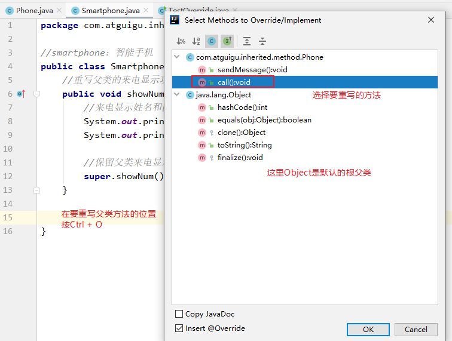

# JavaSE_第6章 面向对象基础(中)

## 教学目标

* [ ] 理解封装的概念
* [ ] 掌握权限修饰符的使用
* [ ] 掌握成员变量的私有化
* [ ] 掌握构造器的声明与使用
* [ ] 会声明标准的JavaBean
* [ ] 能够写出类的继承格式
* [ ] 能够说出继承的特点
* [ ] 能够说出方法重写的概念以及和重载的区别
* [ ] 能够使用this关键字解决问题
* [ ] 能够使用super关键字解决问题
* [ ] 能够分析类初始化过程（为面试服务）
* [ ] 能够分析实例初始化过程（为面试服务）
* [ ] 能够应用多态解决问题
* [ ] 理解向上转型与向下转型
* [ ] 能够使用instanceof关键字判断对象类型
* [ ] 了解native关键字
* [ ] 掌握final关键字
* [ ] 了解Object类的常用方法
* [ ] 会重写Object的常用方法

## 6.1 封装(encapsulation)

面向对象三大特征：封装、继承、多态

### 6.1.1 为什么需要封装？

- 我要用洗衣机，只需要按一下开关和洗涤模式就可以了。有必要了解洗衣机内部的结构吗？有必要碰电动机吗？

- 我们使用的电脑，内部有CPU、硬盘、键盘、鼠标等等，每一个部件通过某种连接方式一起工作，但是各个部件之间又是独立的

- 现实生活中，每一个个体与个体之间是有边界的，每一个团体与团体之间是有边界的，而同一个个体、团体内部的信息是互通的，只是对外有所隐瞒。

面向对象编程语言是对客观世界的模拟，客观世界里每一个事物的内部信息都是隐藏在对象内部的，外界无法直接操作和修改，只能通过指定的方式进行访问和修改。封装可以被认为是一个保护屏障，防止该类的代码和数据被其他类随意访问。适当的封装可以让代码更容易理解与维护，也加强了代码的安全性。

随着我们系统越来越复杂，类会越来越多，那么类之间的访问边界必须把握好，面向对象的开发原则要遵循“高内聚、低耦合”，而“高内聚，低耦合”的体现之一：

- 高内聚：类的内部数据操作细节自己完成，不允许外部干涉；

- 低耦合：仅对外暴露少量的方法用于使用

隐藏对象内部的复杂性，只对外公开简单的接口。便于外界调用，从而提高系统的可扩展性、可维护性。通俗的讲，把该隐藏的隐藏起来，该暴露的暴露出来。这就是封装性的设计思想。

**通俗的讲，封装就是把该隐藏的隐藏起来，该暴露的暴露出来。**那么暴露的程度如何控制呢？就是依赖**访问控制修饰符**，也称为**权限修饰符**来控制。

	便于使用者正确使用系统，防止错误修改属性
	有助于系统之间的松耦合，提高系统独立性
	提高软件的可重用性
	降低了构建大型系统的风险
### **6.1.2 权限修饰符**

权限修饰符共有4种，分别为public，protected、缺省、private；权限修饰符可以使得数据在一定范围内可见或者隐藏。

| 修饰符        | 本类 | 本包 | 其他包子类          | 任意位置 |
| ------------- | ---- | ---- | ------------------- | -------- |
| **private**   | √    | ×    | ×                   | ×        |
| **缺省**      | √    | √    | ×                   | ×        |
| **protected** | √    | √    | √（# 包外子类可用） | ×        |
| **public**    | √    | √    | √                   | √        |

权限修饰符可以修饰：

外部类：public和缺省

成员变量、成员方法、构造器、成员内部类：public,protected,缺省,private

### 6.1.3 类的封装

1. **类的封装的意义：**

   - 隐藏类的实现细节
   
   
      - 让使用者只能通过事先预定的方法来访问数据，从而可以在该方法里面加入控制逻辑，限制对成员变量的不合理访问。还可以进行数据检查，从而有利于保证对象信息的完整性。
   
   
      - 便于修改，提高代码的可维护性。主要说的是隐藏的部分，在内部修改了，如果其对外可以的访问方式不变的话，外部根本感觉不到它的修改。例如：Java8->Java9，String从char[]转为byte[]内部实现，而对外的方法不变，我们使用者根本感觉不到它内部的修改。
   
2. **如何进行类的封装？**

   - 成员变量（field）私有化
   - 提供标准的get/set方法

   ```java
   public class Person {
       //使用 `private` 修饰成员变量
       private String name;
     	private int age;
       private boolean marry;
       
   	//提供 `getXxx`方法 / `setXxx` 方法，可以访问成员变量
   	public void setName(String n) {
   		name = n;
       }
   
       public String getName() {
           return name;
   	}
   
       public void setAge(int a) {
           age = a;
       }
   
       public int getAge() {
           return age;
       }
       
       public void setMarry(boolean m){
           marry = m;
       }
       
       public boolean isMarry(){
           return marry;
       }
   }
   ```

3. **this解决局部变量与成员变量同名问题**

   当局部变量与实例变量（非静态成员变量）同名时，在实例变量前面加“**this.**”

   **this代表当前对象的引用，即当前被创建的对象**

   ```java
   public class Chinese {
     	private static String country;
       private String name;
     	private int age;
       
       public static void setCountry(String country){
           Chinese.country = country;
       }
       
       public static String getCountry(){
           return country;
       }
   
   	public void setName(String name) {
   		this.name = name;
       }
   
       public String getName() {
           return name;
   	}
   
       public void setAge(int age) {
           this.age = age;
       }
   
       public int getAge() {
           return age;
       }
   }
   ```


4. **IDEA自动生成get/set方法**

   - 大部分键盘模式按Alt + Insert键。

   - 部分键盘模式需要按Alt + Insert + Fn键。

   - Mac电脑快捷键需要单独设置


### 练习

（1）定义矩形类Rectangle，

​	声明实例变量长和宽

​	全部私有化，并提供相应的get/set方法

（2）在测试类中创建Rectangle对象，并调用相应的方法测试

## 6.2 继承(inherit)

### 6.2.1 继承的概述

面向对象的三大特征：封装、继承、多态

1. #### 生活中的继承

   父辈的东西可以被孩子继承

   “子承父业”，“这孩子长得像妈妈”，“这个孩子跟爸爸一样有才华”

2. #### Java中的继承

   Java中有父类、子类的概念，类似生活中的父子关系，父类中的一些属性和方法可以被子类继承下来使用，不再需要重复定义。

   如图所示：

   

   多个类中存在相同属性和行为时，将这些内容抽取到单独一个类中，那么多个类中无需再定义这些属性和行为，只需要和抽取出来的类构成某种关系。如图所示：

   

   其中，多个类可以称为**子类**，也叫**派生类**；多个类抽取出来的这个类称为**父类**、**超类（superclass）**或者**基类**。

   继承描述的是事物之间的所属关系，这种关系是：`is-a` 的关系。例如，图中猫属于动物，狗也属于动物。可见，父类更通用，子类更具体。我们通过继承，可以使多种事物之间形成一种关系体系。

3. #### 继承的好处

   - 提高**代码的复用性**。
   - 提高**代码的扩展性**。
   - 类与类之间产生了关系，是学习**多态的前提**。

   > 弊端：增加了类与类之间的耦合度


### 6.2.2 继承的格式

通过 `extends` 关键字，可以声明一个子类继承另外一个父类，定义格式如下：

```java
【修饰符】 class 父类 {
	...
}

【修饰符】 class 子类 extends 父类 {
	...
}

```

继承演示，代码如下：

```java
/*
 * 定义动物类Animal，做为父类
 */
class Animal {
    // 定义name属性
	String name; 
    // 定义age属性
    int age;
	// 定义动物的吃东西方法
	public void eat() {
		System.out.println(age + "岁的" + name + "在吃东西");
	}
}

/*
 * 定义猫类Cat 继承 动物类Animal
 */
class Cat extends Animal {
	// 定义一个猫抓老鼠的方法catchMouse
	public void catchMouse() {
		System.out.println("抓老鼠");
	}
}

/*
 * 定义测试类
 */
public class ExtendDemo01 {
	public static void main(String[] args) {
        // 创建一个猫类对象
		Cat cat = new Cat()；
      
        // 为该猫类对象的name属性进行赋值
		cat.name = "Tom";
      
      	// 为该猫类对象的age属性进行赋值
		cat.age = 2;
        
        // 调用该猫的catchMouse()方法
		cat.catchMouse();
		
      	// 调用该猫继承来的eat()方法
      	cat.eat();
	}
}

演示结果：
抓老鼠
2岁的Tom在吃东西
```

### 6.2.3 继承的特点

#### 1.子类会继承父类所有的成员变量和方法

从类的定义来看，类是一类具有相同特性的事物的抽象描述。父类是所有子类共同特征的抽象描述。而实例变量和实例方法就是事物的特征，那么父类中声明的实例变量和实例方法代表子类事物也有这个特征。

- 当子类对象被创建时，在堆中给对象申请内存时，就要看子类和父类都声明了什么实例变量，这些实例变量都要分配内存。
- 当子类对象调用方法时，编译器会先在子类模板中看该类是否有这个方法，如果没找到，会看它的父类甚至父类的父类是否声明了这个方法，遵循从下往上找的顺序，找到了就停止，一直到根父类都没有找到，就会报编译错误。

所以继承意味着子类的对象除了看子类的类模板还要看父类的类模板。


#### 2.子类无法直接使用父类的私有成员

子类虽会继承父类私有(private)的成员变量，但子类不能对继承的私有成员变量直接进行访问（也可以理解为私有的属性不能被继承，[官方文档中的说法](https://docs.oracle.com/javase/tutorial/java/IandI/subclasses.html)），可通过继承的公共的get/set方法进行访问。如图所示：


父类代码：

```java
package com.atguigu.inherited.modifier;

public class Person {
    private String name;
    private int age;

    public String getName() {
        return name;
    }

    public void setName(String name) {
        this.name = name;
    }

    public int getAge() {
        return age;
    }

    public void setAge(int age) {
        this.age = age;
    }

    public String getInfo(){
        return "姓名：" + name + "，年龄：" + age;
    }
}

```

子类代码：

```java
package com.atguigu.inherited.modifier;

public class Student extends Person {
    private int score;

    public int getScore() {
        return score;
    }

    public void setScore(int score) {
        this.score = score;
    }

    public String getInfo(){
//        return "姓名：" + name + "，年龄：" + age;
        //在子类中不能直接使用父类私有的name和age
        return "姓名：" + getName() + "，年龄：" + getAge();
    }
}

```

测试类代码：

```java
package com.atguigu.inherited.modifier;

public class TestStudent {
    public static void main(String[] args) {
        Student student = new Student();

        student.setName("张三");
        student.setAge(23);
        student.setScore(89);

        System.out.println(student.getInfo());
    }
}
```

IDEA在Debug模式下查看学生对象信息：


#### 3.Java只支持单继承

```java
public class A{}
class B extends A{}

//一个类只能有一个父类，不可以有多个直接父类。
class C extends B{} 	//ok
class C extends A，B...	//error
```

#### 4.Java支持多层继承

```java
class A{}
class B extends A{}
class C extends B{}
```

> 顶层父类是Object类。所有的类默认继承Object，作为父类。
>
> 子类和父类是一种相对的概念，例如，B类对于A来说是子类，但是对于C类来说是父类

#### 5.一个类可以同时拥有多个子类

```java
class A{}
class B extends A{}
class D extends A{}
class E extends A{}
```

### 6.2.4 IDEA中查看类的继承关系

例如：B类继承自A类，C类继承自B类

选择A类名，按`Ctrl + H`就会显示A类的继承树。

：A类的父类和子类

：A类的父类

：A类的所有子类

例如：在类继承目录树中选中某个类，比如C类，按Ctrl+ Alt+U就会用图形化方式显示C类的继承祖宗


### 6.2.5 方法重写(Override)

当子类继承了父类的某个方法之后，发现这个方法并不能满足子类的实际需求，那么可以通过方法重写，覆盖父类的方法。

#### **1. 方法重写：**

**子类中定义与父类中相同的方法，一般方法体不同，用于改造并覆盖父类的方法。**

代码示例：比如新的手机增加来电显示头像的功能

```java
class Phone {
	public void sendMessage(){
		System.out.println("发短信");
	}
	public void call(){
		System.out.println("打电话");
	}
	public void showNum(){
		System.out.println("来电显示号码");
	}
}

//智能手机类
class NewPhone extends Phone {
	
	//重写父类的来电显示号码功能，并增加自己的显示姓名和图片功能
	public void showNum(){
		//调用父类已经存在的功能使用super
		super.showNum();
		//增加自己特有显示姓名和图片功能
		System.out.println("显示来电姓名");
		System.out.println("显示头像");
	}
}

public class ExtendsDemo06 {
	public static void main(String[] args) {
      	// 创建子类对象
      	NewPhone np = new NewPhone()；
        
        // 调用父类继承而来的方法
        np.call();
      
      	// 调用子类重写的方法
      	np.showNum();

	}
}

```

> 小贴士：这里重写时，用到super.父类成员方法，表示调用父类的成员方法。

#### 2. IDEA重写方法快捷键：

快捷键`Ctrl + O`



```java
package com.atguigu.inherited.method;

//smartphone：智能手机
public class Smartphone extends Phone{
    //重写父类的来电显示功能的方法
    public void showNum(){
        //来电显示姓名和图片功能
        System.out.println("显示来电姓名");
        System.out.println("显示头像");

        //保留父类来电显示号码的功能
        super.showNum();//此处必须加super.，否则就是无限递归，那么就会栈内存溢出
    }

    @Override
    public void call() {
        super.call();
        System.out.println("视频通话");
    }
}
```

> @Override：写在方法上面，用来检测是不是满足重写方法的要求。这个注解就算不写，只要满足要求，也是正确的方法覆盖重写。建议保留，这样编译器可以帮助我们检查格式，另外也可以让阅读源代码的程序员清晰的知道这是一个重写的方法。

#### **3. 方法重写的具体要求：**

1. 必须保证父子类之间重写方法的名称相同。

2. 必须保证父子类之间重写方法的参数列表也完全相同。

2. 子类方法的返回值类型必须【小于等于】父类方法的返回值类型（小于其实就是是它的子类，例如：Cat< Animal）。

   > 注意：如果返回值类型是基本数据类型和void，那么必须是相同

3. 子类方法的权限必须【大于等于】父类方法的权限修饰符。

   > 注意：public > protected > 缺省 > private
   >
   > 父类私有方法不能重写
   >
   > 跨包的父类缺省的方法也不能重写

**另外:**

> 静态方法不能被重写，方法重写指的是实例方法重写，静态方法属于类的方法不能被重写，而是隐藏。
>
> final修饰的方法不能被重写

### 继承练习

**练习1**

（1）父类Graphic图形
包含属性：name（图形名），属性私有化
包含求面积getArea()：返回0.0
求周长getPerimeter()方法：返回0.0
显示信息getInfo()方法：返回图形名称、面积、周长

（2）子类Circle圆继承Graphic图形
包含属性：radius
重写求面积getArea()和求周长getPerimeter()方法，显示信息getInfo()加半径信息

（3）子类矩形Rectange继承Graphic图形
包含属性：length、width
重写求面积getArea()和求周长getPerimeter()方法

```java
public class Graphic {
	private String name;

	public Graphic(String name) {
		super();
		this.name = name;
	}

	public String getName() {
		return name;
	}

	public void setName(String name) {
		this.name = name;
	}

	public double getArea() {
		return 0.0;
	}

	public double getPerimeter() {
		return 0.0;
	}

	/*
	 * this对象：调用当前方法的对象，如果是Graphic对象，那么就会执行Graphic的getArea()和getPerimeter()
	 * this对象：调用当前方法的对象，如果是Circle对象，那么就会执行Circle的getArea()和getPerimeter()
	 * this对象：调用当前方法的对象，如果是Rectangle对象，那么就会执行Rectangle的getArea()和getPerimeter()
	 */
	public String getInfo() {
		return "图形：" + name + "，面积：" + getArea() + ",周长：" + getPerimeter();
	}
}
```

```java
public class Circle extends Graphic {
	private double radius;

	public Circle(String name, double radius) {
		super(name);
		this.radius = radius;
	}

	public double getRadius() {
		return radius;
	}

	public void setRadius(double radius) {
		this.radius = radius;
	}

	@Override//表示这个方法是重写的方法
	public double getArea() {
		return Math.PI * radius * radius;
	}

	@Override//表示这个方法是重写的方法
	public double getPerimeter() {
		return Math.PI * radius * 2;
	}

	/*@Override//表示这个方法是重写的方法
	public String getInfo() {
		return super.getInfo() + "，半径：" + radius;
	}*/
	
}

```

```java
public class Rectangle extends Graphic {
	private double length;
	private double width;
	
	public Rectangle(String name, double length, double width) {
		super(name);
		this.length = length;
		this.width = width;
	}

	public double getLength() {
		return length;
	}

	public void setLength(double length) {
		this.length = length;
	}

	public double getWidth() {
		return width;
	}

	public void setWidth(double width) {
		this.width = width;
	}

	@Override
	public double getArea() {
		return length*width;
	}

	@Override
	public double getPerimeter() {
		return 2*(length + width);
	}
}

```

```java
public class TestGraphicExer3 {
	public static void main(String[] args) {
		Graphic g = new Graphic("通用图形");
		System.out.println(g.getInfo());
		
		Circle c = new Circle("圆", 1.2);
		System.out.println(c.getInfo());//调用getInfo()方法的对象是c
		
		Rectangle r = new Rectangle("矩形", 3, 5);
		System.out.println(r.getInfo());
	}
}
```

**练习2**

1、声明父类：Person类
包含属性：姓名，年龄，性别
属性私有化，get/set
包含getInfo()方法：例如：姓名：张三，年龄：23，性别：男

2、声明子类：Student类，继承Person类
新增属性：score成绩
属性私有化，get/set
包含getInfo()方法：例如：姓名：张三，年龄：23，性别：男，成绩：89

3、声明子类：Teacher类，继承Person类
新增属性：salary薪资
属性私有化，get/set
包含getInfo()方法：例如：姓名：张三，年龄：23，性别：男，薪资：10000

```java
public class Person {
	private String name;
	private int age;
	private char gender;
	public Person(String name, int age, char gender) {
		super();
		this.name = name;
		this.age = age;
		this.gender = gender;
	}
	public Person() {
		super();
	}
	public String getName() {
		return name;
	}
	public void setName(String name) {
		this.name = name;
	}
	public int getAge() {
		return age;
	}
	public void setAge(int age) {
		this.age = age;
	}
	public char getGender() {
		return gender;
	}
	public void setGender(char gender) {
		this.gender = gender;
	}
	
	//包含getInfo()方法：例如：姓名：张三，年龄：23，性别：男
	public String getInfo(){
		return "姓名：" + name + "，年龄：" + age +"，性别：" + gender;
	}
}
```

```java
public class Student extends Person {
	private int score;

	public Student() {
	}

	public Student(String name, int age, char gender, int score) {
		setName(name);
		setAge(age);
		setGender(gender);
		this.score = score;
	}

	public int getScore() {
		return score;
	}

	public void setScore(int score) {
		this.score = score;
	}
	//包含getInfo()方法：例如：姓名：张三，年龄：23，性别：男，成绩：89
	public String getInfo(){
		//方式一：
//		return "姓名：" + getName() + "，年龄：" + getAge() + "，成绩：" + score;
		
		//方法二：
		return super.getInfo() + "，成绩：" + score;
	}
	
}
```

```java
public class Teacher extends Person {
	private double salary;

	public Teacher() {
	}

	public Teacher(String name, int age, char gender, double salary) {
		setName(name);
		setAge(age);
		setGender(gender);
		this.salary = salary;
	}

	public double getSalary() {
		return salary;
	}

	public void setSalary(double salary) {
		this.salary = salary;
	}
	
	//包含getInfo()方法：例如：姓名：张三，年龄：23，性别：男，薪资：10000
	public String getInfo(){
		return super.getInfo() + "，薪资：" + salary;
	}
}

```

```java
public class TestPersonExer2 {
	public static void main(String[] args) {
		Person p = new Person("张三", 23, '男');
		System.out.println(p.getInfo());
		
		Student s = new Student("李四", 25, '男', 89);
		System.out.println(s.getInfo());
		
		Teacher t = new Teacher("王五", 18, '男', 11111);
		System.out.println(t.getInfo());
	}
}
```

**练习3** 

1、声明一个银行储蓄卡类，

包含属性：账户id，余额

包含取款 public void withdraw(double money)

存款 pubic void save(double money)

获取账户信息： public String getInfo() 可以返回账户id和余额

2、声明一个银行信用卡类，继承储蓄卡类

增加属性：可透支额度

重写取款 public void withdraw(double money)，可透支

存款 pubic void save(double money)，需要恢复可透支额度

3、在测试类中，分别创建两种卡对象，测试

## 6.3 多态(polymorphism)

### 6.3.1 案例引入

多态是继封装、继承之后，面向对象的第三大特性。也是面向对象思想的核心。

我们通过代码先看一个案例，引入多态性这个重要特性。

定义一个Animal类

```java
public class Animal {
    //String name = "animal";
    public void eat(){
        System.out.println("动物吃饭");
    }
}
```

定义一个Dog类

```java
public class Dog extends Animal {//继承Animal类
    //String name = "dog";
    @Override
    public void eat() {
        System.out.println("狗啃骨头");
    }

}
```

定义一个Person类

```java
public class Person {
    //喂狗吃饭
   public void feed(Dog dog){
        dog.eat();
    }
}
```

测试类

```java
public class Test1 {
    public static void main(String[] args) {
        Person p=new Person();
        //测试人喂狗吃饭
        p.feed(new Dog());
    }
}
```

这时如果需要拓展功能，增加一个猫Cat类，让人喂Cat吃饭，应该如何做？

很简单，在Person类中增加喂猫的方法，那如果后期还要不断的增加新功能（新增各种动物类），就要不断增加Person类对应的方法。这里就出现了一个问题：违背了软件开发中的开闭原则（对修改关闭，对扩展开放），并且大量类同代码冗余，即每次新增的方法除了参数类型不同，其他都基本相同。

能不能用简单方式解决？可以。

只需要在Person类中定义一个类似的方法，参数为Animal，其他全舍去，这就是多态的应用。

```java
//修改后的Person类
public class Person {
    //喂动物吃饭
   public void feed(Animal animal){
        animal.eat();
    }
}
```

再次测试，功能正常，增加新的动物类测试，发现不需要修改Person类，功能依然正常。

### 6.3.2 什么是多态

生活中：一个事物在不同的条件下呈现不同的特征状态，如水在100度下呈液态，100度以上呈气态。

Java中的多态指的是什么？	

#### 1、多态的形式

Java规定父类类型的变量可以接收子类类型的对象，这一点从逻辑上也是说得通的。

```java
父类类型 变量名 = 子类对象;
```

> 父类类型：指子类继承的父类类型，或者实现的父接口类型。
>
> 所以说继承是多态的前提

```java
//多态的引用形式
Animal a = new Cat();//Cat对象也属于其父类Animal类型。猫也是一个动物。
```

#### 2、多态的表现

多态引用形式的具体表现：编译时类型与运行时类型不一致，编译时看左边的“父类”，运行时看右边的“子类”。

也就是我们常说的：编译看左边，运行看右边。

```java
public class Test {
    public static void main(String[] args) {
        // 多态形式，创建对象
        Animal a = new Cat();  
        // 编译时，a变量呈现Animal类型特征，即Animal类中有eat方法，a调用eat方法时编译才能成功
        a.eat();//运行时，实际执行的是Cat类中重写的eat方法。 
        
        //a1.catchMouse();//错误，编译时左边父类Animal中没有此方法，所以编译失败

        // 多态形式，创建对象
        a = new Dog(); 
        //运行时执行的是 Dog类中重写的eat方法
        a.eat();               
    }  
}
```

#### 3、多态的好处

运行时，看“子类”，如果子类重写了方法，一定是执行子类重写的方法；变量引用的子类对象不同，执行的方法就不同，实现动态绑定。代码编写更灵活、功能更强大，可维护性和扩展性更好了。

1. 提高程序的扩展性（参考引入案例分析）
2. 降低类与类之间的耦合度（参考引入案例分析）

### 6.3.3 多态的应用

1. #### 声明父类类型变量，变量赋值子类对象	

   - 方法的形参是父类类型，调用方法的实参是子类对象
   - 实例变量声明父类类型，实际存储的是子类对象

   代码如下：

   ```java
   public class OnePersonOnePet {
       private Pet pet;
       public void adopt(Pet pet) {//形参是父类类型，实参是子类对象
           this.pet = pet;
       }
       public void feed(){
           pet.eat();//pet实际引用的对象类型不同，执行的eat方法也不同
       }
   }
   ```

   ```java
   public class TestOnePersonOnePet {
       public static void main(String[] args) {
           OnePersonOnePet person = new OnePersonOnePet();
   
           Dog dog = new Dog();
           person.adopt(dog);//实参是dog子类对象，形参是父类Pet类型
           person.feed();
   
           Cat cat = new Cat();
           person.adopt(cat);//实参是cat子类对象，形参是父类Pet类型
           person.feed();
       }
   }
   ```

2. #### 声明父类类型数组，元素是子类对象

   数组元素类型声明为父类类型，实际存储的是子类对象

   ```java
   public class OnePersonManyPets {
       private Pet[] pets;//数组元素类型是父类类型，元素存储的是子类对象
   
       public void adopt(Pet[] pets) {
           this.pets = pets;
       }
   
       public void feed() {
           for (int i = 0; i < pets.length; i++) {
               pets[i].eat();//pets[i]实际引用的对象类型不同，执行的eat方法也不同
           }
       }
   }
   ```

   ```java
   public class TestPets {
       public static void main(String[] args) {
           Pet[] pets = new Pet[2];
           pets[0] = new Dog();//多态引用
           pets[1] = new Cat();//多态引用
           OnePersonManyPets person = new OnePersonManyPets();
           person.adopt(pets);
           person.feed();
       }
   }
   ```

   

3. ```java
   public class PetShop {
       //返回值类型是父类类型，实际返回的是子类对象
       public Pet sale(String type){
           switch (type){
               case "Dog":
                   return new Dog();
               case "Cat":
                   return new Cat();
           }
           return null;
       }
   }
   ```

   ```java
   public class TestPetShop {
       public static void main(String[] args) {
           PetShop shop = new PetShop();
   
           Pet dog = shop.sale("Dog");
           dog.eat();
   
           Pet cat = shop.sale("Cat");
           cat.eat();
       }
   }
   ```


### 6.3.4 多态练习

1. #### 练习1

   （1）声明父类Traffic，包含方法public void drive()
   （2）声明子类Car,Bicycle等，并重写drive方法
   （3）在测试类的main中创建一个数组，有各种交通工具，遍历调用drive()方法
   模拟马路上跑的各种交通工具

   ```java
   public class Traffic {
   	public void drive(){
           System.out.println("~~~~");
       }
   }
   ```

   ```java
   public class Car extends Traffic {
   	@Override
   	public void drive() {
   		System.out.println("滴滴滴...");
   	}
   }
   ```

   ```java
   public class Bicycle extends Traffic {
   	@Override
   	public void drive() {
   		System.out.println("蹬蹬蹬。。。");
   	}
   }
   ```

   ```java
   public class TestExer1 {
   	public static void main(String[] args) {
   		//右边这些是用匿名对象，初始化数组
   		Traffic[] arr = {new Car(),new Bicycle(),new Car(),new Bicycle()};
   		for (int i = 0; i < arr.length; i++) {
   			arr[i].drive();
   		}
   	}
   }
   ```

2. #### 练习2

   （1）声明一个父类Person类，public void toilet()

   （2）声明一个子类Woman类，重写方法
   （3）声明一个子类Man类，重写方法
   （4）在测试类中声明一个方法，
   public static void goToToilet(Person p){
   	p.toilet();
   }
   在main中，创建不同子类对象，调用goToToilet方法进行测试

   ```java
   public class Person {
   	public void toilet(){
           System.out.println("~~~");
       }
   }
   ```

   ```java
   public class Man extends Person {
   	@Override
   	public void toilet() {
   		System.out.println("站着..");
   	}
   }
   ```

   ```java
   public class Woman extends Person {
   	@Override
   	public void toilet() {
   		System.out.println("坐着..");
   	}
   }
   ```

   ```java
   public class TestPerson {
   	public static void main(String[] args) {
   		goToToilet(new Woman());//隐含了Person p = new Woman();
   		goToToilet(new Man());//隐含了Person p = new Man();
   	}
   	
   	public static void goToToilet(Person p){
   		p.toilet();
   	}
   }
   ```

3. #### 练习3

   1、声明一个父类Employee员工类型，有属性，姓名（String）
   有方法，public double earning() 用于返回实发工资，默认返回0
   		public String getInfo()：显示姓名和实发工资

   2、声明一个子类SalaryEmployee正式工，继承父类Employee，增加属性，薪资，工作日天数，请假天数
   重写方法，public double earning()返回实发工资，实发工资 = 薪资 - 薪资/工作日天数 * 请假天数，

   3、声明一个子类HourEmployee小时工，继承父类Employee
   有属性，工作小时数，每小时多少钱
   重写方法，public double earning()返回实发工资， 实发工资 = 每小时多少钱 * 小时数

   4、声明一个子类Manager经理，继承SalaryEmployee，增加属性：奖金比例
   重写方法，public double earning()返回实发工资，实发工资 = (薪资 - 薪资/工作日天数 * 请假天数)*(1+奖金比例)

   5、你现在是财务，需要查看每个人的实发工资，并查看工资总额。
   声明一个员工数组，存储各种员工，并遍历显示他们的姓名和实发工资，并计算所有员工的工资总额

   ```java
   public class Employee {
   	private String name;
   
   	public Employee(String name) {
   		super();
   		this.name = name;
   	}
   
   	public Employee() {
   		super();
   	}
   
   	public String getName() {
   		return name;
   	}
   
   	public void setName(String name) {
   		this.name = name;
   	}
   
   	public double earning(){
           return 0.0;
       }
   
   	public String getInfo() {
   		return "姓名：" + name + "，实发工资：" + earning();
   	}
   }
   ```

   ```java
   public class SalaryEmployee extends Employee {
   	private double salary;
   	private int workingDays;//工作日天数，
   	private double offDays;//请假天数
   
   	public SalaryEmployee() {
   		super();
   	}
   
   	public SalaryEmployee(String name,  double salary, int workingDays, double offDays) {
   		super(name);
   		this.salary = salary;
   		this.workingDays = workingDays;
   		this.offDays = offDays;
   	}
   
   	public double getSalary() {
   		return salary;
   	}
   
   	public void setSalary(double salary) {
   		this.salary = salary;
   	}
   
   	public int getWorkingDays() {
   		return workingDays;
   	}
   
   	public void setWorkingDays(int workingDays) {
   		this.workingDays = workingDays;
   	}
   
   	public double getOffDays() {
   		return offDays;
   	}
   
   	public void setOffDays(double offDays) {
   		this.offDays = offDays;
   	}
   
   	/*
   	 * 重写方法，public double earning()返回实发工资， 
   		实发工资 = 薪资 - 薪资/工作日天数 * 请假天数
   	 */
   	@Override
   	public double earning() {
   		return salary - salary/workingDays * offDays;
   	}
   
   }
   ```

   ```java
   public class HourEmployee extends Employee {
   	private double moneyPerHour;
   	private double hours;
   	
   	public HourEmployee() {
   		super();
   	}
   
   	public HourEmployee(String name, double moneyPerHour, double hours) {
   		super(name);
   		this.moneyPerHour = moneyPerHour;
   		this.hours = hours;
   	}
   
   	public double getMoneyPerHour() {
   		return moneyPerHour;
   	}
   
   	public void setMoneyPerHour(double moneyPerHour) {
   		this.moneyPerHour = moneyPerHour;
   	}
   
   	public double getHours() {
   		return hours;
   	}
   
   	public void setHours(double hours) {
   		this.hours = hours;
   	}
   
   	/*
   	 * 重写方法，public double earning()返回实发工资， 
   		实发工资 = 每小时多少钱 * 小时数	
   	 */
   	@Override
   	public double earning() {
   		return moneyPerHour * hours;
   	}
   
   }
   
   ```

   ```java
   public class Manager extends SalaryEmployee {
   	private double commisionPer;
   
   	public Manager() {
   		super();
   	}
   
   	public Manager(String name,  double salary, int workingDays, double offDays, double commisionPer) {
   		super(name, salary, workingDays, offDays);
   		this.commisionPer = commisionPer;
   	}
   
   	public double getCommisionPer() {
   		return commisionPer;
   	}
   
   	public void setCommisionPer(double commisionPer) {
   		this.commisionPer = commisionPer;
   	}
   
   	@Override
   	public double earning() {
   		return super.earning() * (1+commisionPer);
   	}
   }
   ```

   ```java
   public class TestEmployee {
   	public static void main(String[] args) {
   		Employee[] all = new Employee[3];
   		
   		all[0] = new HourEmployee("张三", 50, 50);
   		all[1] = new SalaryEmployee("李四", 10000, 22, 1);
   		all[2] = new Manager("老王", 20000, 22, 0, 0.3);
   		
   		double sum = 0;
   		for (int i = 0; i < all.length; i++) {
   			System.out.println(all[i].getInfo());
   			sum += all[i].earning();
   		}
   		System.out.println("总额：" + sum);
   	}
   }
   ```


### 6.3.5 向上转型与向下转型

首先，一个对象在new的时候创建是哪个类型的对象，它从头至尾都不会变。即这个对象的运行时类型，本质的类型用于不会变。但是，把这个对象赋值给不同类型的变量时，这些变量的编译时类型却不同。

这个和基本数据类型的转换是不同的。基本数据类型是把数据值copy了一份，相当于有两种数据类型的值。而对象的赋值不会产生两个对象。

**1、为什么要类型转换呢？**

因为多态，就一定会有把子类对象赋值给父类变量的时候，这个时候，<font color="red">**在编译期间**</font>，就会出现类型转换的现象。

但是，使用父类变量接收了子类对象之后，我们就**不能调用**子类拥有，而父类没有的方法了。这也是多态给我们带来的一点"小麻烦"。所以，想要调用子类特有的方法，必须做类型转换，使得<font color='red'>**编译通过**</font>。

* **向上转型**：当左边的变量的类型（父类） > 右边对象/变量的类型（子类），我们就称为向上转型
  * 此时，编译时按照左边变量的类型处理，就只能调用父类中有的变量和方法，不能调用子类特有的变量和方法了
  * 但是，**运行时，仍然是对象本身的类型**，所以执行的方法是子类重写的方法体。
  * 此时，一定是安全的，而且也是自动完成的

* **向下转型**：当左边的变量的类型（子类）<右边对象/变量的编译时类型（父类），我们就称为向下转型
  * 此时，编译时按照左边变量的类型处理，就可以调用子类特有的变量和方法了
  * 但是，**运行时，仍然是对象本身的类型**
  * 不是所有通过编译的向下转型都是正确的，可能会发生ClassCastException，为了安全，可以通过instanceof关键字进行判断

**2、如何向上转型与向下转型**

向上转型：自动完成

向下转型：（子类类型）父类变量

```java
package com.atguigu.polymorphism.grammar;

public class ClassCastTest {
    public static void main(String[] args) {
        //没有类型转换
        Dog dog = new Dog();//dog的编译时类型和运行时类型都是Dog

        //向上转型
        Pet pet = new Dog();//pet的编译时类型是Pet，运行时类型是Dog
        pet.setNickname("小白");
        pet.eat();//可以调用父类Pet有声明的方法eat，但执行的是子类重写的eat方法体
//        pet.watchHouse();//不能调用父类没有的方法watchHouse

        Dog d = (Dog) pet;
        System.out.println("d.nickname = " + d.getNickname());
        d.eat();//可以调用eat方法
        d.watchHouse();//可以调用子类扩展的方法watchHouse

        Cat c = (Cat) pet;//编译通过，因为从语法检查来说，pet的编译时类型是Pet，Cat是Pet的子类，所以向下转型语法正确
        //这句代码运行报错ClassCastException，因为pet变量的运行时类型是Dog，Dog和Cat之间是没有继承关系的
    }
}
```

**3、instanceof关键字**

`instanceof`关键字**用于判断一个对象的运行时类型**

为了避免`ClassCastException`的发生，Java提供了 `instanceof` 关键字，给引用变量做类型的校验，只要用`instanceof`判断返回true的，那么强转为该类型就一定是安全的，不会报`ClassCastException`异常。

格式：

```
变量/匿名对象 instanceof 数据类型 
```

那么，哪些`instanceof`判断会返回true呢？

- 变量/匿名对象的编译时类型 与  `instanceof`后面数据类型是直系亲属关系才可以比较
- 变量/匿名对象的运行时类型<= instanceof后面数据类型，才为true

示例代码：

```java
public class TestInstanceof {
    public static void main(String[] args) {
        Pet[] pets = new Pet[2];
        pets[0] = new Dog();//多态引用
        pets[1] = new Cat();//多态引用

        for (int i = 0; i < pets.length; i++) {
            pets[i].eat();

            if(pets[i] instanceof Dog){
                Dog dog = (Dog) pets[i];
                dog.lookDoor();
            }else if(pets[i] instanceof Cat){
                Cat cat = (Cat) pets[i];
                cat.catchMouse();
            }
        }
    }
}
```

**练习题**

1、声明一个父类Employee员工类型，
有属性，姓名（String），出生日期（MyDate类型，也是自定义的含年，月，日属性日期类型）
有方法，public  double earning()
		public String getInfo()：显示姓名和实发工资

2、声明一个子类SalaryEmployee正式工，继承父类Employee
增加属性，薪资，工作日天数，请假天数
重写方法，public double earning()返回实发工资， 实发工资 = 薪资 - 薪资/工作日天数 * 请假天数，
重写方法，public String getInfo()：显示姓名和实发工资，月薪，工作日天数，请假天数	

3、声明一个子类HourEmployee小时工，继承父类Employee
有属性，工作小时数，每小时多少钱
重写方法，public double earning()返回实发工资， 实发工资 = 每小时多少钱 * 小时数
重写方法，public String getInfo()：显示姓名和实发工资，时薪，工作小时数
增加方法，public void leave()：打印查看使用工具是否损坏，需要赔偿

4、声明一个子类Manager经理，继承SalaryEmployee
增加属性：奖金，奖金比例
重写方法，public double earning()返回实发工资， 实发工资 = (薪资 - 薪资/工作日天数 * 请假天数)*(1+奖金比例)
重写方法，public String getInfo()：显示姓名和实发工资，月薪，工作日天数，请假天数，奖金比例

5、声明一个员工数组，存储各种员工，
你现在是人事，从键盘输入当前的月份，需要查看每个人的详细信息。
如果他是正式工（包括SalaryEmployee和Manager），并且是本月生日的，祝福生日快乐，通知领取生日礼物。如果是HourEmployee显示小时工，就进行完工检查，即调用leave方法

```java
public abstract class Employee {
	private String name;
	private MyDate birthday;
	public Employee(String name, MyDate birthday) {
		super();
		this.name = name;
		this.birthday = birthday;
	}
	public Employee(String name, int year, int month, int day) {
		super();
		this.name = name;
		this.birthday = new MyDate(year, month, day);
	}
	public Employee() {
		super();
	}
	public String getName() {
		return name;
	}
	public void setName(String name) {
		this.name = name;
	}
	public MyDate getBirthday() {
		return birthday;
	}
	public void setBirthday(MyDate birthday) {
		this.birthday = birthday;
	}
	
	public abstract double earning();
	
	public String getInfo(){
		return "姓名：" + name + "，生日：" + birthday.getInfo() +"，实发工资：" + earning();
	}
}
```

```java
public class SalaryEmployee extends Employee {
	private double salary;
	private int workingDays;//工作日天数，
	private double offDays;//请假天数

	public SalaryEmployee() {
		super();
	}

	public SalaryEmployee(String name, int year, int month, int day, double salary, int workingDays, double offDays) {
		super(name, year, month, day);
		this.salary = salary;
		this.workingDays = workingDays;
		this.offDays = offDays;
	}

	public SalaryEmployee(String name, MyDate birthday, double salary, int workingDays, double offDays) {
		super(name, birthday);
		this.salary = salary;
		this.workingDays = workingDays;
		this.offDays = offDays;
	}

	public double getSalary() {
		return salary;
	}

	public void setSalary(double salary) {
		this.salary = salary;
	}

	public int getWorkingDays() {
		return workingDays;
	}

	public void setWorkingDays(int workingDays) {
		this.workingDays = workingDays;
	}

	public double getOffDays() {
		return offDays;
	}

	public void setOffDays(double offDays) {
		this.offDays = offDays;
	}

	/*
	 * 重写方法，public double earning()返回实发工资， 
		实发工资 = 薪资 - 薪资/工作日天数 * 请假天数
	 */
	@Override
	public double earning() {
		return salary - salary/workingDays * offDays;
	}
	
	@Override
	public String getInfo() {
		return super.getInfo() + "，月薪：" + salary + "，工作日：" + workingDays +"，请假天数：" + offDays;
	}
}
```

```java
public class HourEmployee extends Employee {
	private double moneyPerHour;
	private double hours;
	
	public HourEmployee() {
		super();
	}

	public HourEmployee(String name, int year, int month, int day, double moneyPerHour, double hours) {
		super(name, year, month, day);
		this.moneyPerHour = moneyPerHour;
		this.hours = hours;
	}

	public HourEmployee(String name, MyDate birthday, double moneyPerHour, double hours) {
		super(name, birthday);
		this.moneyPerHour = moneyPerHour;
		this.hours = hours;
	}

	public double getMoneyPerHour() {
		return moneyPerHour;
	}

	public void setMoneyPerHour(double moneyPerHour) {
		this.moneyPerHour = moneyPerHour;
	}

	public double getHours() {
		return hours;
	}

	public void setHours(double hours) {
		this.hours = hours;
	}

	/*
	 * 重写方法，public double earning()返回实发工资， 
		实发工资 = 每小时多少钱 * 小时数	
	 */
	@Override
	public double earning() {
		return moneyPerHour * hours;
	}

	@Override
	public String getInfo() {
		return super.getInfo() + "，时薪：" + moneyPerHour + "，小时数：" + hours;
	}

	public void leave(){
		System.out.println("小时工，查看使用工具是否损坏，需要赔偿，然后拿钱走人");
	}
}

```

```java
public class Manager extends SalaryEmployee {
	private double commisionPer;

	public Manager() {
		super();
	}

	public Manager(String name, int year, int month, int day, double salary, int workingDays, double offDays,
			double commisionPer) {
		super(name, year, month, day, salary, workingDays, offDays);
		this.commisionPer = commisionPer;
	}

	public Manager(String name, MyDate birthday, double salary, int workingDays, double offDays, double commisionPer) {
		super(name, birthday, salary, workingDays, offDays);
		this.commisionPer = commisionPer;
	}

	public double getCommisionPer() {
		return commisionPer;
	}

	public void setCommisionPer(double commisionPer) {
		this.commisionPer = commisionPer;
	}

	@Override
	public double earning() {
		return super.earning() * (1+commisionPer);
	}
	@Override
	public String getInfo() {
		return super.getInfo() + "，奖金比例：" + commisionPer;
	}
}

```

```java
public class TestEmployee {
	public static void main(String[] args) {
		Employee[] all = new Employee[3];
		/*all[0] = new HourEmployee("张三", new MyDate(1990, 5, 1), 50, 50);
		all[1] = new SalaryEmployee("李四", new MyDate(1991, 1, 1), 10000, 22, 1);
		all[2] = new Manager("老王", new MyDate(1987, 12, 8), 20000, 22, 0, 0.3);*/
		
		all[0] = new HourEmployee("张三", 1990, 5, 1, 50, 50);
		all[1] = new SalaryEmployee("李四", 1991, 1, 1, 10000, 22, 1);
		all[2] = new Manager("老王", 1987, 12, 8, 20000, 22, 0, 0.3);
		
		//从键盘输入当前的月份
		Scanner input = new Scanner(System.in);
		System.out.print("请输入当前月份：");
		int month;
		while(true){
			month = input.nextInt();
			if(month>=1 && month<=12){
				break;
			}
		}
		input.close();
		
		for (int i = 0; i < all.length; i++) {
			System.out.println(all[i].getInfo());
			if(all[i] instanceof SalaryEmployee){
				if(month == all[i].getBirthday().getMonth()){
					System.out.println(all[i].getName() +"生日快乐，领取生日补助购物卡");
				}
			}else{
				HourEmployee he = (HourEmployee) all[i];
				he.leave();
			}
		}
	}
}
```

### 6.7.6 虚方法(理解)

在Java中虚方法是指在编译阶段和类加载阶段都不能确定方法的调用入口地址，在运行阶段才能确定的方法，**即可能被重写的方法。**

当我们通过“对象.方法”的形式，调用一个虚方法，我们要如何确定它具体执行哪个方法呢？

- **静态分派**：先看这个对象的编译时类型，在这个对象的编译时类型中找到最匹配的方法,   最匹配的是指，实参的编译时类型与形参的类型最匹配
- **动态绑定：**再看这个对象的运行时类型，如果这个对象的运行时类重写了刚刚找到的那个最匹配的方法，那么执行重写的，否则仍然执行刚才编译时类型中的那个方法

> 成员变量和非虚方法不具有多态性。

示例：

```java
class MyClass{
	public void method(Father f) {
		System.out.println("father");
	}
	public void method(Son s) {
		System.out.println("son");
	}
}
class MySub extends MyClass{
	public void method(Father d) {
		System.out.println("sub--father");
	}
    public void method(Daughter d) {
		System.out.println("daughter");
	}
}
class Father{
	
}
class Son extends Father{
	
}
class Daughter extends Father{
	
}
```

```java
public class TestVirtualMethod {
    public static void main(String[] args) {
        MyClass my = new MySub();
        Father f = new Father();
        Son s = new Son();
        Daughter d = new Daughter();
        my.method(f);//sub--
            /*
            (1)静态分派：看my的编译时类型MyClass，在MyClass中找最匹配的
                匹配的原则：看实参的编译时类型与方法形参的类型的匹配程度
                 实参f的编译时类型是Father，形参(Father f) 、(Son s)
                 最匹配的是public void method(Father f)
            （2）动态绑定：看my的运行时类型MySub，看在MySub中是否有对    public void method(Father f)进行重写
                发现有重写，如果有重写，就执行重写的
                    public void method(Father d) {
                        System.out.println("sub--");
                    }
             */
        my.method(s);//son
            /*
            (1)静态分派：看my的编译时类型MyClass，在MyClass中找最匹配的
                匹配的原则：看实参的编译时类型与方法形参的类型的匹配程度
                 实参s的编译时类型是Son，形参(Father f) 、(Son s)
                 最匹配的是public void method(Son s)
            （2）动态绑定：看my的运行时类型MySub，看在MySub中是否有对 public void method(Son s)进行重写
                发现没有重写，如果没有重写，就执行刚刚父类中找到的方法
             */
        my.method(d);//sub--
             /*
            (1)静态分派：看my的编译时类型MyClass，在MyClass中找最匹配的
                匹配的原则：看实参的编译时类型与方法形参的类型的匹配程度
                 实参d的编译时类型是Daughter，形参(Father f) 、(Son s)
                 最匹配的是public void method(Father f)
            （2）动态绑定：看my的运行时类型MySub，看在MySub中是否有对 public void method(Father f)进行重写
                发现有重写，如果有重写，就执行重写的
                    public void method(Father d) {
                        System.out.println("sub--");
                    }
             */
    }
}
```

## 6.4 实例初始化

### 6.4.1 构造器

我们发现我们new完对象时，所有成员变量都是默认值，如果我们需要赋别的值，需要挨个为它们再赋值，太麻烦了。我们能不能在new对象时，直接为当前对象的某个或所有成员变量直接赋值呢。

可以，Java给我们提供了构造器（Constructor)。

#### 1、构造器的作用

new对象，并在new对象的时候为实例变量赋值。

#### 2、构造器的语法格式

构造器又称为构造方法，那是因为它长的很像方法。但是和方法还是有所区别的。

```java
【修饰符】 class 类名{
    【修饰符】 构造器名(){
    	// 实例初始化代码
    }
    【修饰符】 构造器名(参数列表){
        // 实例初始化代码
    }
}
```

代码如下：

```java
package com.atguigu.constructor;

public class Student {
    private String name;
    private int age;

    // 无参构造
    public Student() {}

    // 有参构造
    public Student(String name,int age) {
        this.name = name;
        this.age = age;
    }

    public String getName() {
        return name;
    }
    public void setName(String name) {
        this.name = name;
    }
    public int getAge() {
        return age;
    }
    public void setAge(int age) {
        this.age = age;
    }

    public String getInfo(){
        return "姓名：" + name +"，年龄：" + age;
    }
}

```

注意事项：

1. 构造器名必须与它所在的类名必须相同。
2. 它没有返回值，所以不需要返回值类型，甚至不需要void
3. 如果你不提供构造器，系统会给出无参数构造器，并且该构造器的修饰符默认与类的修饰符相同
4. 如果你提供了构造器，系统将不再提供无参数构造器，除非你自己定义。
5. 构造器是可以重载的，既可以定义参数，也可以不定义参数。
6. 构造器的修饰符只能是权限修饰符，不能被其他任何修饰

```java
package com.atguigu.constructor;

public class TestStudent {
    public static void main(String[] args) {
        //调用无参构造创建学生对象
        Student s1 = new Student();

        //调用有参构造创建学生对象
        Student s2 = new Student("张三",23);

        System.out.println(s1.getInfo());
        System.out.println(s2.getInfo());
    }
}
```

#### 3、this调用本类其他构造器

同一个类中，使用**`this(【实参列表】)`**可以实现构造器之间的相互调用。

- this()：调用本类的无参构造

- this(实参列表)：调用本类的有参构造

- this(【实参列表】)只能出现在构造器内首行

  注意：不能出现构造器递归调用

```java
package com.atguigu.constructor;

public class Student {
    private String name;
    private int age;

    // 无参构造
    public Student() {
//        this("",18);//调用本类有参构造
    }

    // 有参构造
    public Student(String name,int age) {
        this();//调用本类无参构造
        this.name = name;
        this.age = age;
    }

    public String getName() {
        return name;
    }
    public void setName(String name) {
        this.name = name;
    }
    public int getAge() {
        return age;
    }
    public void setAge(int age) {
        this.age = age;
    }

    public String getInfo(){
        return "姓名：" + name +"，年龄：" + age;
    }
}
```

#### 4、super调用父类构造器

在继承关系中，子类不会继承父类的构造器，子类构造器可以通过**`super(【实参列表】)`**来调用父类构造器。

- 子类的每个构造器中默认隐藏`super()`,即默认调用父类的无参构造器。
- 子类构造器中可以显示使用`super(【实参列表】)`来调用父类无参或有参构造器，那么默认隐藏的`super()`不再存在。
- 如果父类没有无参构造，则必须在子类构造器中显示使用`super(实参列表)`来调用父类构造器。
- `super(【实参列表】)`只能出现在子类构造器的首行

**总之：使用子类任意构造器创建对象时，必须要直接或间接通过`super(【实参列表】)`先调用执行父类构造器。**

```java
package com.atguigu.constructor;

public class Employee {
    private String name;
    private int age;
    private double salary;

    public Employee() {
        System.out.println("父类Employee无参构造");
    }

    public Employee(String name, int age, double salary) {
        this.name = name;
        this.age = age;
        this.salary = salary;
        System.out.println("父类Employee有参构造");
    }

    public String getName() {
        return name;
    }

    public void setName(String name) {
        this.name = name;
    }

    public int getAge() {
        return age;
    }

    public void setAge(int age) {
        this.age = age;
    }

    public double getSalary() {
        return salary;
    }

    public void setSalary(double salary) {
        this.salary = salary;
    }

    public String getInfo(){
        return "姓名：" + name + "，年龄：" + age +"，薪资：" + salary;
    }
}

```

```java
package com.atguigu.constructor;

public class Manager extends Employee{
    private double bonusRate;

    public Manager() {
        super();//可以省略
    }

    public Manager(String name, int age, double salary, double bonusRate) {
        super(name, age, salary);//调用父类的有参构造
        this.bonusRate = bonusRate;
    }

    public double getBonusRate() {
        return bonusRate;
    }

    public void setBonusRate(double bonusRate) {
        this.bonusRate = bonusRate;
    }

    @Override
    public String getInfo() {
        return super.getInfo() +"，奖金比例：" + bonusRate;
    }
}

```

```java
package com.atguigu.constructor;

public class TestEmployee {
    public static void main(String[] args) {
        Manager m1 = new Manager();
        System.out.println(m1.getInfo());

        Manager m2 = new Manager("张三",23,20000,0.1);
        System.out.println(m2.getInfo());
    }
}

```

形式一：

```java
class A{

}
class B extends A{

}

class Test{
    public static void main(String[] args){
        B b = new B();
        //A类和B类都是默认有一个无参构造，B类的默认无参构造中还会默认调用A类的默认无参构造
        //但是因为都是默认的，没有打印语句，看不出来
    }
}
```

形式二：

```java
class A{
	A(){
		System.out.println("A类无参构造器");
	}
}
class B extends A{

}
class Test{
    public static void main(String[] args){
        B b = new B();
        //A类显示声明一个无参构造，
		//B类默认有一个无参构造，
		//B类的默认无参构造中会默认调用A类的无参构造
        //可以看到会输出“A类无参构造器"
    }
}
```

形式三：

```java
class A{
	A(){
		System.out.println("A类无参构造器");
	}
}
class B extends A{
	B(){
		System.out.println("B类无参构造器");
	}
}
class Test{
    public static void main(String[] args){
        B b = new B();
        //A类显示声明一个无参构造，
		//B类显示声明一个无参构造，        
		//B类的无参构造中虽然没有写super()，但是仍然会默认调用A类的无参构造
        //可以看到会输出“A类无参构造器"和"B类无参构造器")
    }
}
```

形式四：

```java
class A{
	A(){
		System.out.println("A类无参构造器");
	}
}
class B extends A{
	B(){
        super();
		System.out.println("B类无参构造器");
	}
}
class Test{
    public static void main(String[] args){
        B b = new B();
        //A类显示声明一个无参构造，
		//B类显示声明一个无参构造，        
		//B类的无参构造中明确写了super()，表示调用A类的无参构造
        //可以看到会输出“A类无参构造器"和"B类无参构造器")
    }
}
```

形式五：

```java
class A{
	A(int a){
		System.out.println("A类有参构造器");
	}
}
class B extends A{
	B(){
		System.out.println("B类无参构造器");
	}
}
class Test05{
    public static void main(String[] args){
        B b = new B();
        //A类显示声明一个有参构造，没有写无参构造，那么A类就没有无参构造了
		//B类显示声明一个无参构造，        
		//B类的无参构造没有写super(...)，表示默认调用A类的无参构造
        //编译报错，因为A类没有无参构造
    }
}
```

形式六：

```java
class A{
	A(int a){
		System.out.println("A类有参构造器");
	}
}
class B extends A{
	B(){
		super();
		System.out.println("B类无参构造器");
	}
}
class Test06{
    public static void main(String[] args){
        B b = new B();
        //A类显示声明一个有参构造，没有写无参构造，那么A类就没有无参构造了
		//B类显示声明一个无参构造，        
		//B类的无参构造明确写super()，表示调用A类的无参构造
        //编译报错，因为A类没有无参构造
    }
}
```

形式七：

```java
class A{
	A(int a){
		System.out.println("A类有参构造器");
	}
}
class B extends A{
	B(int a){
		super(a);
		System.out.println("B类有参构造器");
	}
}
class Test07{
    public static void main(String[] args){
        B b = new B(10);
        //A类显示声明一个有参构造，没有写无参构造，那么A类就没有无参构造了
		//B类显示声明一个有参构造，        
		//B类的有参构造明确写super(a)，表示调用A类的有参构造
        //会打印“A类有参构造器"和"B类有参构造器"
    }
}
```

形式八：

```java
class A{
    A(){
        System.out.println("A类无参构造器");
    }
	A(int a){
		System.out.println("A类有参构造器");
	}
}
class B extends A{
    B（）{
        super();//可以省略，调用父类的无参构造
        System.out.println("B类无参构造器");
    }
	B(int a){
		super(a);//调用父类有参构造
		System.out.println("B类有参构造器");
	}
}
class Test8{
    public static void main(String[] args){
        B b1 = new B();
        B b2 = new B(10);
    }
}
```

#### 5、IDEA生成构造器：Alt + Insert


#### 6、IDEA查看构造器和方法形参列表快捷键：Ctrl + P


### 6.4.2 非静态代码块(了解)

#### 1、非静态代码块的作用

和构造器一样，也是用于实例变量的初始化等操作，所以也称为构造代码块。

如果多个重载的构造器有公共代码，并且这些代码都是先于构造器其他代码执行的，那么可以将这部分代码抽取到非静态代码块中，减少冗余代码。

#### 2、非静态代码块的执行特点

所有非静态代码块中代码都是在new对象时自动执行，并且一定是先于构造器的代码执行。

#### 3、非静态代码块的语法格式

```java
【修饰符】 class 类{
    {
        非静态代码块
    }
    【修饰符】 构造器名(){
    	// 实例初始化代码
    }
    【修饰符】 构造器名(参数列表){
        // 实例初始化代码
    }
}
```

#### 4、非静态代码块的应用

案例：

（1）声明User类，

- 包含属性：username（String类型），password（String类型），registrationTime（long类型），私有化

- 包含get/set方法，其中registrationTime没有set方法

- 包含无参构造，
  - 输出“新用户注册”，
  - registrationTime赋值为当前系统时间，
  - username就默认为当前系统时间值，
  - password默认为“123456”

- 包含有参构造(String username, String password)，
  - 输出“新用户注册”，
  - registrationTime赋值为当前系统时间，
  - username和password由参数赋值

- 包含public String getInfo()方法，返回：“用户名：xx，密码：xx，注册时间：xx”

（2）编写测试类，测试类main方法的代码如下：

```java
    public static void main(String[] args) {
        User u1 = new User();
        System.out.println(u1.getInfo());

        User u2 = new User("chai","8888");
        System.out.println(u2.getInfo());
    }
```

如果不用非静态代码块，User类是这样的：

```java
package com.atguigu.block.no;

public class User {
    private String username;
    private String password;
    private long registrationTime;

    public User() {
        System.out.println("新用户注册");
        registrationTime = System.currentTimeMillis();
        username = registrationTime+"";
        password = "123456";
    }

    public User(String username,String password) {
        System.out.println("新用户注册");
        registrationTime = System.currentTimeMillis();
        this.username = username;
        this.password = password;
    }

    public String getUsername() {
        return username;
    }

    public void setUsername(String username) {
        this.username = username;
    }

    public String getPassword() {
        return password;
    }

    public void setPassword(String password) {
        this.password = password;
    }

    public long getRegistrationTime() {
        return registrationTime;
    }
    public String getInfo(){
        return "用户名：" + username + "，密码：" + password + "，注册时间：" + registrationTime;
    }
}
```

如果提取构造器公共代码到非静态代码块，User类是这样的：

```java
package com.atguigu.block.use;

public class User {
    private String username;
    private String password;
    private long registrationTime;

    {
        System.out.println("新用户注册");
        registrationTime = System.currentTimeMillis();
    }

    public User() {
        username = registrationTime+"";
        password = "123456";
    }

    public User(String username, String password) {
        this.username = username;
        this.password = password;
    }

    public String getUsername() {
        return username;
    }

    public void setUsername(String username) {
        this.username = username;
    }

    public String getPassword() {
        return password;
    }

    public void setPassword(String password) {
        this.password = password;
    }

    public long getRegistrationTime() {
        return registrationTime;
    }
    public String getInfo(){
        return "用户名：" + username + "，密码：" + password + "，注册时间：" + registrationTime;
    }
}
```

### 6.4.3 实例初始化过程(了解)

#### 1、实例初始化的目的

实例初始化的过程其实就是在new对象的过程中为实例变量赋有效初始值的过程

#### 2、实例初始化相关代码

在new对象的过程中给实例变量赋初始值可以通过以下3个部分的代码完成：

（1）实例变量直接初始化

（2）非静态代码块

（3）构造器

当然，如果没有编写上面3个部分的任何代码，那么实例变量也有默认值。

#### 3、实例初始化方法

实际上我们编写的代码在编译时，会自动处理代码，整理出一个或多个的<init>(...)实例初始化方法。一个类有几个实例初始化方法，由这个类就有几个构造器决定。

实例初始化方法的方法体，由4部分构成：

（1）super()或super(实参列表) 

- 这里选择哪个，看原来构造器首行是super()还是super(实参列表) 
- 如果原来构造器首行是this()或this(实参列表)，那么就取对应构造器首行的super()或super(实参列表) 
- 如果原来构造器首行既没写this()或this(实参列表)，也没写super()或super(实参列表) ，默认就是super()

（2）实例变量的显示赋值语句

（3）非静态代码块

（4）对应构造器中剩下的的代码

特别说明：其中（2）和（3）是按顺序合并的，（1）一定在最前面（4）一定在最后面

#### 4、实例初始化执行特点

* 创建对象时，才会执行
* 每new一个对象，都会完成该对象的实例初始化
* 调用哪个构造器，就是执行它对应的<init>实例初始化方法
* 子类super()还是super(实参列表)实例初始化方法中的super()或super(实参列表) 不仅仅代表父类的构造器代码了，而是代表父类构造器对应的实例初始化方法。

#### 5、演示父类实例初始化

```java
package com.atguigu.init;

public class Father {
    private int a = 1;

    public Father(){
        System.out.println("Father类的无参构造");
    }
    public Father(int a, int b){
        System.out.println("Father类的有参构造");
        this.a = a;
        this.b = b;
    }
    {
        System.out.println("Father类的非静态代码块1，a = " + a);
        System.out.println("Father类的非静态代码块1，b = " + this.b);
    }
    private int b = 1;
    {
        System.out.println("Father类的非静态代码块2，a = " + a);
        System.out.println("Father类的非静态代码块2，b = " + b);
    }

    public String getInfo(){
        return "a = " + a + "，b = " + b;
    }
}

```

```java
package com.atguigu.init;

public class TestFather {
    public static void main(String[] args) {
        Father f1 = new Father();
        System.out.println(f1.getInfo());
        System.out.println("-----------------------");
        Father f2 = new Father(10,10);
        System.out.println(f2.getInfo());
    }
}
```


#### 6、演示子类实例初始化

```java
package com.atguigu.init;

public class Son extends Father {
    private int c = 1;
    {
        System.out.println("Son类的非静态代码块,c = " + c);
    }
    public Son() {
        System.out.println("Son类的无参构造");
    }

    public Son(int a, int b, int c) {
        super(a, b);
        this.c = c;
        System.out.println("Son类的有参构造");
    }

    @Override
    public String getInfo() {
        return super.getInfo() + ",c = " + c;
    }
}
```

```java
package com.atguigu.init;

public class TestSon {
    public static void main(String[] args) {
        Son s1 = new Son();
        System.out.println(s1.getInfo());

        System.out.println("---------------");
        Son s2 = new Son(10,10,10);
        System.out.println(s2.getInfo());
    }
}
```


## 6.5 关键字和Object类

### 6.5.1 this和super关键字

#### 1.this和super的含义和使用位置

- **this：表示当前对象**

  - 使用在构造器和非静态代码块中，表示正在new的对象

  - 使用在实例方法中，表示调用当前方法的对象


- **super：表示引用父类声明的成员**
  - 在构造器和实例方法中

无论是this和super都是和对象有关的（不能出现在静态域内）。

#### 2.this和super的使用格式

- **this**
  - this.成员变量：表示当前对象的某个成员变量，而不是局部变量
  - this.成员方法：表示当前对象的某个成员方法，完全可以省略this.
  - this()或this(实参列表)：调用另一个构造器协助当前对象的实例化，只能在构造器首行，只会找本类的构造器，找不到就报错
- **super**
  - super.成员变量：表示当前对象的某个成员变量，该成员变量在父类中声明的
  - super.成员方法：表示当前对象的某个成员方法，该成员方法在父类中声明的
  - super()或super(实参列表)：调用父类的构造器协助当前对象的实例化，只能在构造器首行，只会找直接父类的对应构造器，找不到就报错

#### 3.避免子类和父类声明重名的成员变量

**<font color='red'>特别说明：应该避免子类声明和父类重名的成员变量</font>**

因为，子类会继承父类所有的成员变量，所以：

- 如果重名的成员变量表示相同的意义，就无需重复声明

- 如果重名的成员变量表示不同的意义，会引起歧义

在阿里的开发规范等文档中都做出明确说明：


#### 4.解决成员变量重名问题

- 如果实例变量与局部变量重名，可以在实例变量前面加this.进行区别
- 如果子类实例变量和父类实例变量重名，并且父类的该实例变量在子类仍然可见，在子类中要访问父类声明的实例变量需要在父类实例变量前加super.，否则默认访问的是子类自己声明的实例变量
- 如果父子类实例变量没有重名，只要权限修饰符允许，在子类中完全可以直接访问父类中声明的实例变量，也可以用this.实例访问，也可以用super.实例变量访问

```java
class Father{
	int a = 10;
	int b = 11;
}
class Son extends Father{
	int a = 20;
    
    public void test(){
		//子类与父类的属性同名，子类对象中就有两个a
		System.out.println("子类的a：" + a);//20  先找局部变量找，没有再从本类成员变量找
        System.out.println("子类的a：" + this.a);//20   先从本类成员变量找
        System.out.println("父类的a：" + super.a);//10    直接从父类成员变量找
		
		//子类与父类的属性不同名，是同一个b
		System.out.println("b = " + b);//11  先找局部变量找，没有再从本类成员变量找，没有再从父类找
		System.out.println("b = " + this.b);//11   先从本类成员变量找，没有再从父类找
		System.out.println("b = " + super.b);//11  直接从父类局部变量找
	}
	
	public void method(int a, int b){
		//子类与父类的属性同名，子类对象中就有两个成员变量a，此时方法中还有一个局部变量a		
		System.out.println("局部变量的a：" + a);//30  先找局部变量
        System.out.println("子类的a：" + this.a);//20  先从本类成员变量找
        System.out.println("父类的a：" + super.a);//10  直接从父类成员变量找

        System.out.println("b = " + b);//13  先找局部变量
		System.out.println("b = " + this.b);//11  先从本类成员变量找
		System.out.println("b = " + super.b);//11  直接从父类局部变量找
    }
}
class Test{
    public static void main(String[] args){
        Son son = new Son();
		son.test();
		son.method(30,13);  
    }
}
```

总结：起点不同（就近原则）

* **变量前面没有super.和this.**
  * 在构造器、代码块、方法中如果出现使用某个变量，先查看是否是当前块声明的**局部变量**，
  * 如果不是局部变量，先从当前执行代码的**本类去找成员变量**
  * 如果从当前执行代码的本类中没有找到，会往上找**父类声明的成员变量**（权限修饰符允许在子类中访问的）

* **变量前面有this.** 
  * 通过this找成员变量时，先从当前执行代码的**本类去找成员变量**
  * 如果从当前执行代码的本类中没有找到，会往上找**父类声明的成员变量**（权限修饰符允许在子类中访问的）

* **变量前面super.** 
  * 通过super找成员变量，直接从当前执行代码的直接父类去找成员变量（权限修饰符允许在子类中访问的）
  * 如果直接父类没有，就去父类的父类中找（权限修饰符允许在子类中访问的）

#### 5.解决成员方法重写后调用问题

- 如果子类没有重写父类的方法，只要权限修饰符允许，在子类中完全可以直接调用父类的方法；
- 如果子类重写了父类的方法，在子类中需要通过super.才能调用父类被重写的方法，否则默认调用的子类重写的方法

```java
public class Test{
    public static void main(String[] args){
    	Son s = new Son();
    	s.test();
    	
    	Daughter d = new Daughter();
    	d.test();
    }
}
class Father{
	protected int num = 10;
	public int getNum(){
		return num;
	}
}
class Son extends Father{
	private int num = 20;
    
	public void test(){
		System.out.println(getNum());//10  本类没有找父类，执行父类中的getNum()
		System.out.println(this.getNum());//10  本类没有找父类，执行父类中的getNum()
		System.out.println(super.getNum());//10  本类没有找父类，执行父类中的getNum()
	}
}
class Daughter extends Father{
	private int num = 20;
    
    @Override
	public int getNum(){
		return num;
	}
    
	public void test(){
		System.out.println(getNum());//20  先找本类，执行本类的getNum()
		System.out.println(this.getNum());//20  先找本类，执行本类的getNum()
		System.out.println(super.getNum());//10  直接找父类，执行父类中的getNum()
	}
}
```

总结：

* **方法前面没有super.和this.**
  * 先从子类找匹配方法，如果没有，再从直接父类找，再没有，继续往上追溯

* **方法前面有this.**
  * 先从子类找匹配方法，如果没有，再从直接父类找，再没有，继续往上追溯

* **方法前面有super.**
  * 从当前子类的直接父类找，如果没有，继续往上追溯

### 6.5.2 native关键字

#### 1.native的意义

native：本地的，原生的

#### 2.native的语法

native只能修饰方法，表示这个方法的方法体代码不是用Java语言实现的，而是由C/C++语言编写的。但是对于Java程序员来说，可以当做Java的方法一样去正常调用它，或者子类重写它。

JVM内存的管理：


| 区域名称   | 作用                                                         |
| ---------- | ------------------------------------------------------------ |
| 程序计数器 | 程序计数器是CPU中的寄存器，它包含每一个线程下一条要执行的指令的地址 |
| 本地方法栈 | 当程序中调用了native的本地方法时，本地方法执行期间的内存区域 |
| 方法区     | 存储已被虚拟机加载的类信息、常量、静态变量、即时编译器编译后的代码等数据。 |
| 堆内存     | 存储对象（包括数组对象），new来创建的，都存储在堆内存。      |
| 虚拟机栈   | 用于存储正在执行的每个Java方法的局部变量表等。局部变量表存放了编译期可知长度的各种基本数据类型、对象引用，方法执行完，自动释放。 |

### 6.5.3 final关键字

#### 1.final的意义

final：最终的，不可更改的

#### 2.final修饰类

表示这个类不能被继承，没有子类

```java
final class Eunuch{//太监类
	
}
class Son extends Eunuch{//错误
	
}
```

#### 3.final修饰方法

表示这个方法不能被子类重写

```java
class Father{
	public final void method(){
		System.out.println("father");
	}
}
class Son extends Father{
	public void method(){//错误
		System.out.println("son");
	}
}
```

#### 4.final修饰变量

final修饰某个变量（成员变量或局部变量），表示它的值就不能被修改，即常量，常量名建议使用大写字母。

> 如果某个成员变量用final修饰后，没有set方法，并且必须初始化（可以显式赋值、或在初始化块赋值、实例变量还可以在构造器中赋值）

```java
package com.atguigu.keyword.finals;

public class TestFinal {
    public static void main(String[] args){
        final int MIN_SCORE = 0;
        final int MAX_SCORE = 100;

        MyDate m1 = new MyDate();
        System.out.println(m1.getInfo());

        MyDate m2 = new MyDate(2022,2,14);
        System.out.println(m2.getInfo());
    }
}
class MyDate{
    //没有set方法,必须有显示赋值的代码
    private final int year;
    private final int month;
    private final int day;

    public MyDate(){
        year = 1970;
        month = 1;
        day = 1;
    }

    public MyDate(int year, int month, int day) {
        this.year = year;
        this.month = month;
        this.day = day;
    }

    public int getYear() {
        return year;
    }

    public int getMonth() {
        return month;
    }

    public int getDay() {
        return day;
    }

    public String getInfo(){
        return year + "年" + month + "月" + day + "日";
    }
}
```

### 6.5.4  Object根父类

#### 1.如何理解根父类

类 `java.lang.Object`是类层次结构的根类，即所有类的父类。每个类都使用 `Object` 作为超类。

* Object类型的变量与除Object以外的任意引用数据类型的对象都多态引用
* 所有对象（包括数组）都实现这个类的方法。
* 如果一个类没有特别指定父类，那么默认则继承自Object类。例如：


```java
public class MyClass /*extends Object*/ {
  	// ...
}
```

#### 2.Object类的其中5个方法

**API(Application Programming Interface)**，应用程序编程接口。Java API是一本程序员的`字典` ，是JDK中提供给我们使用的类的说明文档。所以我们可以通过查询API的方式，来学习Java提供的类，并得知如何使用它们。在API文档中是无法得知这些类具体是如何实现的，如果要查看具体实现代码，那么我们需要查看**src源码**。

根据JDK源代码及Object类的API文档，Object类当中包含的方法有11个。今天我们主要学习其中的5个：

#### （1）hashCode()

public int hashCode()：返回每个对象的hash码值。根据对象内存地址换算得到的一个整数。

hashCode 的常规协定：

* 如果两个对象的hash值是不同的，那么这两个对象一定不相等；
* 如果两个对象的hash值是相同的，那么这两个对象不一定相等。


主要用于后面当对象存储到哈希表等容器中时，为了提高存储和查询性能用的。

```java
	public static void main(String[] args) {
		System.out.println("Aa".hashCode());//2112
		System.out.println("BB".hashCode());//2112
	}
```

#### （2）getClass()

public final Class<?> getClass()：获取对象的运行时类型

> 因为Java有多态现象，所以一个引用数据类型的变量的编译时类型与运行时类型可能不一致，因此如果需要查看这个变量实际指向的对象的类型，需要用getClass()方法

```java
	public static void main(String[] args) {
		Object obj = new String();
		System.out.println(obj.getClass().getName());//运行时类型
	}
```

讲反射时还会讲的到它。

#### （3）toString()

public String toString()

①默认情况下，toString()返回的是“对象的运行时类型名称 @ 对象的hashCode值的十六进制形式"

②通常是建议重写

③如果我们直接System.out.println(对象)，默认会自动调用这个对象的toString()

> 因为Java的引用数据类型的变量中存储的实际上是对象的内存地址，但是Java对程序员隐藏内存地址信息，所以不能直接将内存地址显示出来，所以当你打印对象时，JVM帮你调用了对象的toString()。

例如自定义的Person类：

```java
public class Person {  
    private String name;
    private int age;

    @Override
    public String toString() {
        return "Person{" + "name='" + name + '\'' + ", age=" + age + '}';
    }

    // 省略构造器与Getter Setter
}
```

#### （4）equals()

public boolean equals(Object obj)：用于判断当前对象this与指定对象obj是否“相等”

①默认情况下，equals方法的实现等价于与“==”，比较的是对象的地址值

②我们一般选择重写，重写有些要求：

- 如果重写equals，那么一定要一起重写hashCode()方法，因为规定：
  - ​	如果两个对象调用equals返回true，那么要求这两个对象的hashCode值一定是相等的；
  - ​	如果两个对象的hashCode值不同的，那么要求这个两个对象调用equals方法一定是false；
  - ​	如果两个对象的hashCode值相同的，那么这个两个对象调用equals可能是true，也可能是false

- 如果重写equals，那么一定要遵循如下几个原则：
  - ​	自反性：x.equals(x)返回true
  - ​	传递性：x.equals(y)为true, y.equals(z)为true，然后x.equals(z)也应该为true
  - ​	一致性：只要参与equals比较的属性值没有修改，那么无论何时调用结果应该一致
  - ​	对称性：x.equals(y)与y.equals(x)结果应该一样
  - ​	非空对象与null的equals一定是false

```java
class User{
	private String host;
	private String username;
	private String password;
	public User(String host, String username, String password) {
		super();
		this.host = host;
		this.username = username;
		this.password = password;
	}
	public User() {
		super();
	}
	public String getHost() {
		return host;
	}
	public void setHost(String host) {
		this.host = host;
	}
	public String getUsername() {
		return username;
	}
	public void setUsername(String username) {
		this.username = username;
	}
	public String getPassword() {
		return password;
	}
	public void setPassword(String password) {
		this.password = password;
	}
	@Override
	public String toString() {
		return "User [host=" + host + ", username=" + username + ", password=" + password + "]";
	}
	@Override
	public int hashCode() {
		final int prime = 31;
		int result = 1;
		result = prime * result + ((host == null) ? 0 : host.hashCode());
		result = prime * result + ((password == null) ? 0 : password.hashCode());
		result = prime * result + ((username == null) ? 0 : username.hashCode());
		return result;
	}
	@Override
	public boolean equals(Object obj) {
		if (this == obj)
			return true;
		if (obj == null)
			return false;
		if (getClass() != obj.getClass())
			return false;
		User other = (User) obj;
		if (host == null) {
			if (other.host != null)
				return false;
		} else if (!host.equals(other.host))
			return false;
		if (password == null) {
			if (other.password != null)
				return false;
		} else if (!password.equals(other.password))
			return false;
		if (username == null) {
			if (other.username != null)
				return false;
		} else if (!username.equals(other.username))
			return false;
		return true;
	}
	
}
```

#### （5）finalize()

protected void finalize()：用于最终清理内存的方法


演示finalize()方法被调用：

```java
public class TestFinalize {
	public static void main(String[] args) {
		for (int i = 0; i < 10; i++) {
			MyData my = new MyData();
             //每一次循环my就会指向新的对象，那么上次的对象就没有变量引用它了，就成垃圾对象
		}
		//通知垃圾回收器来回收垃圾
		System.gc();//为了看到垃圾回收器工作，让main方法不那么快结束，因为main结束就会导致JVM退出，GC也会跟着结束。
		
		try {
			Thread.sleep(2000);//等待2秒再结束main，为了看效果
		} catch (InterruptedException e) {
			e.printStackTrace();
		}
	}
}
class MyData{

	@Override
	protected void finalize() throws Throwable {
//        正常重写，这里是编写清理系统内存的代码
//        这里写输出语句是为了看到finalize()方法被调用的效果
		System.out.println("轻轻的我走了...");
	}
	
}
```

面试题：对finalize()的理解？

* 当对象被GC确定为要被回收的垃圾，在回收之前由GC帮你调用这个方法，不是由程序员手动调用。
* 这个方法与C语言的析构函数不同，C语言的析构函数被调用，那么对象一定被销毁，内存被回收，而finalize方法的调用不一定会销毁当前对象，因为可能在finalize()中出现了让当前对象“复活”的代码

* 每一个对象的finalize方法只会被调用一次。

* 子类可以选择重写，一般用于彻底释放一些资源对象，而且这些资源对象往往是通过C/C++等代码申请的资源内存

#### （6）重写toString、equals和hashCode方法(Alt+Insert)

建议使用IDEA中的Alt + Insert快捷键，而不是Ctrl + O快捷键。

### 6.5.5 标准JavaBean

`JavaBean` 是 Java语言编写类的一种标准规范。标准的 JavaBean —般需遵循以下规范：	

（1）类必须是具体的和公共的，

（2）并且具有无参数的构造方法，

（3）成员变量私有化，并提供用来操作成员变量的`set` 和`get` 方法。

> （4）实现 `java.io.Serializable` 接口 ？ 

```java
public class ClassName{
  //成员变量
    
  //构造方法
  	//无参构造方法【必须】
  	//有参构造方法【建议】
  	
  //getXxx()
  //setXxx()
  //其他成员方法
}
```

 编写符合`JavaBean` 规范的类，以学生类为例，标准代码如下：

```java
public class Student {
	// 成员变量
	private String name;
	private int age;

	// 构造方法
	public Student() {
	}

	public Student(String name, int age) {
		this.name = name;
		this.age = age;
	}

	// get/set成员方法
	public void setName(String name) {
		this.name = name;
	}

	public String getName() {
		return name;
	}

	public void setAge(int age) {
		this.age = age;
	}

	public int getAge() {
		return age;
	}
    
    //其他成员方法列表
    public String toString(){
        return "姓名：" + name + "，年龄：" + age;
    }
}
```

测试类，代码如下：

```java
public class TestStudent {
	public static void main(String[] args) {
		// 无参构造使用
		Student s = new Student();
		s.setName("柳岩");
		s.setAge(18);
		System.out.println(s.getName() + "---" + s.getAge());
        System.out.println(s);

		// 带参构造使用
		Student s2 = new Student("赵丽颖", 18);
		System.out.println(s2.getName() + "---" + s2.getAge());
        System.out.println(s2);
	}
}
```

