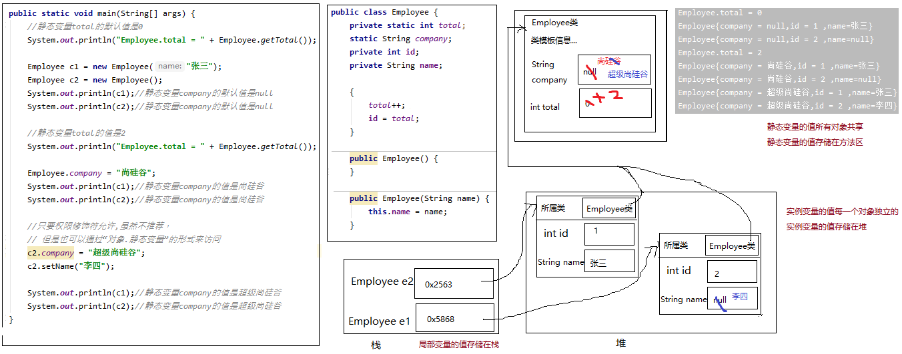
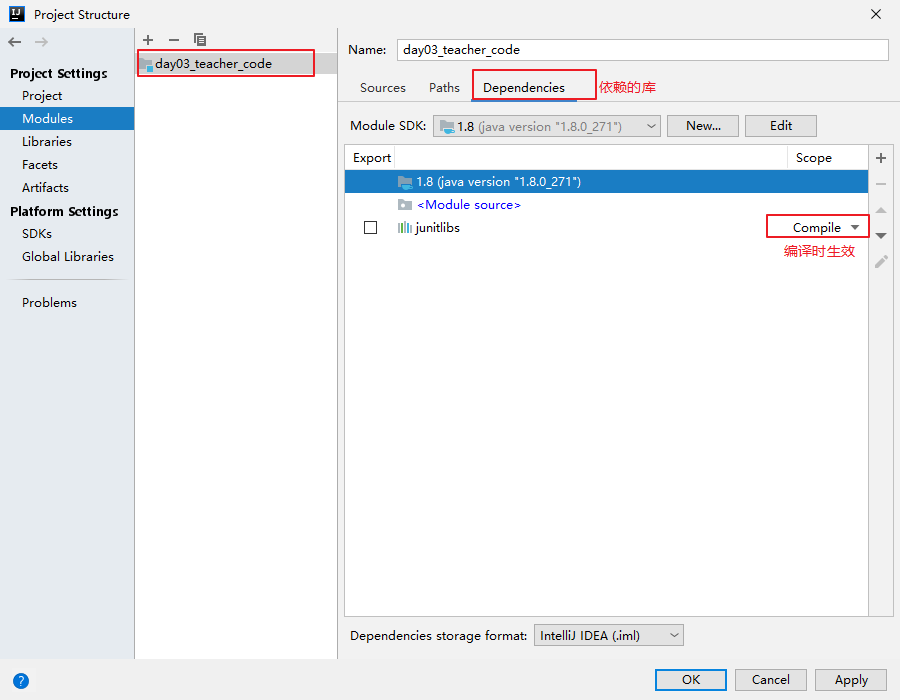
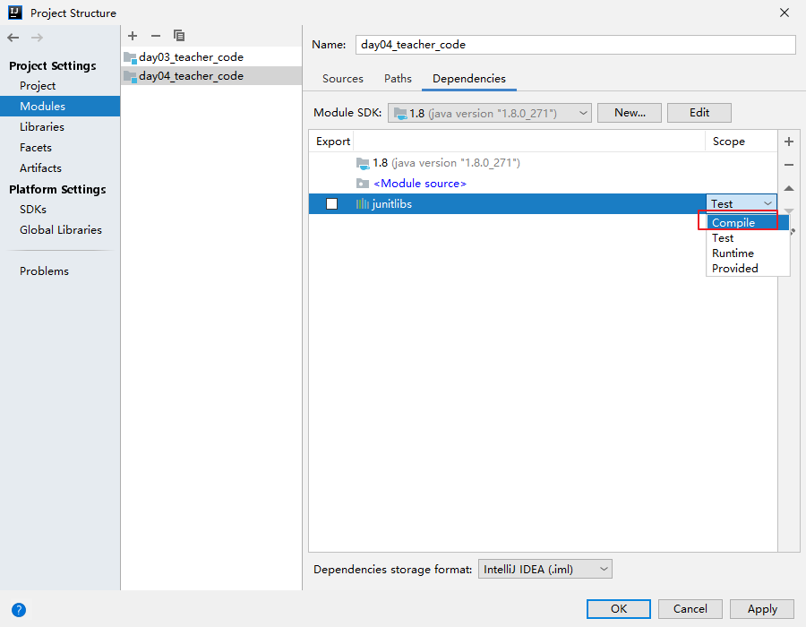

# JavaSE_第7章 面向对象基础(下)

## 学习目标

* [ ] 能够声明抽象类
* [ ] 能够说出抽象类的特点
* [ ] 能够继承抽象类

* [ ] 掌握声明接口的格式
* [ ] 掌握实现接口的格式
* [ ] 说出接口中成员的特点
* [ ] 说出接口的其他特点
* [ ] 掌握static关键字的用法
* [ ] 说出内部类的几种形式
* [ ] 能够声明静态内部类和非静态成员内部类
* [ ] 能够看懂和声明匿名内部类
* [ ] 能够使用系统预定义的三个基本注解
* [ ] 能够编写文档注释
* [ ] 能够使用JUnit框架的@Test注解

## 7.1 静态

### 7.1.1 静态关键字(static)

在类中声明的实例变量，其值是每一个对象独立的。但是有些成员变量的值不需要或不能每一个对象单独存储一份，即有些成员变量和当前类的对象无关。

在类中声明的实例方法，在类的外面必须要先创建对象，才能调用。但是有些方法的调用和当前类的对象无关，那么创建对象就有点麻烦了。

此时，就需要将和当前类的对象无关的成员变量、成员方法声明为静态的（static）。

### 7.1.2 静态变量

#### 1、语法格式

有static修饰的成员变量就是静态变量。

```java
【修饰符】 class 类{
	【其他修饰符】 static 数据类型  静态变量名;
}
```

#### 2、静态变量的特点

- 静态变量的默认值规则和实例变量一样。
- 静态变量值是所有对象共享。

- 静态变量的值存储在方法区。
- 静态变量在本类中，可以在任意方法、代码块、构造器中直接使用。
- 如果权限修饰符允许，在其他类中可以通过“类名.静态变量”直接访问，也可以通过“对象.静态变量”的方式访问（但是更推荐使用类名.静态变量的方式）。
- 静态变量的get/set方法也静态的，当局部变量与静态变量重名时，使用“类名.静态变量”进行区分。

| 分类     | 数据类型                       | 默认值   |
| -------- | ------------------------------ | -------- |
| 基本类型 | 整数（byte，short，int，long） | 0        |
|          | 浮点数（float，double）        | 0.0      |
|          | 字符（char）                   | '\u0000' |
|          | 布尔（boolean）                | false    |
|          | 数据类型                       | 默认值   |
| 引用类型 | 数组，类，接口                 | null     |

演示：

```java
package com.atguigu.keyword;

public class Employee {
    private static int total;//这里私有化，在类的外面必须使用get/set方法的方式来访问静态变量
    static String company; //这里缺省权限修饰符，是为了演示在类外面演示“类名.静态变量”的方式访问
    private int id;
    private String name;

    {
        //两个构造器的公共代码可以提前到非静态代码块
        total++; 
        id = total; //这里使用total静态变量的值为id属性赋值
    }

    public Employee() {
    }

    public Employee(String name) {
        this.name = name;
    }

    public void setId(int id) {
        this.id = id;
    }

    public int getId() {
        return id;
    }

    public String getName() {
        return name;
    }

    public void setName(String name) {
        this.name = name;
    }

    public static int getTotal() {
        return total;
    }

    public static void setTotal(int total) {
        Employee.total = total;
    }

    @Override
    public String toString() {
        return "Employee{company = " + company + ",id = " + id + " ,name=" + name +"}";
    }
}
```

```java
package com.atguigu.keyword;

public class TestStaticVariable {
    public static void main(String[] args) {
        //静态变量total的默认值是0
        System.out.println("Employee.total = " + Employee.getTotal());

        Employee c1 = new Employee("张三");
        Employee c2 = new Employee();
        System.out.println(c1);//静态变量company的默认值是null
        System.out.println(c2);//静态变量company的默认值是null
        System.out.println("Employee.total = " + Employee.getTotal());//静态变量total值是2

        Employee.company = "尚硅谷";
        System.out.println(c1);//静态变量company的值是尚硅谷
        System.out.println(c2);//静态变量company的值是尚硅谷

        //只要权限修饰符允许,虽然不推荐，但是也可以通过“对象.静态变量”的形式来访问
        c1.company = "超级尚硅谷";

        System.out.println(c1);//静态变量company的值是超级尚硅谷
        System.out.println(c2);//静态变量company的值是超级尚硅谷
    }
}
```

#### 3、静态变量内存分析



#### 4、静态类变量和非静态实例变量、局部变量

|                | 静态变量                                   | **实例变量**                 | **局部变量**                                                 |
| -------------- | ------------------------------------------ | ---------------------------- | ------------------------------------------------------------ |
| **声明的位置** | 直接声明在类的成员位置                     | 直接声明在类的成员位置       | 声明在方法体中或其他局部区域内（方法声明上，构造方法，代码块等） |
| **修饰符**     | 必须static，还可以public、private、final等 | 可以public、private、final等 | 不能使用访问权限修饰符，可以使用final                        |
| **内存位置**   | **方法区**                                 | **堆**                       | **栈**                                                       |
| **初始化值**   | 有默认初始化值                             | 有默认初始化值               | 无默认初始化值                                               |
| **生命周期**   | 和类相同                                   | 同对象的生命周期             | 随着方法的调用而存在，方法调用完毕即消失                     |

### 7.1.3 静态方法

#### 1、语法格式

有static修饰的成员方法就是静态方法。

```java
【修饰符】 class 类{
	【其他修饰符】 static 返回值类型 方法名(形参列表){
        方法体
    }
}
```

#### 2、静态方法的特点

- 静态方法在本类的任意方法、代码块、构造器中都可以直接被调用。
- 只要权限修饰符允许，静态方法在其他类中可以通过“类名.静态方法“的方式调用。也可以通过”对象.静态方法“的方式调用（但是更推荐使用类名.静态方法的方式）。
- 静态方法可以被子类继承，但==**不能被子类重写**==。
- 静态方法的调用都只看编译时类型。

```java
package com.atguigu.keyword;

public class Father {
    public static void method(){
        System.out.println("Father.method");
    }

    public static void fun(){
        System.out.println("Father.fun");
    }
}
```

```java
package com.atguigu.keyword;

public class Son extends Father{
//    @Override //尝试重写静态方法，加上@Override编译报错，去掉Override不报错，但是也不是重写
    public static void fun(){
        System.out.println("Son.fun");
    }
}
```

```java
package com.atguigu.keyword;

public class TestStaticMethod {
    public static void main(String[] args) {
        Father.method();
        Son.method();//继承静态方法

        Father f = new Son();
        f.method();//执行Father类中的method
    }
}
```

### 7.1.4 静态代码块

如果想要为静态变量初始化，可以直接在静态变量的声明后面直接赋值，也可以使用静态代码块。

#### 1、语法格式

在代码块的前面加static，就是静态代码块。

```java
【修饰符】 class 类{
	static{
        静态代码块
    }
}
```

#### 2、静态代码块的特点

每一个类的静态代码块只会执行一次。

静态代码块的执行优先于非静态代码块和构造器。

```java
package com.atguigu.keyword;

public class Chinese {
//    private static String country = "中国";

    private static String country;
    private String name;

    {
        System.out.println("非静态代码块，country = " + country);
    }

    static {
        country = "中国";
        System.out.println("静态代码块");
    }

    public Chinese(String name) {
        this.name = name;
    }
}
```

```java
package com.atguigu.keyword;

public class TestStaticBlock {
    public static void main(String[] args) {
        Chinese c1 = new Chinese("张三");
        Chinese c2 = new Chinese("李四");
    }
}

```

#### 3、静态代码块和非静态代码块

静态代码块在类初始化时执行，只执行一次

==**非静态代码块在实例初始化时执行，每次new对象都会执行**==

### 7.1.5 类初始化

（1）类的初始化就是为静态变量初始化。实际上，类初始化的过程时在调用一个<clinit>()方法，而这个方法是编译器自动生成的。编译器会将如下两部分的**所有**代码，**按顺序**合并到类初始化<clinit>()方法体中。

-  静态类成员变量的显式赋值语句

- 静态代码块中的语句

  > 当然没有这两部分代码，静态变量也有默认初始值


（2）每个类初始化只会进行一次，如果子类初始化时，发现父类没有初始化，那么会先初始化父类。

（3）类的初始化一定优先于实例初始化。

#### 1、类初始化代码只执行一次

```java
public class Fu{
    static{
        System.out.println("Fu静态代码块1，a = " + Fu.a);
    }
    private static int a = 1;
    static{
        System.out.println("Fu静态代码块2，a = " + a);
    }
    
    public static void method(){
        System.out.println("Fu.method");
    }

}
```

```java
public class TestClassInit {
    public static void main(String[] args) {
        Fu.method();
    }
}
```

#### 2、父类优先于子类初始化

```java
public class Zi extends Fu{
    static{
        System.out.println("Zi静态代码块");
    }
}
```

```java
public class TestZiInit {
    public static void main(String[] args) {
        Zi z = new Zi();
    }
}
```

#### 3、类初始化优先于实例初始化

```java
public class Fu{
    static{
        System.out.println("Fu静态代码块1，a = " + Fu.a);
    }
    private static int a = 1;
    static{
        System.out.println("Fu静态代码块2，a = " + a);
    }

    {
        System.out.println("Fu非静态代码块");
    }
    public Fu(){
        System.out.println("Fu构造器");
    }

    public static void method(){
        System.out.println("Fu.method");
    }
}

```

```java
public class Zi extends Fu{
    static{
        System.out.println("Zi静态代码块");
    }
    {
        System.out.println("Zi非静态代码块");
    }
    public Zi(){
        System.out.println("Zi构造器");
    }
}
```

```java
public class TestZiInit {
    public static void main(String[] args) {
        Zi z1 = new Zi();
        Zi z2 = new Zi();
    }
}
```

### 7.1.6 静态和非静态的区别

#### 1、本类中的访问限制区别

静态的类变量和静态的方法可以在本类的任意方法、代码块、构造器中直接访问。

非静态的实例变量和非静态的方法 ==**只能 **==在本类的非静态的方法、非静态代码块、构造器中直接访问。

即：

- 静态直接访问静态，可以

- 非静态直接访问非静态，可以

- 非静态直接访问静态，可以

- 静态直接访问非静态，不可以

  一句话关于静态与非静态直接访问问题：**静态不能直接访问非静态**

#### 2、在其他类的访问方式区别

- 访问静态的类变量和静态的方法：
  - 通过“**类名.静态变量或方法**”的方式访问。（推荐）
  - 通过“**对象.静态变量或方法**"的方式访问。（不推荐）

- 访问非静态的实例变量和非静态的方法：
  - 只能通过“**对象.实例变量或方法**“方式访问。

#### 3、this和super的使用

静态的方法和静态的代码块中，【不允许】出现this和super关键字，如果有重名问题，使用“类名.”进行区别。（this和super都是与对象相关）

非静态的方法和非静态的代码块中，可以使用this和super关键字。

### 7.1.7 静态导入(了解)

如果大量使用另一个类的静态成员，可以使用静态导入，简化代码。

```java
import static 包.类名.静态成员名;
import static 包.类名.*;
```

演示：

```java
package com.atguigu.keyword;

import static java.lang.Math.*;

public class TestStaticImport {
    public static void main(String[] args) {
        //使用Math类的静态成员
        System.out.println(Math.PI);
        System.out.println(Math.sqrt(9));
        System.out.println(Math.random());

        System.out.println("----------------------------");
        System.out.println(PI);
        System.out.println(sqrt(9));
        System.out.println(random());
    }
}
```

## 7.2 抽象类

### 7.2.1 引入

抽象：即不具体、或无法具体

例如：当我们声明一个几何图形类：圆、矩形、三角形类等，发现这些类都有共同特征：求面积、求周长、获取图形详细信息。那么这些共同特征应该抽取到一个公共父类中。但是这些方法在父类中又**无法给出具体的实现**，而是应该交给子类各自具体实现。那么父类在声明这些方法时，**就只有方法签名，没有方法体**，我们把没有方法体的方法称为**抽象方法**。Java语法规定，包含抽象方法的类必须是**抽象类**。

*动物 - 猫 - 狗案例：动物类方法无需具体实现*

### 7.2.2 语法格式

* **抽象方法** ： 没有方法体的方法。
* **抽象类**：被abstract所修饰的类。

抽象类的语法格式

```java
【权限修饰符】 abstract class 类名{
    
}
【权限修饰符】 abstract class 类名 extends 父类{
    
}
```

抽象方法的语法格式

```java
【其他修饰符】 abstract 返回值类型  方法名(【形参列表】);
```

> ==**注意：抽象方法没有方法体**==

代码举例：

```java
public abstract class Animal {
    public abstract void run()；
}
```

```java
public class Cat extends Animal {
    public void run (){
      	System.out.println("小猫在墙头走~~~")； 	 
    }
}
```

```java
public class CatTest {
 	 public static void main(String[] args) {
        // 创建子类对象
        Cat c = new Cat(); 
       
        // 调用run方法
        c.run();
  	}
}
输出结果：
小猫在墙头走~~~
```

此时的方法重写，是子类对父类抽象方法的完成实现，我们将这种方法重写的操作，也叫做**实现方法**。

### 7.2.3 抽象类特点

关于抽象类的使用，以下为语法上要注意的细节，虽然条目较多，但若理解了抽象的本质，无需死记硬背。

1. ==**抽象类不能创建对象**==，如果创建，编译无法通过而报错。只能创建其非抽象子类的对象。

   > 理解：假设创建了抽象类的对象，调用抽象的方法，而抽象方法没有具体的方法体，没有意义。

2. ==**抽象类中，也有构造方法，是供子类创建对象时，初始化父类成员变量使用的**==。

   > 理解：子类的构造方法中，有默认的super()或手动的super(实参列表)，需要访问父类构造方法。

3. ==**抽象类中，不一定包含抽象方法，但是有抽象方法的类必定是抽象类**==。

   > 理解：未包含抽象方法的抽象类，目的就是不想让调用者创建该类对象，通常用于某些特殊的类结构设计。

4. ==**抽象类的子类，必须重写抽象父类中**所有的**抽象方法**==，否则，编译无法通过而报错。除非该子类也是抽象类。 

   > 理解：假设不重写所有抽象方法，则类中可能包含抽象方法。那么创建对象后，调用抽象的方法，没有意义。

###  练习

1. #### 练习1

   定义一个几何图形父类Graphic。所有几何图形都应该具备一个计算面积的方法。但是不同的几何图形计算面积的方式完全不同。

   ```java
   abstract class Graphic{
   	public abstract double getArea();
   }
   class Circle extends Graphic{
   	private double radius;
   
   	public Circle(double radius) {
   		super();
   		this.radius = radius;
   	}
   
   	public Circle() {
   		super();
   	}
   
   	public double getRadius() {
   		return radius;
   	}
   
   	public void setRadius(double radius) {
   		this.radius = radius;
   	}
   
   	@Override
   	public double getArea() {
   		return Math.PI * radius * radius;
   	}
   	
   }
   class Rectangle extends Graphic{
   	private double length;
   	private double width;
   	public Rectangle(double length, double width) {
   		super();
   		this.length = length;
   		this.width = width;
   	}
   	public Rectangle() {
   		super();
   	}
   	public double getLength() {
   		return length;
   	}
   	public void setLength(double length) {
   		this.length = length;
   	}
   	public double getWidth() {
   		return width;
   	}
   	public void setWidth(double width) {
   		this.width = width;
   	}
   	@Override
   	public double getArea() {
   		return length * width;
   	}
   }
   ```

2. #### 练习2

   1、声明抽象父类：Person，包含抽象方法：
   public abstract void walk();
   public abstract void eat();

   2、声明子类Man，继承Person
   重写walk()：大步流星走路
   重写eat()：狼吞虎咽吃饭
   新增方法：public void smoke()实现为吞云吐雾

   3、声明子类Woman，继承Person
   重写walk()：婀娜多姿走路
   重写eat()：细嚼慢咽吃饭
   新增方法：public void buy()实现为买买买...

   4、在测试类中创建子类对象，调用方法测试

   ```java
   public abstract class Person {
   	public abstract void walk();
   	public abstract void eat();
   }
   
   ```

   ```java
   public class Man extends Person {
   
   	@Override
   	public void walk() {
   		System.out.println("大步流星走路");
   	}
   
   	@Override
   	public void eat() {
   		System.out.println("狼吞虎咽吃饭");
   	}
   
   	public void smoke(){
   		System.out.println("吞云吐雾");
   	}
   }
   ```

   ```java
   public class Woman extends Person {
   
   	@Override
   	public void walk() {
   		System.out.println("婀娜多姿走路");
   	}
   
   	@Override
   	public void eat() {
   		System.out.println("细嚼慢咽吃饭");
   	}
   	
   	public void buy(){
   		System.out.println("买买买...");
   	}
   }
   ```

   ```java
   public class TestExer1 {
   
   	public static void main(String[] args) {
   		Man m = new Man();
   		m.eat();
   		m.walk();
   		m.smoke();
   		
   		System.out.println("-------------------------");
   		
   		Woman w = new Woman();
   		w.eat();
   		w.walk();
   		w.buy();
   	}
   
   }
   ```

### 7.2.4 修饰符一起使用问题？

|           | 外部类 | 成员变量 | 代码块 | 构造器 | 方法 | 局部变量 | 内部类（后面讲） |
| --------- | ------ | -------- | ------ | ------ | ---- | -------- | ---------------- |
| public    | √      | √        | ×      | √      | √    | ×        | √                |
| protected | ×      | √        | ×      | √      | √    | ×        | √                |
| 缺省      | √      | √        | ×      | √      | √    | ×        | √                |
| private   | ×      | √        | ×      | √      | √    | ×        | √                |
| static    | ×      | √        | √      | ×      | √    | ×        | √                |
| final     | √      | √        | ×      | ×      | √    | √        | √                |
| abstract  | √      | ×        | ×      | ×      | √    | ×        | √                |
| native    | ×      | ×        | ×      | ×      | √    | ×        | ×                |


## 7.3 接口

### 7.3.1 概述

- 一方面 ，有时必须从几个类中派生出一个子类，继承它们所有的属性和方法。但是 ， Java不支持多重继承。
- 另一方面，有时必须从几个类中抽取出一些共同的行为特征，而它们之间又没有 is -a的关系，仅是具有相同行为特征而已 。例如 ：鼠标、键盘、打印机、 扫描仪、摄像头、充电器、移动硬盘等都支持USB连接 。
- 接口就是规范，定义的一组则体现了现实世界中“如果你/要... 则必须能 ... ”的思想。继承是一个 "is a"的关系，而接口实现则是 "has a"的关系。
-  接口的本质是契约，标准规范 ，就像我们的法律一样。制定好后大家都 要遵守 。 

生活中大家每天都在用USB接口，那么USB接口与我们今天要学习的接口有什么相同点呢？

 	USB是通用串行总线的英文缩写，是Intel公司开发的总线架构，使得在计算机上添加串行设备（鼠标、键盘、打印机、扫描仪、摄像头、充电器、MP3机、手机、数码相机、移动硬盘等）非常容易。只须将设备插入计算机的USB端口中，系统会自动识别和配置。 有了USB，我们电脑需要提供的各种插槽的口越来越少，而能支持的其他设备的连接却越来越多。

​	那么我们平时看到的电脑上的USB插口、以及其他设备上的USB插口是什么呢？

​	其实，不管是电脑上的USB插口，还是其他设备上的USB插口都只是遵循了USB规范的一种具体设备而已。

​	根据时代发展，USB接口标准经历了一代USB、第二代USB 2.0和第三代USB 3.0 。

​	USB规格第一次是于1995年，由Intel、IBM、Compaq、Microsoft、NEC、Digital、North Telecom等七家公司组成的USBIF(USB Implement Forum)共同提出，USBIF于1996年1月正式提出USB1.0规格，频宽为1.5Mbps。

   USB2.0技术规范是有由Compaq、Hewlett Packard、Intel、Lucent、Microsoft、NEC、Philips共同制定、发布的，规范把外设数据传输速度提高到了480Mbps，被称为USB 2.0的高速(High-speed)版本.

   USB 3.0是最新的USB规范，该规范由英特尔等公司发起,USB3.0的最大传输带宽高达5.0Gbps(640MB/s),USB3.0 引入全双工数据传输。5根线路中2根用来发送数据，另2根用来接收数据，还有1根是地线。也就是说，USB 3.0可以同步全速地进行读写操作。

| **USB版本** | **最大传输速率** | **速率称号**          | **最大输出电流** | **推出时间** |
| ----------- | ---------------- | --------------------- | ---------------- | ------------ |
| USB1.0      | 1.5Mbps(192KB/s) | 低速(Low-Speed)       | 5V/500mA         | 1996年1月    |
| USB1.1      | 12Mbps(1.5MB/s)  | 全速(Full-Speed)      | 5V/500mA         | 1998年9月    |
| USB2.0      | 480Mbps(60MB/s)  | 高速(High-Speed)      | 5V/500mA         | 2000年4月    |
| USB3.0      | 5Gbps(500MB/s)   | 超高速(Super-Speed)   | 5V/900mA         | 2008年11月   |
| USB 3.1     | 10Gbps(1280MB/s) | 超高速+(Super-speed+) | 20V/5A           | 2013年12月   |

 下面是USB2.0和USB3.0标准下的各类接口示意图： 


​		电脑边上提供了USB插槽，这个插槽遵循了USB的规范，只要其他设备也是遵循USB规范的，那么就可以互联，并正常通信。至于这个电脑、以及其他设备是哪个厂家制造的，内部是如何实现的，我们都无需关心。

​		这种设计是将规范和实现分离，这也正是Java接口的好处。Java的软件系统会有很多模块组成，那么各个模块之间也应该采用这种面相接口的低耦合，为系统提供更好的可扩展性和可维护性。

* 接口就是规范，定义的是一组规则，体现了现实世界中“如果你是/要...则必须能...”的思想。继承是一个"是不是"的is-a关系，而接口实现则是 "能不能"的has-a关系。
  * 例如：你能不能用USB进行连接，或是否具备USB通信功能，就看你是否遵循USB接口规范
  * 例如：Java程序是否能够连接使用某种数据库产品，那么要看该数据库产品有没有实现Java设计的JDBC规范


### 7.3.2 定义格式

接口通常是静态常量与抽象方法定义的集合。跟定义类的方式类似，接口使用关键字interface定义。

#### 1、接口的声明格式

```java
【修饰符】 interface 接口名{
    
}
```

示例代码：

```java
interface Usb3{
    //静态常量
	long MAX_SPEED = 500*1024*1024;//500MB/s
    
    //抽象方法
	void in();
    void out();
    
    //默认方法
    public default void start(){
        System.out.println("开始");
    }
    public default void stop(){
        System.out.println("结束");
    }
    
    //静态方法
    public static void show(){
        System.out.println("USB 3.0可以同步全速地进行读写操作");
    }
}
```

#### 2、接口的成员说明

接口定义的是多个类共同的公共行为规范，这些行为规范是与外部交流的通道，这就意味着接口里通常是定义一组公共方法。

在JDK8之前，接口中只允许出现：

- （1）公共的静态的常量：其中public static final可以省略

- （2）公共的抽象的方法：其中public abstract可以省略

> 理解：接口是从多个相似类中抽象出来的规范，不需要提供具体实现

在JDK1.8时，接口中允许声明默认方法和静态方法：

- （3）公共的默认的方法：其中public 可以省略，建议保留，但是default不能省略

- （4）公共的静态的方法：其中public 可以省略，建议保留，但是static不能省略

在JDK1.9时，接口又增加了：

- （5）私有方法

除此之外，接口中不能有其他成员，没有构造器，没有初始化块，因为接口中没有成员变量需要动态初始化。

#### 3、面试题(了解)

- **为什么接口中只能声明公共的静态的常量？**

  因为接口是标准规范，那么在规范中需要声明一些底线边界值，当实现者在实现这些规范时，不能去随意修改和触碰这些底线，否则就有“危险”。

  例如：USB1.0规范中规定最大传输速率是1.5Mbps，最大输出电流是5V/500mA

  ​           USB3.0规范中规定最大传输速率是5Gbps(500MB/s)，最大输出电流是5V/900mA

- **为什么JDK1.8之后要允许接口定义静态方法和默认方法呢？这样做违反了接口作为一个抽象标准定义的概念。**

  **关于静态方法**：因为之前的核心类库设计中，有很多Collection/Colletions或者Path/Paths这样成对的接口和类，后面的类中都是静态方法，而这些静态方法都是为前面的接口服务的，那么这样设计一对API，不如把静态方法直接定义到接口中使用和维护更方便。接口中的静态方法不能被实现类覆盖，并且只能由接口名调用。

  **关于默认方法**：①我们要在已有的老版接口中提供新方法时，如果添加抽象方法，原来使用这些接口的类就会有问题，需要修改实现新增的抽象方法，那么为了保持与旧版本代码的兼容性，只能允许在接口中定义默认方法实现。比如：Java8中对Collection、List、Comparator等接口提供了丰富的默认方法。②当我们接口的某个抽象方法，在很多实现类中的实现代码是一样的，此时将这个抽象方法设计为默认方法更为合适，那么实现类就可以选择重写，也可以选择不重写。

- **我们说接口是规范，规范时需要公开让大家遵守的，为什么JDK1.9要允许接口定义私有方法呢？**

  **私有方法**：因为有了默认方法和静态方法这样具有具体实现的方法，那么就可能出现多个方法由共同的代码可以抽取，而这些共同的代码抽取出来的方法又只希望在接口内部使用，所以就增加了私有方法。

### 7.3.3 接口的实现

接口**不能创建对象**，但是可以被类实现，类似于被继承。

类与接口的关系为实现关系，即**类实现接口**，该类可以称为接口的实现类，也可以称为接口的子类。实现的动作类似继承，格式相仿，只是关键字不同，实现使用 ` implements`关键字。

#### 1、类实现接口语法格式

```java
【修饰符】 class 实现类  implements 接口{
	// 重写接口中抽象方法【必须】，当然如果实现类是抽象类，那么可以不重写
  	// 重写接口中默认方法【可选】
}

【修饰符】 class 实现类 extends 父类 implements 接口{
    // 重写接口中抽象方法【必须】，当然如果实现类是抽象类，那么可以不重写
  	// 重写接口中默认方法【可选】
}
```

注意：

1. 如果接口的实现类是非抽象类，那么必须重写接口中**所有**抽象方法。

2. 默认方法可以选择保留，也可以重写。

   > 重写时，default单词就不要再写了，它只用于在接口中表示默认方法，到类中就没有默认方法的概念了

3. **接口中的静态方法不能被继承也不能被重写**

示例代码：

```java
public class MobileHDD implements Usb3 {
    //重写/实现接口的抽象方法，【必选】
    public void out() {
        System.out.println("读取数据并发送");
    }
    public void in(){
        System.out.println("接收数据并写入");
    }

    //重写接口的默认方法，【可选】
    //重写默认方法时，default单词去掉
    public void end(){
        System.out.println("清理硬盘中的隐藏回收站中的东西，再结束");
    }
}
```

#### 2、访问接口的成员

* 接口的抽象方法、默认方法：
  * 抽象方法必须被实现类重写才能访问，默认方法可以选择是否重写，但必须通过实现类对象来访问 
* 访问接口的静态方法：
  * 只能使用**"接口名.静态成员"**来访问
* 访问接口的静态常量：
  * 通常通过**"接口名.静态常量"**来访问

```java
public class TestMobileHDD {
    public static void main(String[] args) {
        //创建实现类对象
        MobileHDD b = new MobileHDD();

        //通过实现类对象调用重写的抽象方法，以及接口的默认方法，如果实现类重写了就执行重写的默认方法，如果没有重写，就执行接口中的默认方法
        b.start();
        b.in();
        b.stop();

        //通过接口名调用接口的静态方法
//        MobileHDD.show();
//        b.show();
        Usb3.show();
        //通过“接口名.”直接使用接口的静态常量
        System.out.println(Usb3.MAX_SPEED);
    }
}
```

#### 3、接口的多态形式

实现类实现接口，类似于子类继承父类，因此，接口类型的变量与实现类的对象之间，也可以构成多态引用。通过接口类型的变量调用方法，最终执行的是你new的实现类对象实现的方法体。

接口的不同实现类：

```java
package com.atguigu.interfacetype;

public class Mouse implements Usb3 {
    @Override
    public void out() {
        System.out.println("发送脉冲信号");
    }

    @Override
    public void in() {
        System.out.println("不接收信号");
    }
}
```

```java
package com.atguigu.interfacetype;

public class KeyBoard implements Usb3{
    @Override
    public void in() {
        System.out.println("不接收信号");
    }

    @Override
    public void out() {
        System.out.println("发送按键信号");
    }
}

```

测试类

```java
package com.atguigu.interfacetype;

public class TestComputer {
    public static void main(String[] args) {
        Computer computer = new Computer();
        Usb3 usb = new Mouse();
        computer.setUsb(usb);
        usb.start();
        usb.out();
        usb.in();
        usb.stop();
        System.out.println("--------------------------");

        usb = new KeyBoard();
        computer.setUsb(usb);
        usb.start();
        usb.out();
        usb.in();
        usb.stop();
        System.out.println("--------------------------");

        usb = new MobileHDD();
        computer.setUsb(usb);
        usb.start();
        usb.out();
        usb.in();
        usb.stop();
    }
}
```

#### 练习

1、声明一个LiveAble接口

* 包含两个抽象方法：
  * void eat();	
  * void breathe();
* 包含默认方法  default void sleep()，实现为打印“静止不动”
* 包含静态方法 static void drink()，实现为“喝水”

2、声明动物Animal类，实现LiveAble接口。

* void eat();实现为“吃东西”，
* void breathe();实现为"吸入氧气呼出二氧化碳"
* void sleep()重写为”闭上眼睛睡觉"

3、声明植物Plant类，实现LiveAble接口。

* void eat();实现为“吸收营养”
* void breathe();实现为"吸入二氧化碳呼出氧气"

4、在测试类中，分别创建两个实现类的对象，调用对应的方法。通过接口名，调用静态方法

定义接口：

```java
public interface LiveAble {
    // 定义抽象方法
    public abstract void eat();
    public abstract void breathe();
    //定义默认方法
    public default void sleep(){
    	System.out.println("静止不动");
    }
    //定义静态方法
    public static void drink(){
    	System.out.println("喝水");
    }
}
```

定义实现类：

```java
public Animal implements LiveAble {
	//重写/实现接口的抽象方法
    @Override
    public void eat() {
        System.out.println("吃东西");
    }
    
    //重写/实现接口的抽象方法
    @Override
    public void breathe(){
        System.out.println("吸入氧气呼出二氧化碳");
    }
    
    //重写接口的默认方法
    @Override
    public void sleep() {
        System.out.println("闭上眼睛睡觉");
    }
}
```

```java
public class Plant implements LiveAble {
	//重写/实现接口的抽象方法
    @Override
    public void eat() {
        System.out.println("吸收营养");
    }
    //重写/实现接口的抽象方法
    @Override
    public void breathe(){
        System.out.println("吸入二氧化碳呼出氧气");
    }
}
```

定义测试类：

```java
public class InterfaceDemo {
    public static void main(String[] args) {
        // 创建实现类（子类）对象  
        Animal a = new Animal();
        // 调用实现后的方法
        a.eat();
        a.sleep();
        a.breathe();
        
        //创建实现类（子类）对象
        Plant p = new Plant();
        p.eat();
        p.sleep();
        p.breathe();
        
        //通过接口调用静态方法
        LiveAble.drink();
    }
}
输出结果：
吃东西
闭上眼睛睡觉
吸入氧气呼出二氧化碳
吸收营养
静止不动
吸入二氧化碳呼出氧气
喝水
```

### 7.3.4 接口的多实现和多继承

#### 1、接口的多实现

之前学过，在继承体系中，一个类只能继承一个父类。而对于接口而言，一个类是可以实现多个接口的，这叫做接口的**多实现**。并且，一个类能继承一个父类，同时实现多个接口。

实现格式：

```java
【修饰符】 class 实现类  implements 接口1，接口2，接口3。。。{
	// 重写接口中所有抽象方法【必须】，当然如果实现类是抽象类，那么可以不重写
  	// 重写接口中默认方法【可选】
}

【修饰符】 class 实现类 extends 父类 implements 接口1，接口2，接口3。。。{
    // 重写接口中所有抽象方法【必须】，当然如果实现类是抽象类，那么可以不重写
  	// 重写接口中默认方法【可选】
}
```

> 接口中，有多个抽象方法时，实现类必须重写所有抽象方法。**如果抽象方法有重名的，只需要重写一次**。

定义多个接口：

```java
interface A {
    public abstract void showA();
    public abstract void show();
}

interface B {
    public abstract void showB();
    public abstract void show();
}
```

定义实现类：

```java
public class C implements A,B{
    @Override
    public void showA() {
        System.out.println("showA");
    }

    @Override
    public void showB() {
        System.out.println("showB");
    }

    @Override
    public void show() {
        System.out.println("show");
    }
}
```

**练习**

1、声明第一个接口Runner，包含抽象方法：void run()

2、声明第二个接口Swimming，包含抽象方法：void swim()

3、声明兔子类，实现Runner接口

4、声明乌龟类，实现Runner接口和Swimming接口

```java
interface Runner{
	void run();
}
```

```java
interface Swimming{
	void swim();
}
```

```java
class Rabbit implements Runner{

	@Override
	public void run() {
		System.out.println("兔子跑得快");
	}
	
}
```

```java
class Tortoise implements Runner,Swimming{

	@Override
	public void swim() {
		System.out.println("乌龟游得快");
	}

	@Override
	public void run() {
		System.out.println("乌龟跑的慢");
	}
	
}
```

#### 2、接口的多继承

一个接口能继承另一个或者多个接口，接口的继承也使用 `extends` 关键字，子接口继承父接口的方法。

定义父接口：

```java
public interface Chargeable {
    void charge();
    void in();
    void out();
}
```

定义子接口：

```java
public interface UsbC extends Chargeable,Usb3 {
    void reverse();
}
```

定义子接口的实现类：

```java
public class TypeCConverter implements UsbC {
    @Override
    public void reverse() {
        System.out.println("正反面都支持");
    }

    @Override
    public void charge() {
        System.out.println("可充电");
    }

    @Override
    public void in() {
        System.out.println("接收数据");
    }

    @Override
    public void out() {
        System.out.println("输出数据");
    }
}
```

>所有父接口的抽象方法都有重写。
>
>方法签名相同的抽象方法只需要实现一次。

### 7.3.5 冲突问题(了解)

#### 1、默认方法冲突问题

**（1）亲爹优先原则**

当一个类，既继承一个父类，又实现若干个接口时，父类中的成员方法与接口中的抽象方法重名，子类就近选择执行父类的成员方法。代码如下：

定义接口：

```java
public interface Godfather {
    default void date(){//约会
        System.out.println("打麻将");
    }
}
```

定义父类：

```java
public class Father {
    public void date(){//约会
        System.out.println("爸爸约吃饭");
    }
}
```

定义子类：

```java
public class Son extends Father implements Godfather {
    @Override
    public void date() {
        //(1)不重写默认保留父类的
        //(2)调用父类被重写的
//        super.date();
        //(3)保留父接口的
//        Godfather.super.date();
        //(4)完全重写
        System.out.println("学Java");
    }
}
```

定义测试类：

```java
public class TestSon {
    public static void main(String[] args) {
        Son s = new Son();
        s.date();
    }
}
```

**（2）左右为难**

- 当一个类同时实现了多个父接口，而多个父接口中包含方法签名相同的默认方法时，怎么办呢？


无论你多难抉择，最终都是要做出选择的。

声明接口：

```java
public interface Brother {
    default void date(){//约会
        System.out.println("打游戏");
    }
}
```

```java
public interface GirlFriend {
    default void date(){//约会
        System.out.println("神秘约会");
    }
}
```

选择保留其中一个，通过“接口名.super.方法名"的方法选择保留哪个接口的默认方法。

```java
public class Boy implements Brother,GirlFriend{

    @Override
    public void date() {
        //(1)保留其中一个父接口的
//        Brother.super.date();
//        GirlFriend.super.date();
        //(2)完全重写
        System.out.println("学Java");
    }

}
```

测试类

```java
public class TestBoy {
    public static void main(String[] args) {
        Boy boy = new Boy();
        boy.date();
    }
}
```

- 当一个子接口同时继承了多个接口，而多个父接口中包含方法签名相同的默认方法时，怎么办呢？

另一个父接口：

```java
package com.atguigu.interfacetype;

public interface Usb2 {
    //静态常量
    long MAX_SPEED = 60*1024*1024;//60MB/s

    //抽象方法
    void in();
    void out();

    //默认方法
    public default void start(){
        System.out.println("开始");
    }
    public default void stop(){
        System.out.println("结束");
    }

    //静态方法
    public static void show(){
        System.out.println("USB 2.0可以高速地进行读写操作");
    }
}
```

子接口：

```java
package com.atguigu.interfacetype;

public interface Usb extends Usb2,Usb3 {
    @Override
    default void start() {
        System.out.println("Usb.start");
    }

    @Override
    default void stop() {
        System.out.println("Usb.stop");
    }
}

```

> 小贴士：
>
> 子接口重写默认方法时，default关键字可以保留。
>
> 子类重写默认方法时，default关键字不可以保留。

#### 2、常量冲突问题

- 当子类继承父类又实现父接口，而父类中存在与父接口常量同名的成员变量，并且该成员变量名在子类中仍然可见。
- 当子类同时继承多个父接口，而多个父接口存在相同同名常量。

此时在子类中想要引用父类或父接口的同名的常量或成员变量时，就会有冲突问题。

父类和父接口：

```java
package com.atguigu.interfacetype;

public class SuperClass {
    int x = 1;
}
```

```java
package com.atguigu.interfacetype;

public interface SuperInterface {
    int x = 2;
    int y = 2;
}
```

```java
package com.atguigu.interfacetype;

public interface MotherInterface {
    int x = 3;
}
```

子类：

```java
package com.atguigu.interfacetype;

public class SubClass extends SuperClass implements SuperInterface,MotherInterface {
    public void method(){
//        System.out.println("x = " + x);//模糊不清
        System.out.println("super.x = " + super.x);
        System.out.println("SuperInterface.x = " + SuperInterface.x);
        System.out.println("MotherInterface.x = " + MotherInterface.x);
        System.out.println("y = " + y);//没有重名问题，可以直接访问
    }
}
```

### 7.3.6 接口的特点总结

- 接口本身不能创建对象，只能创建接口的实现类对象，接口类型的变量可以与实现类对象构成多态引用。
- 声明接口用interface，接口的成员声明有限制：（1）公共的静态常量（2）公共的抽象方法（3）公共的默认方法（4）公共的静态方法（5）私有方法（JDK1.9以上）
- 类可以实现接口，关键字是implements，而且支持多实现。如果实现类不是抽象类，就必须实现接口中所有的抽象方法。如果实现类既要继承父类又要实现父接口，那么继承（extends）在前，实现（implements）在后。
- 接口可以继承接口，关键字是extends，而且支持多继承。
- 接口的默认方法可以选择重写或不重写。如果有冲突问题，另行处理。子类重写父接口的默认方法，要去掉default，子接口重写父接口的默认方法，不要去掉default。
- 接口的静态方法不能被继承，也不能被重写。接口的静态方法只能通过“接口名.静态方法名”进行调用。

### 7.3.7  经典接口介绍与使用

#### 1、java.lang.Comparable

我们知道基本数据类型的数据（除boolean类型外）需要比较大小的话，之间使用比较运算符即可，但是引用数据类型是不能直接使用比较运算符来比较大小的。那么，如何解决这个问题呢？

Java给所有引用数据类型的大小比较，指定了一个标准接口，就是java.lang.Comparable接口：

```java
package java.lang;

public interface Comparable{
    int compareTo(Object obj);
}
```

那么我们想要使得我们某个类的对象可以比较大小，怎么做呢？步骤：

第一步：哪个类的对象要比较大小，哪个类就实现java.lang.Comparable接口，并重写方法

* 方法体就是你要如何比较当前对象和指定的另一个对象的大小

第二步：对象比较大小时，通过对象调用compareTo方法，根据方法的返回值决定谁大谁小。

* this对象（调用compareTo方法的对象）大于指定对象（传入compareTo()的参数对象）返回正整数
* this对象（调用compareTo方法的对象）小于指定对象（传入compareTo()的参数对象）返回负整数
* this对象（调用compareTo方法的对象）等于指定对象（传入compareTo()的参数对象）返回零

代码示例：

```java
class Student implements Comparable{
    private int id;
    private String name;
    private int score;
    private int age;
	
	//省略了构造器、get/set、toString等方法

	@Override
	public int compareTo(Object o) {
		//这些需要强制，将o对象向下转型为Student类型的变量，才能调用Student类中的属性
		Student stu = (Student) o;
		if(this.score != stu.score){
			return this.score - stu.score;
		}else{//成绩相同，按照学号比较大小
			return this.id - stu.id;
		}
	}
	
}
```

测试类

```java
public class TestStudent {
	public static void main(String[] args) {
        Student[] arr = new Student[5];
        arr[0] = new Student(3,"张三",90,23);
        arr[1] = new Student(1,"熊大",100,22);
        arr[2] = new Student(5,"王五",75,25);
        arr[3] = new Student(4,"李四",85,24);
        arr[4] = new Student(2,"熊二",85,18);

        //单独比较两个对象
        System.out.println(arr[0].compareTo(arr[1]));
        System.out.println(arr[1].compareTo(arr[2]));
        System.out.println(arr[2].compareTo(arr[2]));

        System.out.println("所有学生：");
        for (int i = 0; i < arr.length; i++) {
            System.out.println(arr[i]);
        }
        System.out.println("按照学号排序：");
        for (int i = 1; i < arr.length; i++) {
            for (int j = 0; j < arr.length-i; j++) {
                if(arr[j].compareTo(arr[j+1])>0){
                    Student temp = arr[j];
                    arr[j] = arr[j+1];
                    arr[j+1] = temp;
                }
            }
        }
        for (int i = 0; i < arr.length; i++) {
            System.out.println(arr[i]);
        }
    }
}

```


#### 2、java.util.Comparator

思考：

（1）如果一个类，没有实现Comparable接口，而这个类你又不方便修改（例如：一些第三方的类，你只有.class文件，没有源文件），那么这样类的对象也要比较大小怎么办？

（2）如果一个类，实现了Comparable接口，也指定了两个对象的比较大小的规则，但是此时此刻我不想按照它预定义的方法比较大小，但是我又不能随意修改，因为会影响其他地方的使用，怎么办？

JDK在设计类库之初，也考虑到这种情况了，所以又增加了一个java.util.Comparator接口。

```java
package java.util;

public interface Comparator{
    int compare(Object o1,Object o2);
}
```

那么我们想要比较某个类的两个对象的大小，怎么做呢？步骤：

第一步：编写一个类，我们称之为比较器类型，实现java.util.Comparator接口，并重写方法

* 方法体就是你要如何指定的两个对象的大小

第二步：比较大小时，通过比较器类型的对象调用compare()方法，将要比较大小的两个对象作为compare方法的实参传入，根据方法的返回值决定谁大谁小。

* o1对象大于o2返回正整数
* o1对象小于o2返回负整数
* o1对象等于o2返回零

代码示例：定义比较器类

```java
package com.atguigu.api;

import java.util.Comparator;

public class StudentScoreComparator implements Comparator {
    @Override
    public int compare(Object o1, Object o2) {
        Student s1 = (Student) o1;
        Student s2 = (Student) o2;
        int result = s1.getScore() - s2.getScore();
        return result != 0 ? result : s1.getId() - s2.getId();
    }
}
```

测试类

```java
package com.atguigu.api;

public class TestStudent {
    public static void main(String[] args) {
        Student[] arr = new Student[5];
        arr[0] = new Student(3,"张三",90,23);
        arr[1] = new Student(1,"熊大",100,22);
        arr[2] = new Student(5,"王五",75,25);
        arr[3] = new Student(4,"李四",85,24);
        arr[4] = new Student(2,"熊二",85,18);

        //单独比较两个对象
        System.out.println(arr[0].compareTo(arr[1]));
        System.out.println(arr[1].compareTo(arr[2]));
        System.out.println(arr[2].compareTo(arr[2]));

        System.out.println("所有学生：");
        for (int i = 0; i < arr.length; i++) {
            System.out.println(arr[i]);
        }
        System.out.println("按照学号排序：");
        for (int i = 1; i < arr.length; i++) {
            for (int j = 0; j < arr.length-i; j++) {
                if(arr[j].compareTo(arr[j+1])>0){
                    Student temp = arr[j];
                    arr[j] = arr[j+1];
                    arr[j+1] = temp;
                }
            }
        }
        for (int i = 0; i < arr.length; i++) {
            System.out.println(arr[i]);
        }

        System.out.println("按照成绩排序");
        StudentScoreComparator sc = new StudentScoreComparator();
        for (int i = 1; i < arr.length; i++) {
            for (int j = 0; j < arr.length-i; j++) {
                if(sc.compare(arr[j],arr[j+1])>0){
                    Student temp = arr[j];
                    arr[j] = arr[j+1];
                    arr[j+1] = temp;
                }
            }
        }
        for (int i = 0; i < arr.length; i++) {
            System.out.println(arr[i]);
        }
    }
}
```

## 7.4 内部类(了解)

### 7.4.1 概述

1. 什么是内部类？

   将一个类A定义在另一个类B里面，里面的那个类A就称为**内部类**，B则称为**外部类**。

2. 为什么要声明内部类呢？

   总的来说，遵循高内聚低耦合的面向对象开发总原则。便于代码维护和扩展。

   具体来说，当一个事物的内部，还有一个部分需要一个完整的结构进行描述，而这个内部的完整的结构又只为外部事物提供服务，不在其他地方单独使用，那么整个内部的完整结构最好使用内部类。而且内部类因为在外部类的里面，因此可以直接访问外部类的私有成员。

3. 内部类都有哪些形式？

   根据内部类声明的位置（如同变量的分类），我们可以分为：

   - 成员内部类：

     * 静态成员内部类

     * 非静态成员内部类


   - 局部内部类

     * 有名字的局部内部类

     * 匿名的内部类

### 7.4.2 成员内部类

#### 1、静态内部类

1. **语法格式：**

   ```java
   【修饰符】 class 外部类{
       【其他修饰符】 static class 内部类{
       }
   }
   ```

2. **静态内部类的特点：**

   * 和其他类一样，它只是定义在外部类中的另一个完整的类结构
     * 可以继承自己的想要继承的父类，实现自己想要实现的父接口们，和外部类的父类和父接口无关
     * 可以在静态内部类中声明属性、方法、构造器等结构，包括静态成员
     * 可以使用abstract修饰，因此它也可以被其他类继承
     * 可以使用final修饰，表示不能被继承
     * 编译后有自己的独立的字节码文件，只不过在内部类名前面冠以外部类名和$符号。
   * 和外部类不同的是，它可以允许四种权限修饰符：public，protected，缺省，private
     * 外部类只允许public或缺省的
   * **只**可以在静态内部类中使用外部类的**静态成员**
     * 在静态内部类中不能使用外部类的非静态成员
   * 在外部类的外面不需要通过外部类的对象就可以创建静态内部类的对象
   * 如果在内部类中有变量与外部类的静态成员变量同名，可以使用“外部类名."进行区别

3. **示例代码：**

   ```java
   public class TestInner{
       public static void main(String[] args){
       	Outer.Inner in= new Outer.Inner();
       	in.inMethod();
       	
       	Outer.Inner.inTest();
           
           Outer.Inner.inFun(3);
       }
   }
   
   class Outer{
   	private static int a = 1;
   	private int b = 2;
   	protected static class Inner{
   		static int d = 4;//可以
   		void inMethod(){
   			System.out.println("out.a = " + a);
   //			System.out.println("out.b = " + b);//错误的
   		}
   		static void inTest(){
   			System.out.println("out.a = " + a);
   		}
           static void inFun(int a){
   			System.out.println("out.a = " + Outer.a);
               System.out.println("local.a = " + a);
   		}
   	}
   }
   ```

   > 其实严格的讲（在James Gosling等人编著的《The Java Language Specification》）静态内部类不是内部类，而是类似于C++的嵌套类的概念，外部类仅仅是静态内部类的一种命名空间的限定名形式而已。所以接口中的内部类通常都不叫内部类，因为接口中的内部成员都是隐式是静态的（即public static)。例如：Map.Entry。

#### 2、非静态成员内部类

1. **语法格式：**

   ```java
   【修饰符】 class 外部类{
       【修饰符】 class 内部类{
       }
   }
   ```

2. **非静态内部类的特点：**

   * 和其他类一样，它只是定义在外部类中的另一个完整的类结构
     * 可以继承自己的想要继承的父类，实现自己想要实现的父接口们，和外部类的父类和父接口无关
     * 可以在非静态内部类中声明属性、方法、构造器等结构，但是**不允许声明静态成员**，但是可以**继承**父类的静态成员，而且**可以声明静态常量**。
     * 可以使用abstract修饰，因此它也可以被其他类继承
     * 可以使用final修饰，表示不能被继承
     * 编译后有自己的独立的字节码文件，只不过在内部类名前面冠以外部类名和$符号。
   * 和外部类不同的是，它可以允许四种权限修饰符：public，protected，缺省，private
     * 外部类只允许public或缺省的
   * 还可以在非静态内部类中使用外部类的**所有成员**，哪怕是私有的

   * 在外部类的静态成员中不可以使用非静态内部类哦
     * 就如同静态方法中不能访问本类的非静态成员变量和非静态方法一样
   * 在外部类的外面必须通过外部类的对象才能创建非静态内部类的对象
     * 因此在非静态内部类的方法中有两个this对象，一个是外部类的this对象，一个是内部类的this对象

3. **示例代码：**

   ```java
   public class TestInner{
       public static void main(String[] args){
       	Outer out = new Outer();
       	Outer.Inner in= out.new Inner();
       	in.inMethod();
       	
       	Outer.Inner inner = out.getInner();
       	inner.inMethod();
       }
   }
   class Father{
   	protected static int c = 3;
   }
   class Outer{
   	private static int a = 1;
   	private int b = 2;
   	protected class Inner extends Father{
   //		static int d = 4;//错误
   		int b = 5;
   		void inMethod(){
   			System.out.println("out.a = " + a);
   			System.out.println("out.b = " + Outer.this.b);
   			System.out.println("in.b = " + b);
   			System.out.println("father.c = " + c);
   		}
   	}
   	
   	public static void outMethod(){
   //		Inner in = new Inner();//错误的
   	}
   	public Inner getInner(){
   		return new Inner();
   	}
   }
   ```

### 7.4.3 局部内部类

#### 1、局部内部类


1. **语法格式：**

   ```java
   【修饰符】 class 外部类{
       【修饰符】 返回值类型  方法名(【形参列表】){
               【final/abstract】 class 内部类{
       	}
       }    
   }
   ```

2. **局部内部类的特点：**

   * 和外部类一样，它只是定义在外部类的某个方法中的另一个完整的类结构
     * 可以继承自己的想要继承的父类，实现自己想要实现的父接口们，和外部类的父类和父接口无关
     * 可以在局部内部类中声明属性、方法、构造器等结构，**但不包括静态成员，除非是从父类继承的或静态常量**
     * 可以使用abstract修饰，因此它也可以被同一个方法的在它后面的其他内部类继承
     * 可以使用final修饰，表示不能被继承
     * 编译后有自己的独立的字节码文件，只不过在内部类名前面冠以外部类名、$符号、编号。
       * 这里有编号是因为同一个外部类中，不同的方法中存在相同名称的局部内部类
   * 和成员内部类不同的是，它前面不能有权限修饰符等
   * 局部内部类如同局部变量一样，有作用域
   * 局部内部类中是否能访问外部类的静态还是非静态的成员，取决于所在的方法
   * 局部内部类中还可以使用所在方法的局部常量，即用final声明的局部变量
     * JDK1.8之后，如果某个局部变量在局部内部类中被使用了，自动加final

3. **示例代码：**

   ```java
   class Outer{
   	private static int a = 1;
   	private int b = 2;
   	
   	public static void outMethod(){
   		final int c = 3;
   		class Inner{
   			public void inMethod(){
   				System.out.println("out.a = " + a);
   //				System.out.println("out.b = " + b);//错误的，因为outMethod是静态的
   				System.out.println("out.local.c = " + c);
   			}
   		}
   		
   		Inner in = new Inner();
   		in.inMethod();
   	}
   	
   	public void outTest(){
   		final int c = 3;
   		class Inner{
   			public void inMethod(){
   				System.out.println("out.a = " + a);
   				System.out.println("out.b = " + b);//可以，因为outTest是非静态的
   				System.out.println("method.c = " + c);
   			}
   		}
   		
   		Inner in = new Inner();
   		in.inMethod();
   	}
   	
   }
   ```


#### 2、匿名内部类

当我们在开发过程中，需要用到一个抽象类的子类的对象或一个接口的实现类的对象，而且只创建一个对象，而且逻辑代码也不复杂。那么我们原先怎么做的呢？

（1）编写类，继承这个父类或实现这个接口

（2）重写父类或父接口的方法

（3）创建这个子类或实现类的对象

这里，因为考虑到这个子类或实现类是一次性的，那么我们“费尽心机”的给它取名字，就显得多余。那么我们完全可以使用匿名内部类的方式来实现，避免给类命名的问题。

```java
new 父类(【实参列表】){
    重写方法...
}
//()中是否需要【实参列表】，看你想要让这个匿名内部类调用父类的哪个构造器，如果调用父类的无参构造，那么()中就不用写参数，如果调用父类的有参构造，那么()中需要传入实参
```

```java
new 父接口(){
    重写方法...
}
//()中没有参数，因为此时匿名内部类的父类是Object类，它只有一个无参构造
```

> 匿名内部类是没有名字的类，因此在声明类的同时就创建好了唯一的对象。

注意：

匿名内部类是一种特殊的局部内部类，只不过没有名称而已。所有局部内部类的限制都适用于匿名内部类。例如：

* 在匿名内部类中是否可以使用外部类的非静态成员变量，看所在方法是否静态
* 在匿名内部类中如果需要访问当前方法的局部变量，该局部变量需要加final

思考：这个对象能做什么呢？

（1）使用匿名内部类的对象直接调用方法

```java
interface A{
	void a();
}
public class Test{
    public static void main(String[] args){
    	new A(){
			@Override
			public void a() {
				System.out.println("aaaa");
			}
    	}.a();
    }
}
```

（2）通过父类或父接口的变量多态引用匿名内部类的对象

```java
interface A{
	void a();
}
public class Test{
    public static void main(String[] args){
    	A obj = new A(){
			@Override
			public void a() {
				System.out.println("aaaa");
			}
    	};
    	obj.a();
    }
}
```

（3）匿名内部类的对象作为实参

```java
interface A{
	void method();
}
public class Test{
    public static void test(A a){
    	a.method();
    }
    
    public static void main(String[] args){
    	test(new A(){

			@Override
			public void method() {
				System.out.println("aaaa");
			}
    	});
    }   
}
```

## 7.5 注解

### 7.5.1 什么是注解及作用

注解是以“**@注释名**”在代码中存在的，还可以添加一些参数值，例如：

```java
@SuppressWarnings(value=”unchecked”)
@Override
@Deprecated
```

注解Annotation是从JDK5.0开始引入。

注解就是代码中的特殊标记，这些标记可以在编译、[类加载](https://so.csdn.net/so/search?q=类加载&spm=1001.2101.3001.7020)、运行时被读取，并执行相应的处理。

如果说注释是写给人看的，那么注解就是写给程序看的。它更像一个标签，贴在一个类、一个方法或者属性上。它的目的是为当前读取该注解的程序提供判断依据。

### 7.5.2 三个最基本的注解

#### 1、@Override

​	用于检测被修饰的方法为有效的重写方法，如果不是，则报编译错误!

​	只能标记在方法上。

​	它会被编译器程序读取。

#### 2、@Deprecated

​	用于表示被标记的数据已经过时，不建议使用。

​	可以用于修饰 属性、方法、构造、类、包、局部变量、参数。

​	它会被编译器程序读取。

#### 3、@SuppressWarnings

​	抑制编译警告。

​	可以用于修饰类、属性、方法、构造、局部变量、参数

​	它会被编译器程序读取。

示例代码：

```java
package com.atguigu.annotation;

import java.util.ArrayList;

public class TestAnnotation {
    @SuppressWarnings("all")
    public static void main(String[] args) {
        int i;

        ArrayList list = new ArrayList();
        list.add("hello");
        list.add(123);
        list.add("world");

        Father f = new Son();
        f.show();
        f.methodOl();
    }
}

class Father{
    @Deprecated
    void show() {
        System.out.println("Father.show");
    }
    void methodOl() {
        System.out.println("Father Method");
    }
}

class Son extends Father{
/*	@Override
	void method01() {
		System.out.println("Son Method");
	}*/
}
```

### 7.5.3 JUnit

单元测试（unit testing），是指对软件中的最小可测试单元进行检查和验证。

要使用JUnit，必须在项目的编译路径中必须引入JUnit的库，即相关的.class文件组成的jar包。如何把JUnit的jar添加到编译路径如图所示：

后面会学习maven，在maven仓库中统一管理所有第三方框架和工具组件的jar，但是现在没有学习maven之前，可以使用本地jar包。

#### 1、引入本地JUnitjar

第一步：在当前IDEA项目目录下建立junitlibs，把下载的JUnit的相关jar包放进去：


第二步：在项目中添加Libraries库


第三步：选择要在哪些module中应用JUnit库


第四步：检查是否应用成功



**注意Scope：选择Complie，否则编译时，无法使用JUnit。**

第5步：下次如果有新的模块要使用该libs库，这样操作即可





#### 2、编写和运行@Test单元测试方法

JUnit4版本，要求@Test标记的方法必须满足如下要求：

- 所在的类必须是public的，非抽象的，包含唯一的无参构造的。
- @Test标记的方法本身必须是public，非抽象，非静态的，void无返回值，()无参数的。

```java
package com.atguigu.junit;

import org.junit.Test;

public class TestJUnit {
    @Test
    public void test01(){
        System.out.println("TestJUnit.test01");
    }

    @Test
    public void test02(){
        System.out.println("TestJUnit.test02");
    }

    @Test
    public void test03(){
        System.out.println("TestJUnit.test03");
    }
}
```


#### 3、设置执行JUnit用例时支持控制台输入(了解)

在idea64.exe.vmoptions配置文件中加入下面一行设置，重启idea后生效。

需要注意的是，要看你当前IDEA读取的是哪个idea64.exe.vmoptions配置文件文件。如果在C盘的用户目录的config下（例如：C:\Users\Irene\\.IntelliJIdea2019.2\config）也有一个idea64.exe.vmoptions文件，那么将优先使用C盘用户目录下的。否则用的是IDEA安装目录的bin目录（例如：D:\ProgramFiles\JetBrains\IntelliJ_IDEA_2019.2.3\bin）下的idea64.exe.vmoptions文件。

```java
-Deditable.java.test.console=true
```


